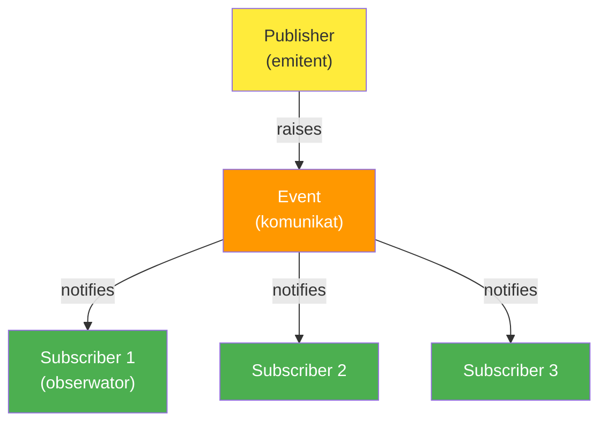

# Diagramy - Zdarzenia

```mermaid
graph TB
    PUB["Publisher<br/>(emitent)"]
    EVENT["Event<br/>(komunikat)"]
    SUB1["Subscriber 1<br/>(obserwator)"]
    SUB2["Subscriber 2"]
    SUB3["Subscriber 3"]
    
    PUB -->|"raises"| EVENT
    EVENT -->|"notifies"| SUB1
    EVENT -->|"notifies"| SUB2
    EVENT -->|"notifies"| SUB3
    
    style PUB fill:#ffeb3b
    style EVENT fill:#ff9800,color:#fff
    style SUB1 fill:#4caf50,color:#fff
    style SUB2 fill:#4caf50,color:#fff
    style SUB3 fill:#4caf50,color:#fff
```
