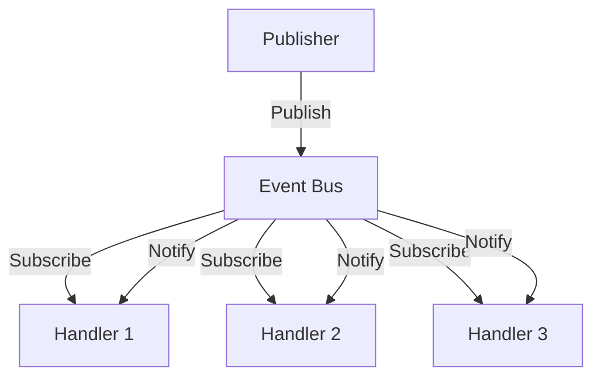

# Diagramy - Wzorce Zdarzeń

```mermaid
graph TB
    EB["Event Bus"]
    EB -->|Subscribe| H1["Handler 1"]
    EB -->|Subscribe| H2["Handler 2"]
    EB -->|Subscribe| H3["Handler 3"]
    
    PUB["Publisher"] -->|Publish| EB
    EB -->|Notify| H1
    EB -->|Notify| H2
    EB -->|Notify| H3
```
