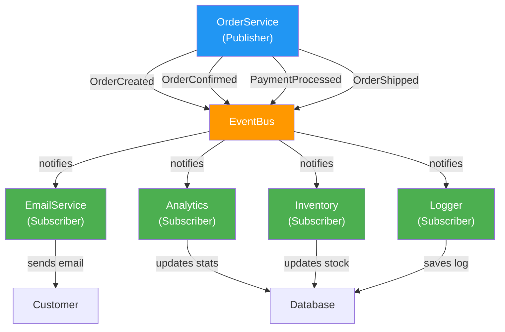

# Diagramy - Event-Driven Architecture

```mermaid
graph TB
    OS["OrderService<br/>(Publisher)"]
    
    OS -->|OrderCreated| EB["EventBus"]
    OS -->|OrderConfirmed| EB
    OS -->|PaymentProcessed| EB
    OS -->|OrderShipped| EB
    
    EB -->|notifies| EMAIL["EmailService<br/>(Subscriber)"]
    EB -->|notifies| ANALYTICS["Analytics<br/>(Subscriber)"]
    EB -->|notifies| INVENTORY["Inventory<br/>(Subscriber)"]
    EB -->|notifies| LOGGER["Logger<br/>(Subscriber)"]
    
    EMAIL -->|sends email| CUSTOMER["Customer"]
    ANALYTICS -->|updates stats| DB["Database"]
    INVENTORY -->|updates stock| DB
    LOGGER -->|saves log| DB
    
    style OS fill:#2196f3,color:#fff
    style EB fill:#ff9800,color:#fff
    style EMAIL fill:#4caf50,color:#fff
    style ANALYTICS fill:#4caf50,color:#fff
    style INVENTORY fill:#4caf50,color:#fff
    style LOGGER fill:#4caf50,color:#fff
```
