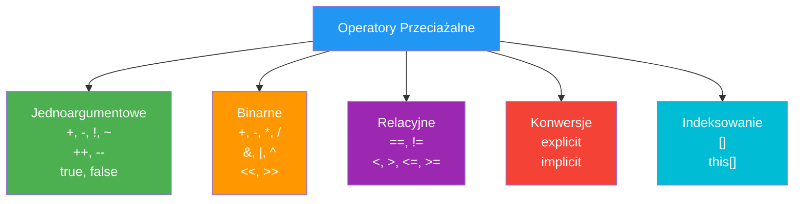

# Diagramy - Operatory Przeciażalne

```mermaid
graph TB
    OP["Operatory Przeciażalne"]
    
    OP --> JEDN["Jednoargumentowe<br/>+, -, !, ~<br/>++, --<br/>true, false"]
    OP --> BIN["Binarne<br/>+, -, *, /<br/>&, |, ^<br/><<, >>"]
    OP --> REL["Relacyjne<br/>==, !=<br/><, >, <=, >="]
    OP --> KON["Konwersje<br/>explicit<br/>implicit"]
    OP --> IND["Indeksowanie<br/>[]<br/>this[]"]
    
    style OP fill:#2196f3,color:#fff
    style JEDN fill:#4caf50,color:#fff
    style BIN fill:#ff9800,color:#fff
    style REL fill:#9c27b0,color:#fff
    style KON fill:#f44336,color:#fff
    style IND fill:#00bcd4,color:#fff
```

```mermaid
table
    title Operatory Nierze ciażalne
    x-axis NIE, NIE, NIE, NIE, NIE, NIE
    line [=, +=, -=, *=, /=, .]
```
