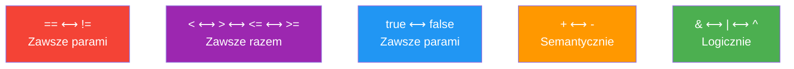

# Diagramy - Operatory Powiązane

```mermaid
graph TB
    EQ["== ⟷ !=<br/>Zawsze parami"]
    CMP["< ⟷ > ⟷ <= ⟷ >=<br/>Zawsze razem"]
    BOOL["true ⟷ false<br/>Zawsze parami"]
    ARITH["+ ⟷ -<br/>Semantycznie"]
    BIT["& ⟷ | ⟷ ^<br/>Logicznie"]
    
    style EQ fill:#f44336,color:#fff
    style CMP fill:#9c27b0,color:#fff
    style BOOL fill:#2196f3,color:#fff
    style ARITH fill:#ff9800,color:#fff
    style BIT fill:#4caf50,color:#fff
```
