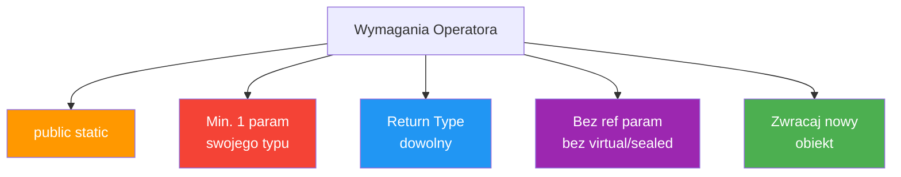

# Diagramy - Zasady Definiowania

```mermaid
graph TB
    REQ["Wymagania Operatora"]
    
    REQ --> PUBLIC["public static"]
    REQ --> PARAM["Min. 1 param<br/>swojego typu"]
    REQ --> RET["Return Type<br/>dowolny"]
    REQ --> NO_MOD["Bez ref param<br/>bez virtual/sealed"]
    REQ --> IMMUT["Zwracaj nowy<br/>obiekt"]
    
    style PUBLIC fill:#ff9800,color:#fff
    style PARAM fill:#f44336,color:#fff
    style RET fill:#2196f3,color:#fff
    style NO_MOD fill:#9c27b0,color:#fff
    style IMMUT fill:#4caf50,color:#fff
```
