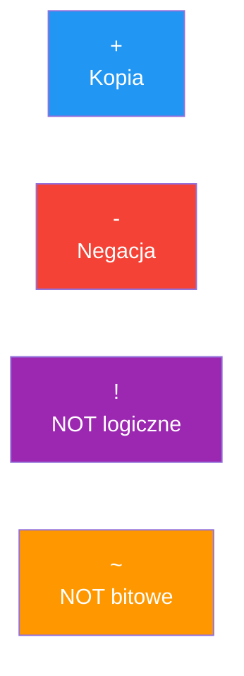

# Diagramy

```mermaid
graph LR
    PLUS["+<br/>Kopia"]
    MINUS["-<br/>Negacja"]
    NOT["!<br/>NOT logiczne"]
    BITNOT["~<br/>NOT bitowe"]
    
    style PLUS fill:#2196f3,color:#fff
    style MINUS fill:#f44336,color:#fff
    style NOT fill:#9c27b0,color:#fff
    style BITNOT fill:#ff9800,color:#fff
```
