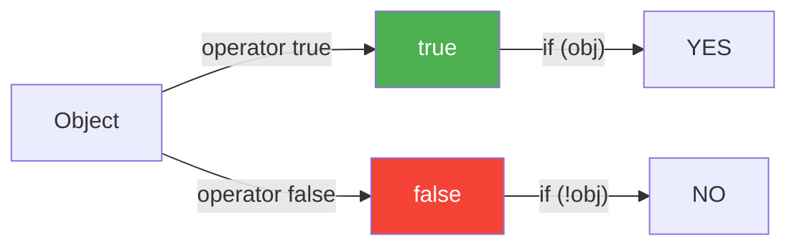

# Diagramy

```mermaid
graph LR
    OBJ["Object"]
    OBJ -->|"operator true"| T["true"]
    OBJ -->|"operator false"| F["false"]
    
    T -->|"if (obj)"| YES["YES"]
    F -->|"if (!obj)"| NO["NO"]
    
    style T fill:#4caf50,color:#fff
    style F fill:#f44336,color:#fff
```
