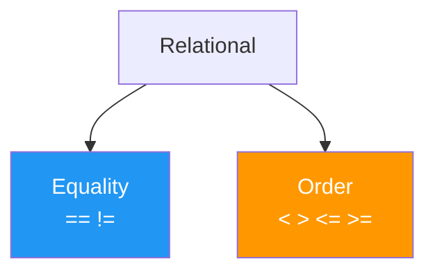

# Diagramy

```mermaid
graph TB
    REL["Relational"]
    EQ["Equality<br/>== !="]
    ORD["Order<br/>< > <= >="]
    
    REL --> EQ
    REL --> ORD
    
    style EQ fill:#2196f3,color:#fff
    style ORD fill:#ff9800,color:#fff
```
