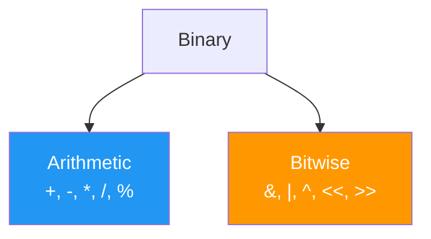

# Diagramy

```mermaid
graph TB
    BIN["Binary"]
    
    ARITH["Arithmetic<br/>+, -, *, /, %"]
    BIT["Bitwise<br/>&, |, ^, <<, >>"]
    
    BIN --> ARITH
    BIN --> BIT
    
    style ARITH fill:#2196f3,color:#fff
    style BIT fill:#ff9800,color:#fff
```
