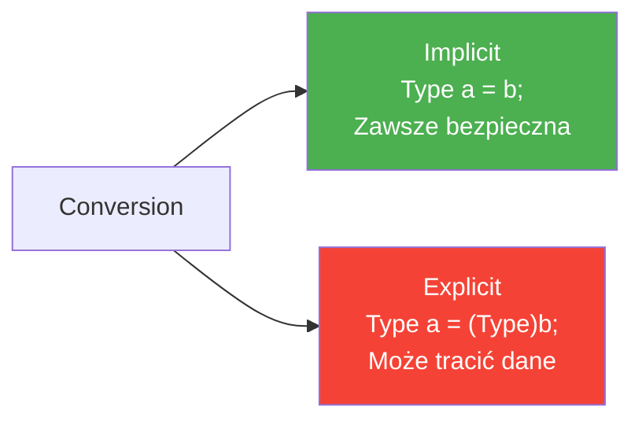

# Diagramy

```mermaid
graph LR
    CONV["Conversion"]
    
    IMPL["Implicit<br/>Type a = b;<br/>Zawsze bezpieczna"]
    EXPL["Explicit<br/>Type a = (Type)b;<br/>Może tracić dane"]
    
    CONV --> IMPL
    CONV --> EXPL
    
    style IMPL fill:#4caf50,color:#fff
    style EXPL fill:#f44336,color:#fff
```
