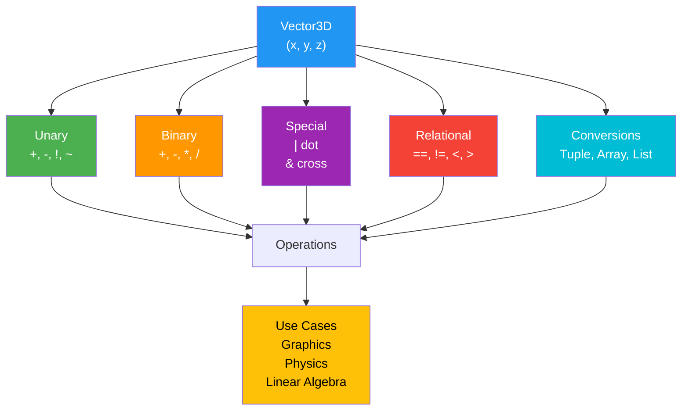
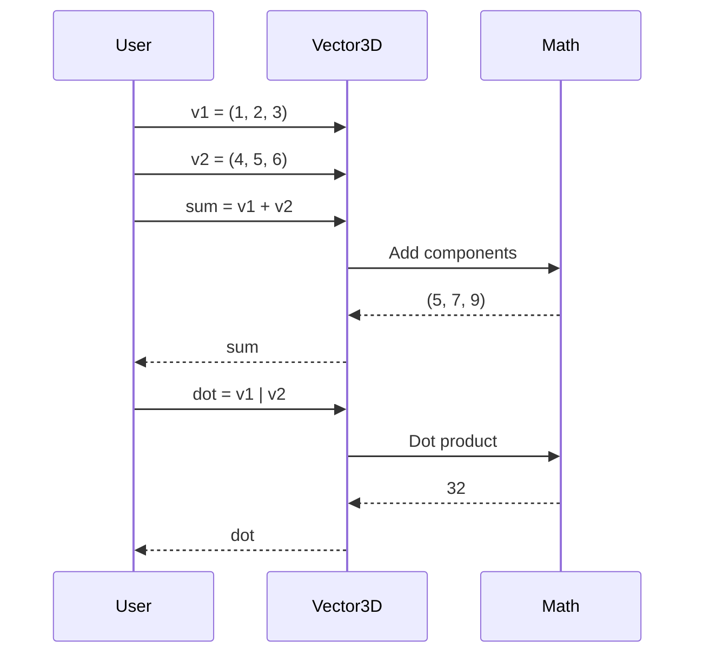

# Diagramy - Vector3D System

```mermaid
graph TB
    V3D["Vector3D<br/>(x, y, z)"]
    
    V3D --> UNARY["Unary<br/>+, -, !, ~"]
    V3D --> BIN["Binary<br/>+, -, *, /"]
    V3D --> SPEC["Special<br/>| dot<br/>& cross"]
    V3D --> REL["Relational<br/>==, !=, <, >"]
    V3D --> CONV["Conversions<br/>Tuple, Array, List"]
    
    UNARY --> OPS["Operations"]
    BIN --> OPS
    SPEC --> OPS
    REL --> OPS
    CONV --> OPS
    
    OPS --> USE["Use Cases<br/>Graphics<br/>Physics<br/>Linear Algebra"]
    
    style V3D fill:#2196f3,color:#fff
    style UNARY fill:#4caf50,color:#fff
    style BIN fill:#ff9800,color:#fff
    style SPEC fill:#9c27b0,color:#fff
    style REL fill:#f44336,color:#fff
    style CONV fill:#00bcd4,color:#fff
    style USE fill:#ffc107,color:#000
```

```mermaid
sequenceDiagram
    participant User
    participant Vector3D
    participant Math
    
    User->>Vector3D: v1 = (1, 2, 3)
    User->>Vector3D: v2 = (4, 5, 6)
    User->>Vector3D: sum = v1 + v2
    Vector3D->>Math: Add components
    Math-->>Vector3D: (5, 7, 9)
    Vector3D-->>User: sum
    
    User->>Vector3D: dot = v1 | v2
    Vector3D->>Math: Dot product
    Math-->>Vector3D: 32
    Vector3D-->>User: dot
```
