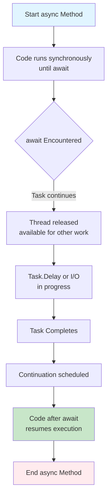
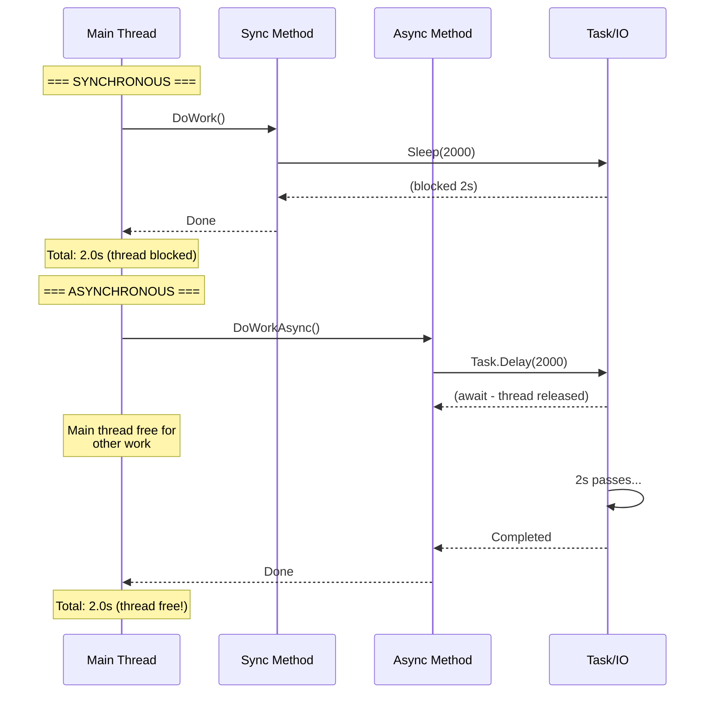
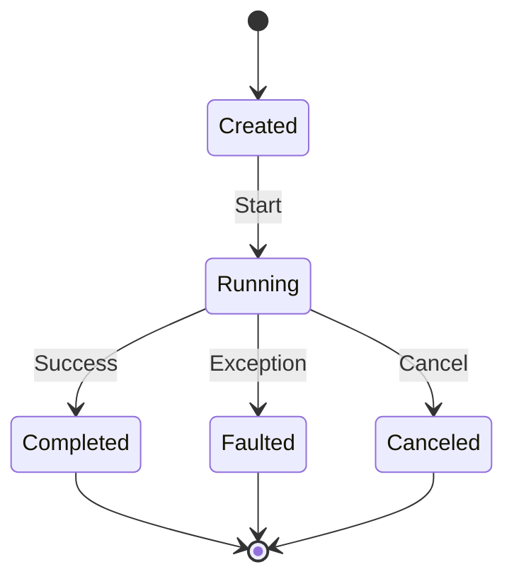
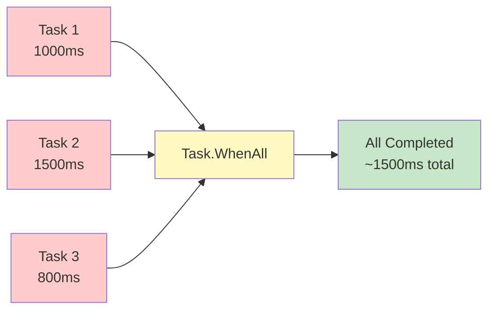
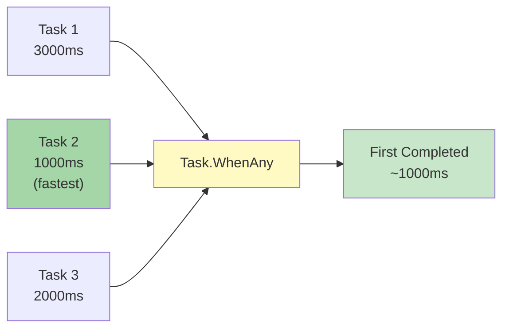
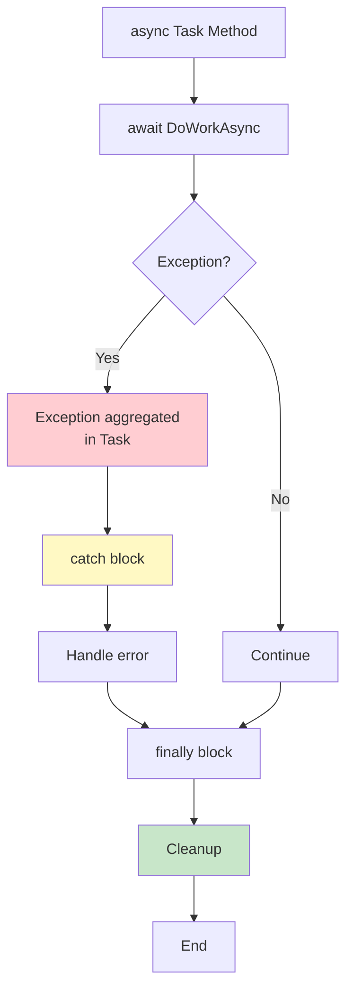

# Diagramy: Async/Await Fundamentals

## 1. Async/Await Flow

## 2. Synchronous vs Asynchronous Timeline

## 3. Task States

## 4. Task.WhenAll Composition

## 5. Task.WhenAny Composition

## 6. Exception Handling in Async

