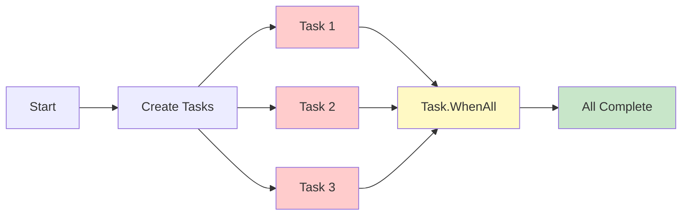
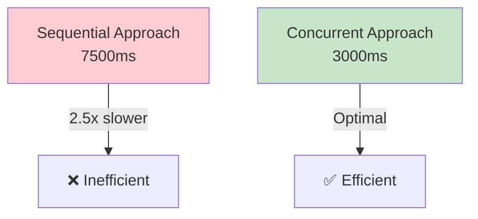
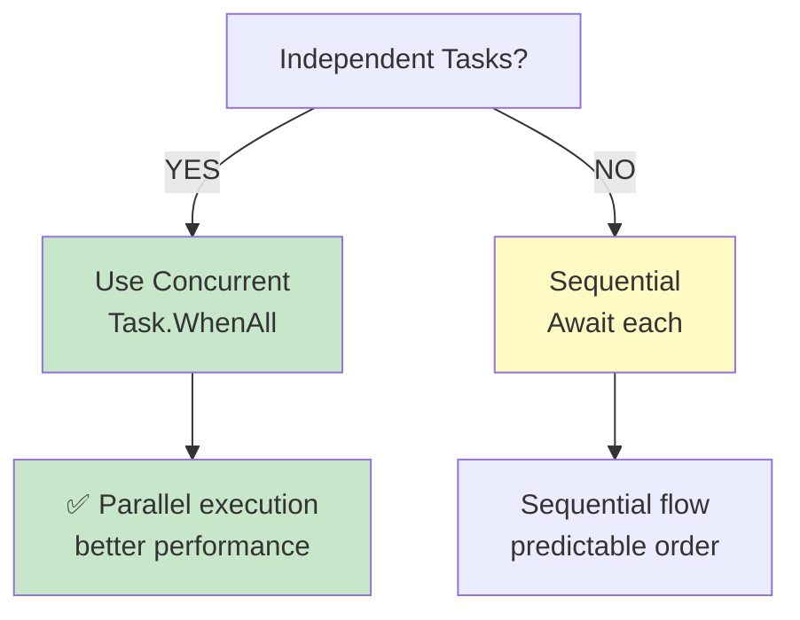

# Diagramy: Breakfast Sequential vs Concurrent

## 1. Sequential Timeline

```mermaid
gantt
    title Sequential Breakfast Preparation
    dateFormat HH:mm:ss
    axisFormat %H:%M:%S
    
    Eggs      :eggs, 00:00:00, 3s
    Bread     :bread, after eggs, 2s
    Coffee    :coffee, after bread, 1.5s
    Bacon     :bacon, after coffee, 1s
    
    Total: ~7.5s
```

## 2. Concurrent Timeline

```mermaid
gantt
    title Concurrent Breakfast Preparation
    dateFormat HH:mm:ss
    axisFormat %H:%M:%S
    
    Eggs      :eggs, 00:00:00, 3s
    Bread     :bread, 00:00:00, 2s
    Coffee    :coffee, 00:00:00, 1.5s
    Bacon     :bacon, 00:00:00, 1s
    
    Total: ~3s (longest task)
```

## 3. Task Flow Diagram

## 4. Sequential vs Concurrent Comparison

## 5. When to Use Each

