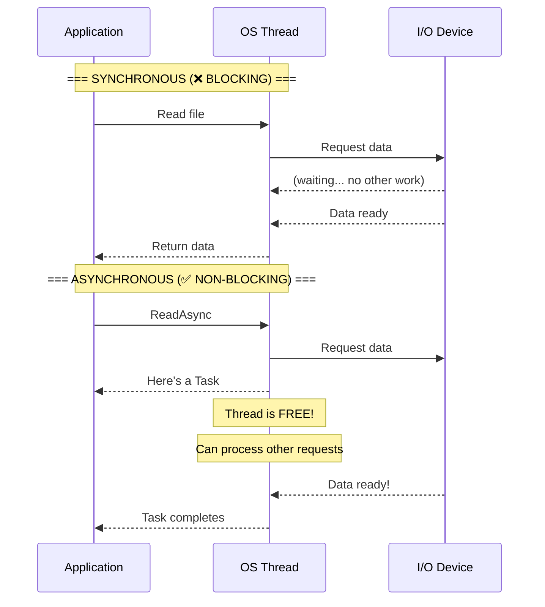
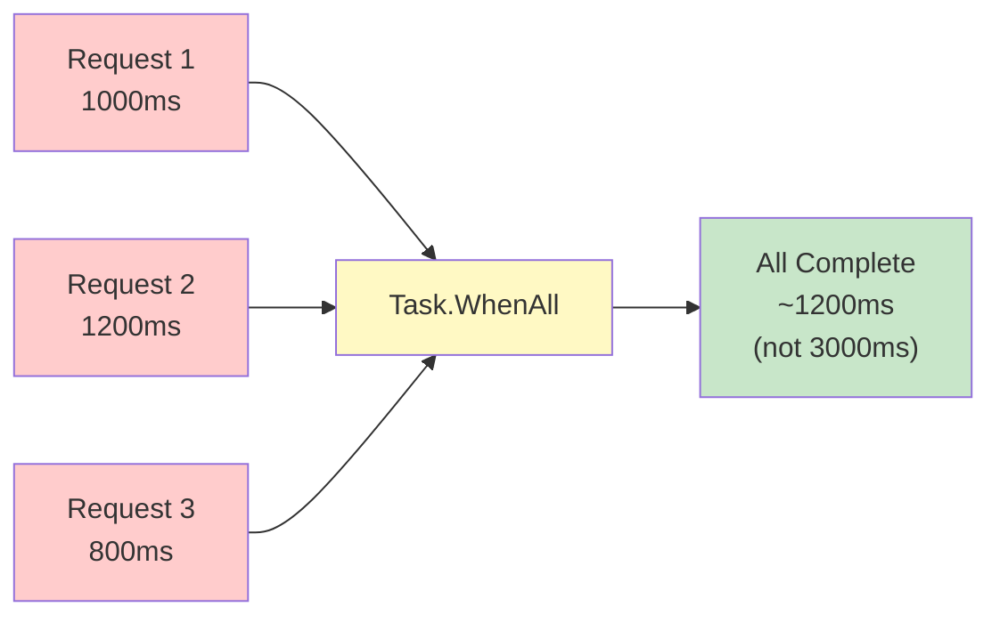
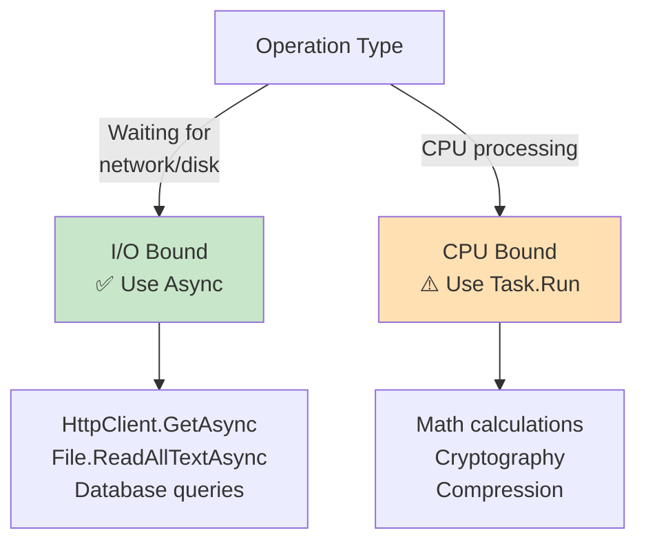

# Diagramy: I/O Operations

## 1. Async I/O vs Sync

```mermaid
sequenceDiagram
    participant App as Application
    participant Thread as OS Thread
    participant IO as I/O Device

    Note over App,Thread: === SYNCHRONOUS (❌ BLOCKING) ===
    App->>Thread: Read file
    Thread->>IO: Request data
    IO-->>Thread: (waiting... no other work)
    IO-->>Thread: Data ready
    Thread-->>App: Return data

    Note over App,Thread: === ASYNCHRONOUS (✅ NON-BLOCKING) ===
    App->>Thread: ReadAsync
    Thread->>IO: Request data
    Thread-->>App: Here's a Task
    Note over Thread: Thread is FREE!
    Note over Thread: Can process other requests
    IO-->>Thread: Data ready!
    Thread-->>App: Task completes
```

## 2. Concurrent HTTP Requests

```mermaid
graph LR
    A["Request 1<br/>1000ms"] --> D["Task.WhenAll"]
    B["Request 2<br/>1200ms"] --> D
    C["Request 3<br/>800ms"] --> D
    D --> E["All Complete<br/>~1200ms<br/>(not 3000ms)"]
    
    style A fill:#ffcccc
    style B fill:#ffcccc
    style C fill:#ffcccc
    style D fill:#fff9c4
    style E fill:#c8e6c9
```

## 3. I/O Bound vs CPU Bound

```mermaid
graph TD
    A["Operation Type"] --> |"Waiting for<br/>network/disk"| B["I/O Bound<br/>✅ Use Async"]
    A --> |"CPU processing"| C["CPU Bound<br/>⚠️ Use Task.Run"]
    
    B --> D["HttpClient.GetAsync<br/>File.ReadAllTextAsync<br/>Database queries"]
    C --> E["Math calculations<br/>Cryptography<br/>Compression"]
    
    style B fill:#c8e6c9
    style C fill:#ffe0b2
```
