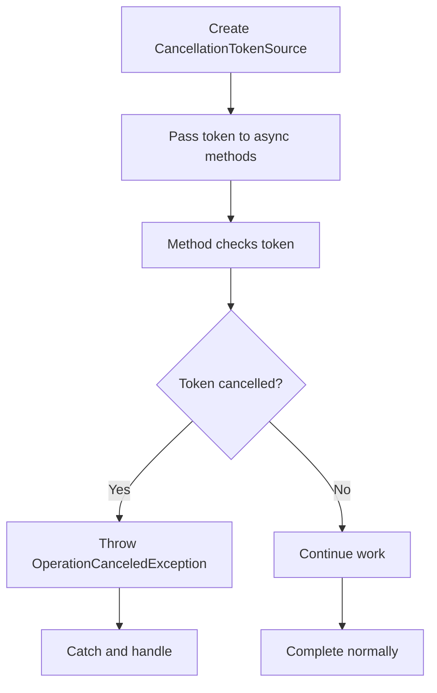
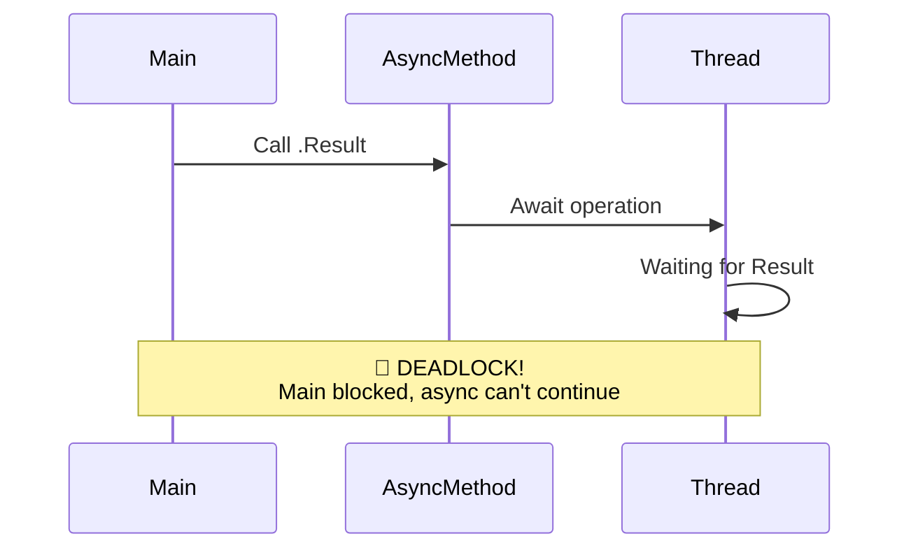

# Diagramy: Advanced Patterns

## Cancellation Flow

```mermaid
graph TD
    A["Create CancellationTokenSource"] --> B["Pass token to async methods"]
    B --> C["Method checks token"]
    C --> D{Token cancelled?}
    D -->|Yes| E["Throw OperationCanceledException"]
    D -->|No| F["Continue work"]
    E --> G["Catch and handle"]
    F --> H["Complete normally"]
```

## Deadlock Scenario

```mermaid
sequenceDiagram
    participant Main
    participant AsyncMethod
    participant Thread

    Main->>AsyncMethod: Call .Result
    AsyncMethod->>Thread: Await operation
    Thread->>Thread: Waiting for Result
    Note over Main,Thread: 🔴 DEADLOCK!<br/>Main blocked, async can't continue
```
