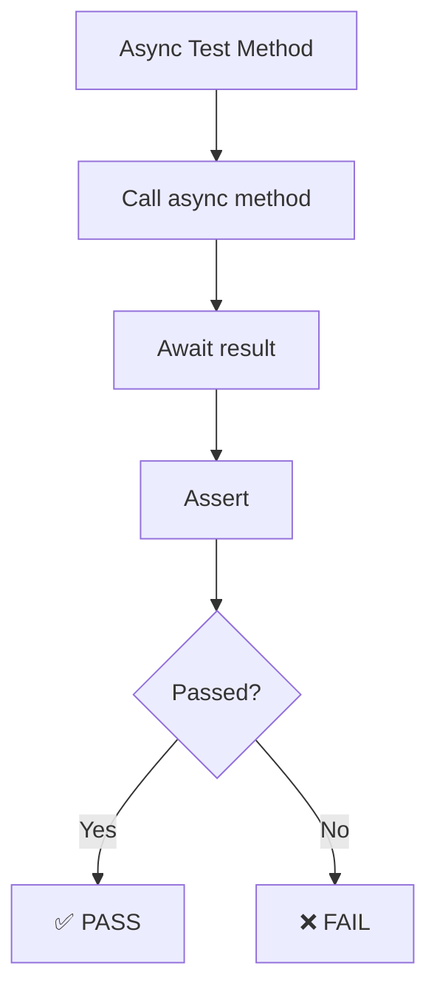
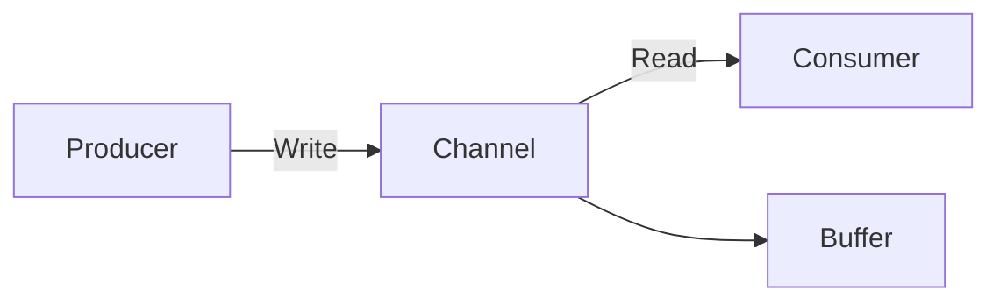

# Diagramy & Ćwiczenia: Tematy 6-10

## Temat 6: Testing

Diagrams:

Exercises:
- 🟢 Write 3 async tests with xUnit
- 🟡 Mock async service
- 🔴 Test timeout scenarios

---

## Temat 7: Async LINQ & Channels

Diagrams:

Exercises:
- 🟢 Async stream with yield return
- 🟡 Producer-consumer pattern
- 🔴 Pipeline with channels

---

## Temat 8: Dependency Injection

Exercises:
- 🟢 Async service initialization
- 🟡 DI registration with async
- 🔴 Lazy<Task<T>> pattern

---

## Temat 9: Real-World

Exercises:
- 🟢 Simple API client
- 🟡 Concurrent API calls + caching
- 🔴 Error handling + retry logic

---

## Temat 10: Modern C#

Exercises:
- 🟢 ValueTask caching
- 🟡 Async iterators
- 🔴 Zero-allocation patterns
