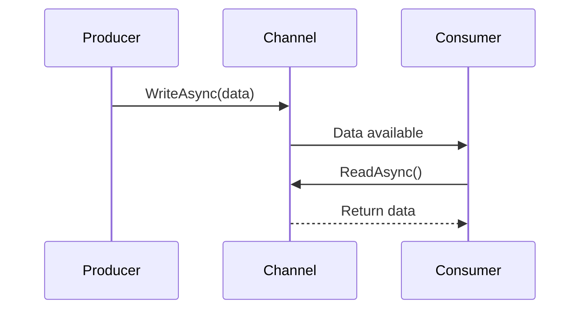

# Diagramy: Channels

```mermaid
sequenceDiagram
    participant Prod as Producer
    participant Ch as Channel
    participant Cons as Consumer

    Prod->>Ch: WriteAsync(data)
    Ch->>Cons: Data available
    Cons->>Ch: ReadAsync()
    Ch-->>Cons: Return data
```
