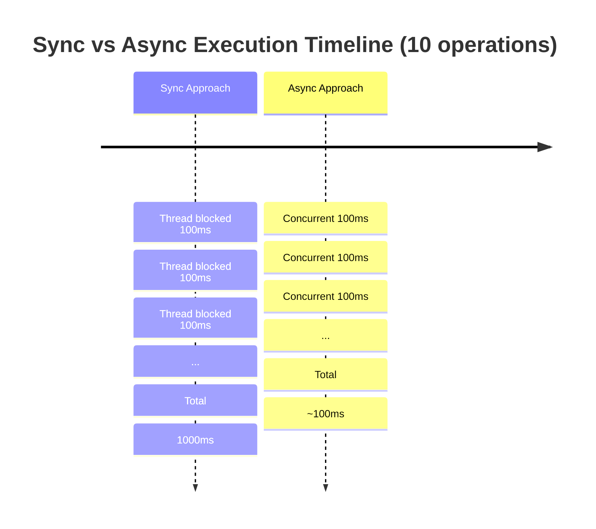
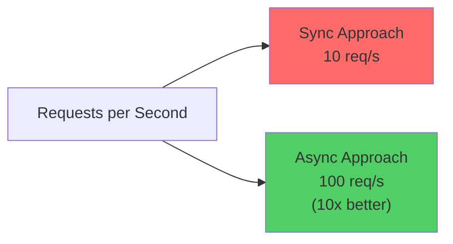
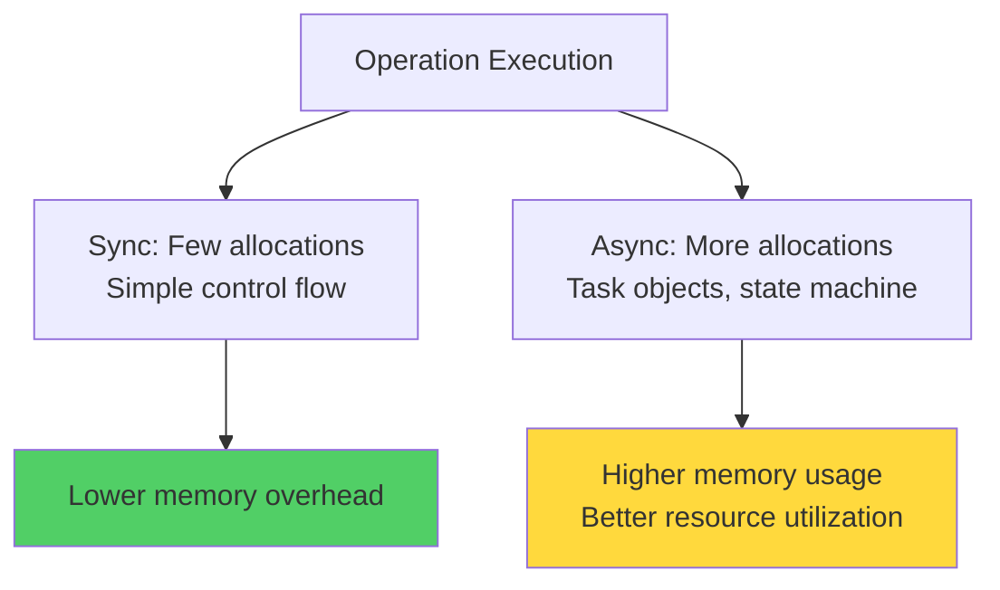
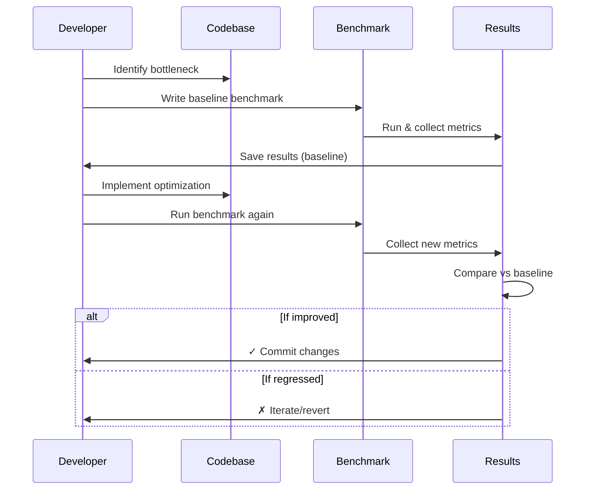
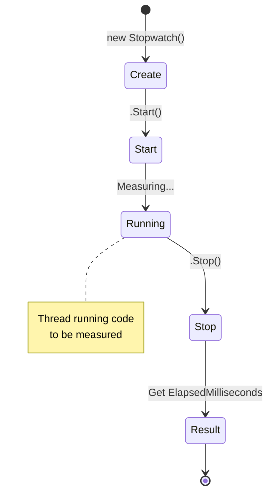
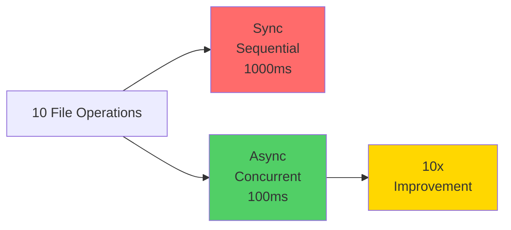
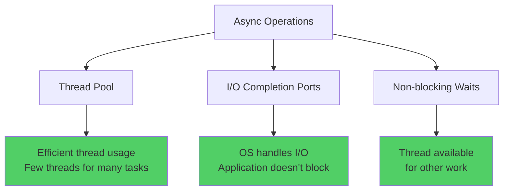

# Diagramy: Benchmarking Performance

## Diagram 1: Sync vs Async Timeline

## Diagram 2: Throughput Comparison

## Diagram 3: Memory Allocation Pattern

## Diagram 4: Benchmark Results Interpretation

```mermaid
graph LR
    A["Benchmark Results"]
    
    A --> B["Mean ± StdDev<br/>Consistency"]
    A --> C["Min/Max<br/>Range"]
    A --> D["Ratio<br/>Improvement"]
    A --> E["Memory<br/>Allocations"]
    
    style A fill:#e8f5e9
    style B fill:#c8e6c9
    style C fill:#c8e6c9
    style D fill:#c8e6c9
    style E fill:#c8e6c9
```

## Diagram 5: Benchmark Workflow

## Diagram 6: Stopwatch Usage Pattern

## Diagram 7: I/O Performance Improvement

## Diagram 8: Resource Utilization

