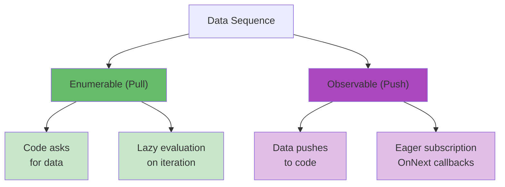
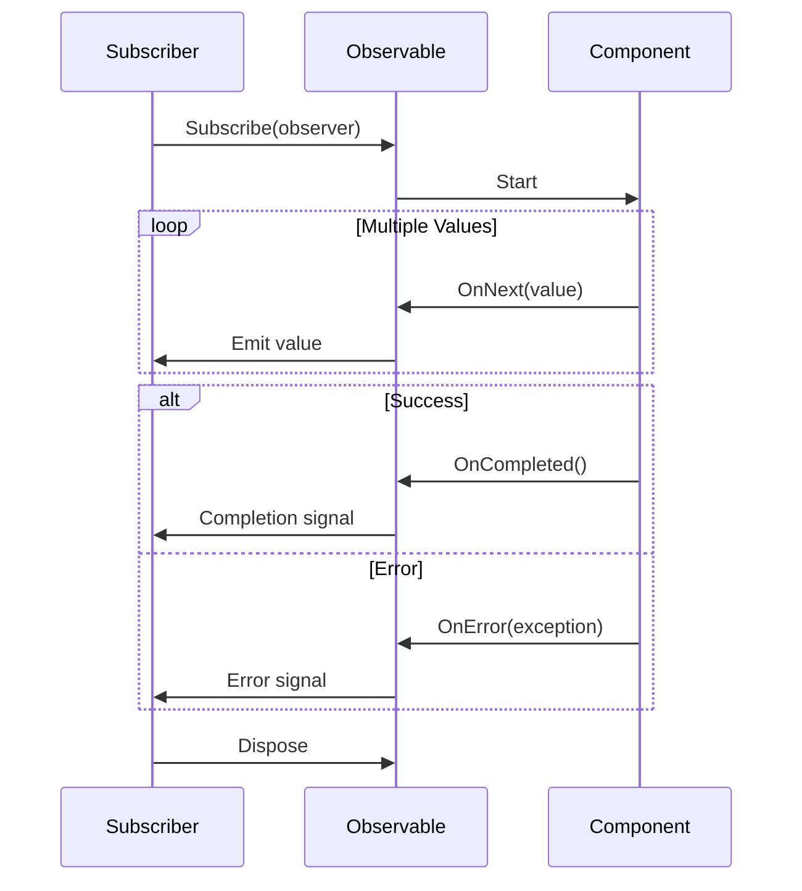
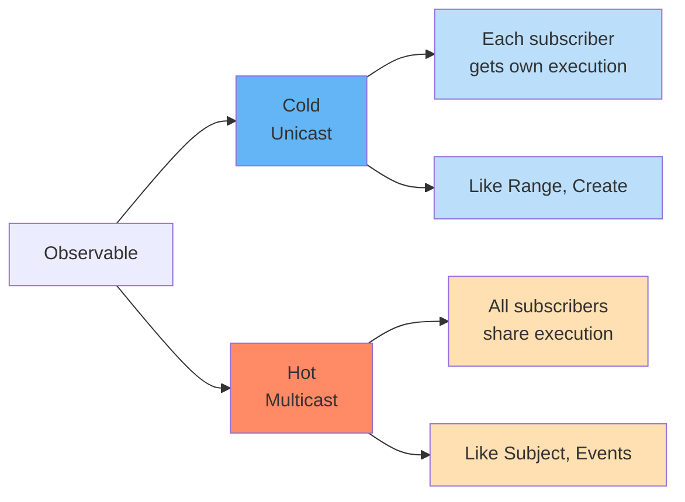
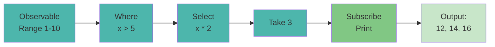
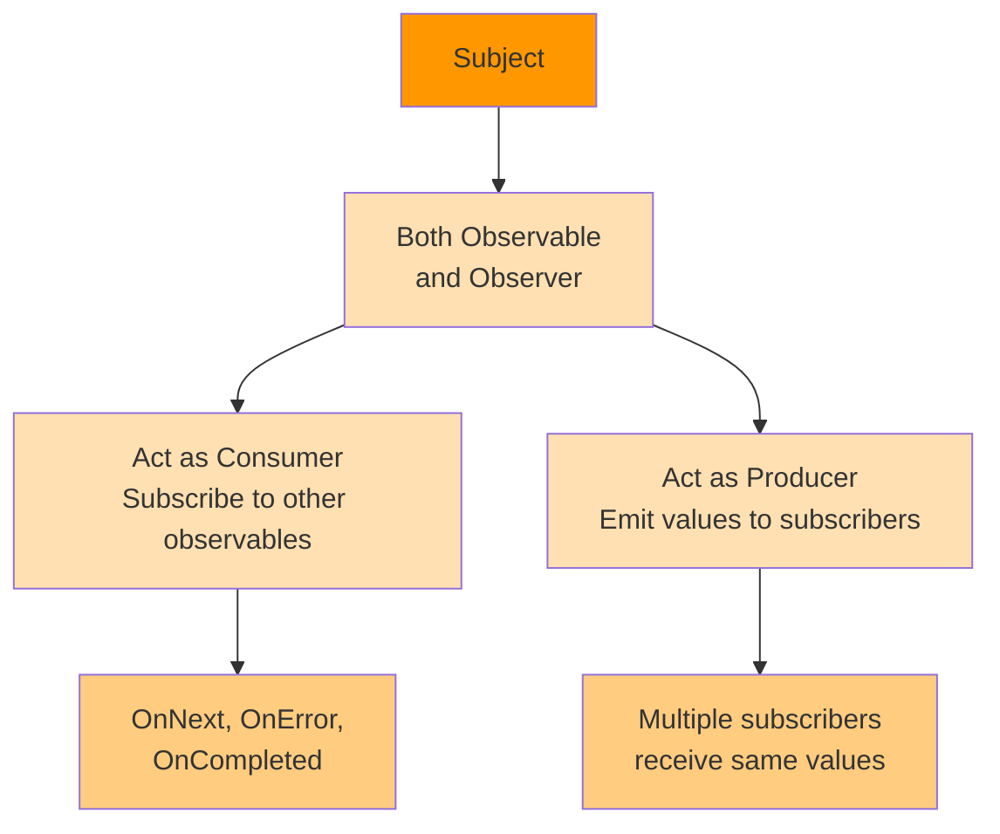
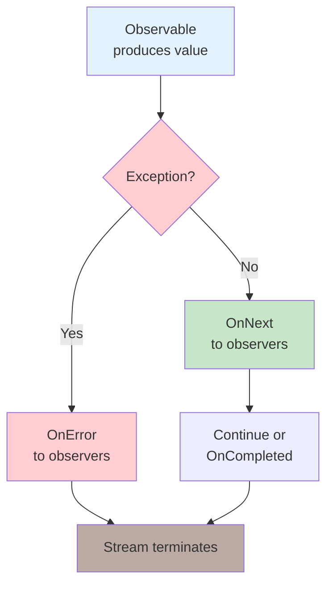
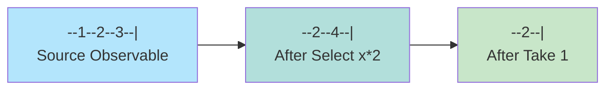
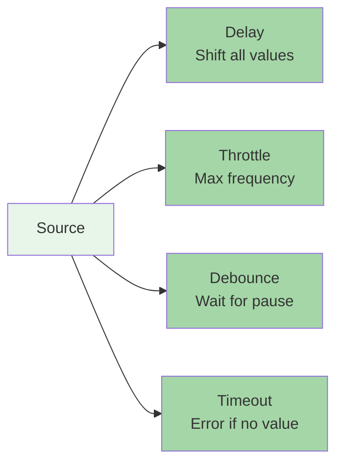
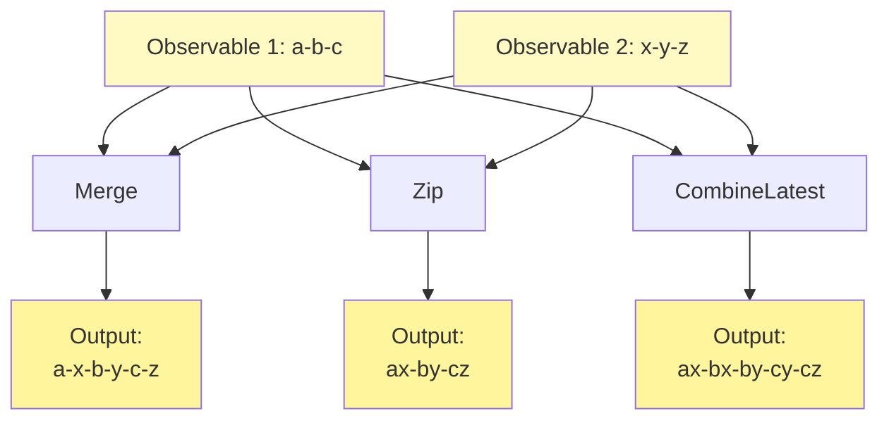

# Diagramy: Reactive Extensions (Rx)

## Diagram 1: Observable vs Enumerable

## Diagram 2: Observable Lifecycle

## Diagram 3: Cold vs Hot Observable

## Diagram 4: LINQ Operators Pipeline

## Diagram 5: Subject Pattern

## Diagram 6: Error Handling Flow

## Diagram 7: Marble Diagram Example

## Diagram 8: Time-based Operators

## Diagram 9: Combination Operators

