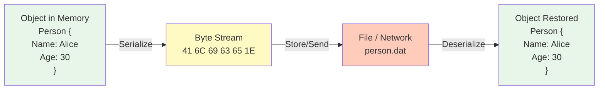
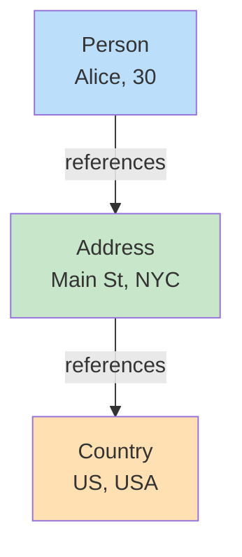
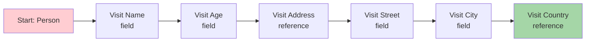
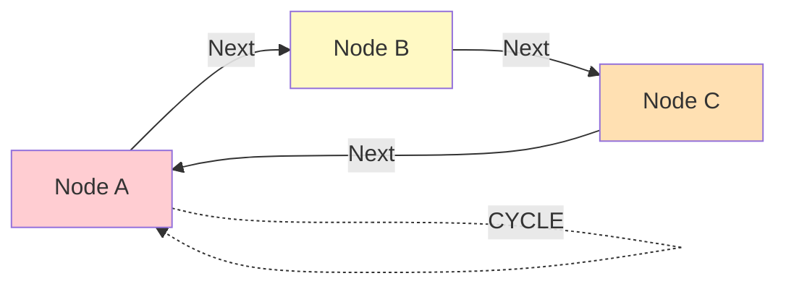
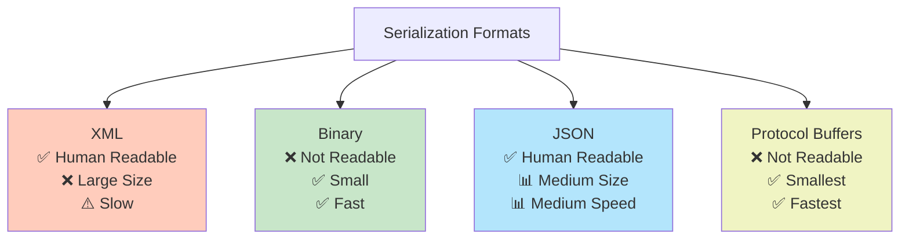
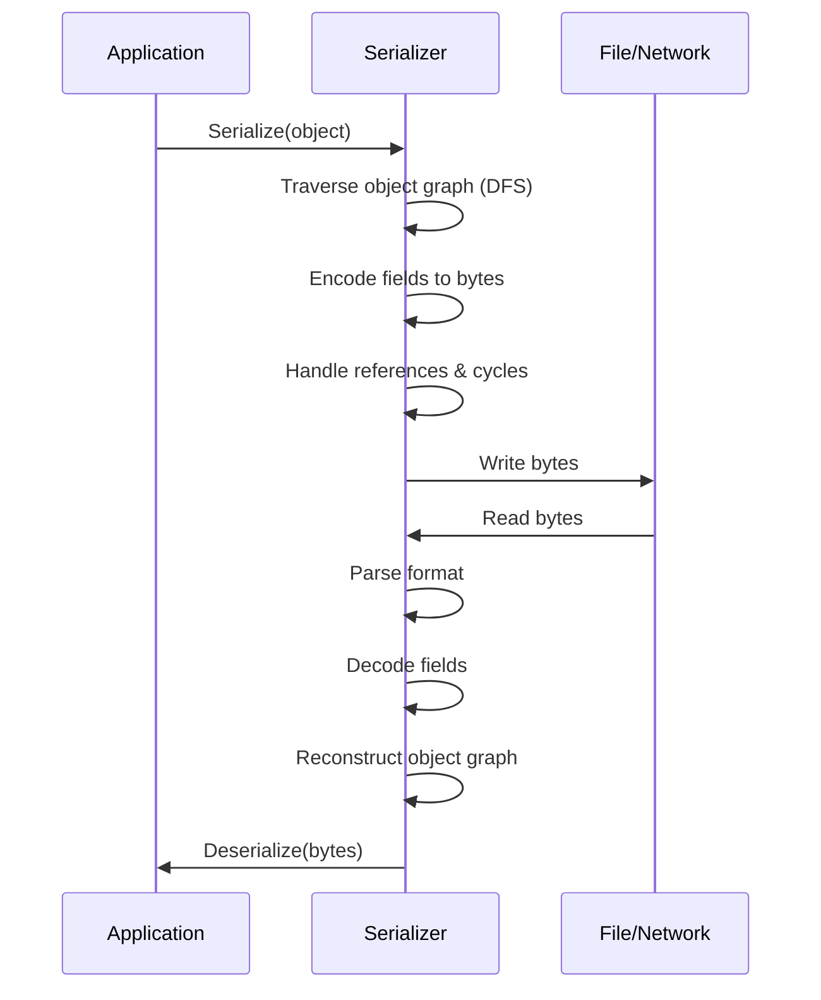
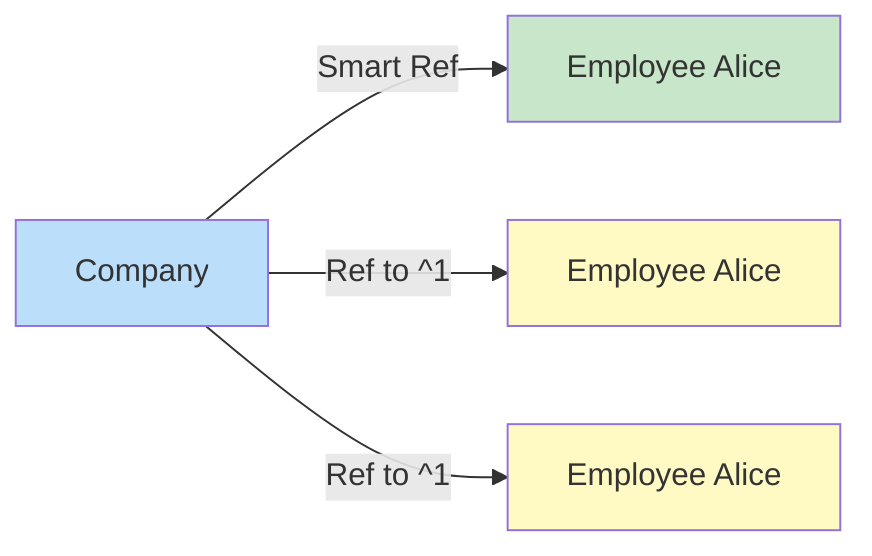
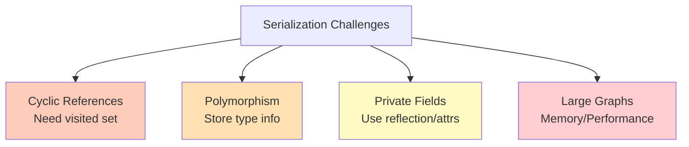

# Diagramy: Serialization Concepts

## Diagram 1: Serializacja vs Deserializacja

## Diagram 2: Object Graph Structure

## Diagram 3: Depth-First Search (DFS) Traversal

## Diagram 4: Cycle Detection Problem

## Diagram 5: Serialization Formats Comparison

## Diagram 6: Serialization Workflow

## Diagram 7: Object Reference Handling

## Diagram 8: Serialization Challenges

