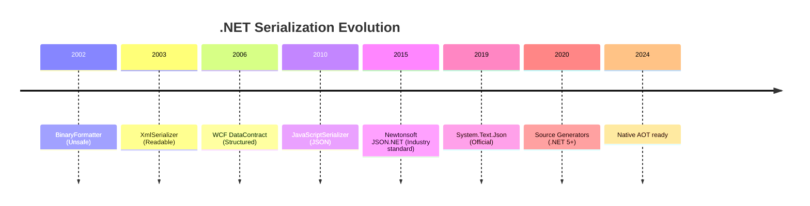
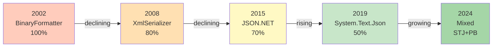
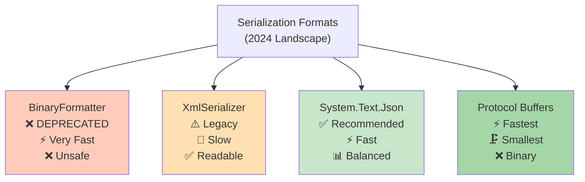
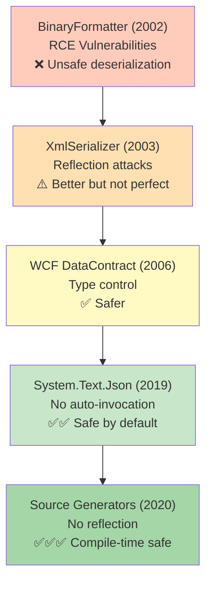
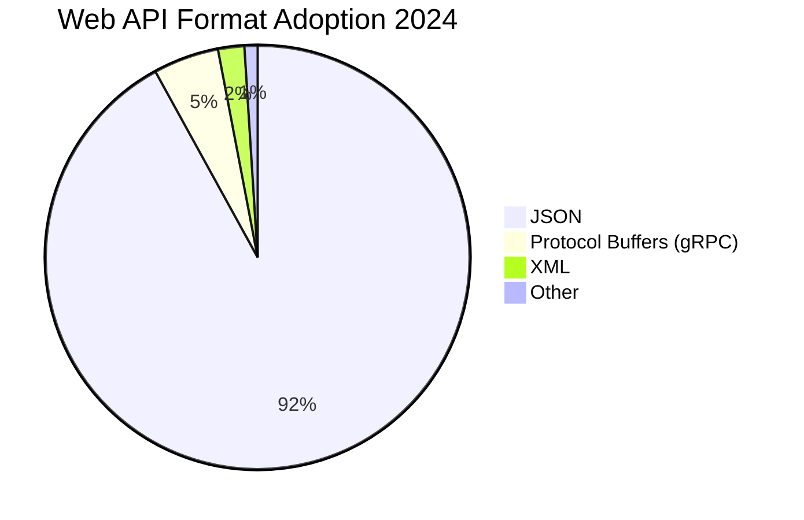
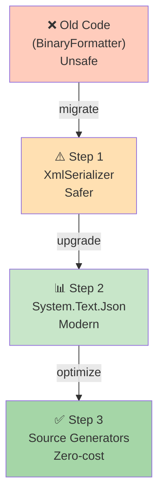

# Diagramy: Serialization History

## Diagram 1: .NET Serialization Timeline



## Diagram 2: Technology Adoption Curve



## Diagram 3: Format Complexity vs Performance



## Diagram 4: Security Evolution



## Diagram 5: .NET Framework vs .NET Core Timeline

```mermaid
graph LR
    subgraph NET_Framework["".NET Framework (2002-2022)""]
        A["BinaryFormatter<br/>2002-2022"]
        B["XmlSerializer<br/>2003-present"]
        C["WCF<br/>2006-2022"]
        D["Json.NET<br/>2011-present"]
    end
    
    subgraph NET_Core["".NET Core / .NET 5+ (2016-present)""]
        E["System.Text.Json<br/>2019+"]
        F["Source Generators<br/>2020+"]
        G["Protocol Buffers<br/>2020+"]
    end
    
    style A fill:#ffccbc
    style B fill:#ffe0b2
    style C fill:#fff9c4
    style D fill:#c8e6c9
    style E fill:#a5d6a7
    style F fill:#80cbc4
    style G fill:#64b5f6
```

## Diagram 6: Industry Adoption (Web APIs)



## Diagram 7: Performance Comparison


## Diagram 8: Migration Path Strategy


