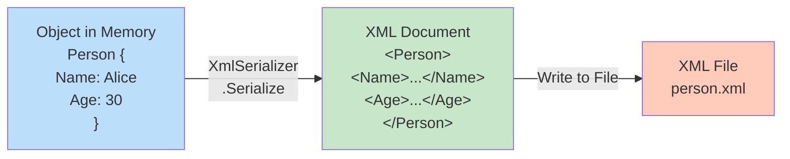
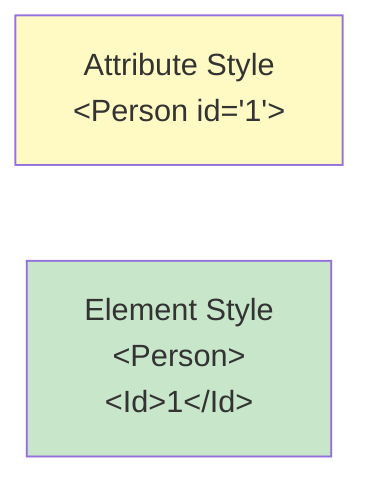
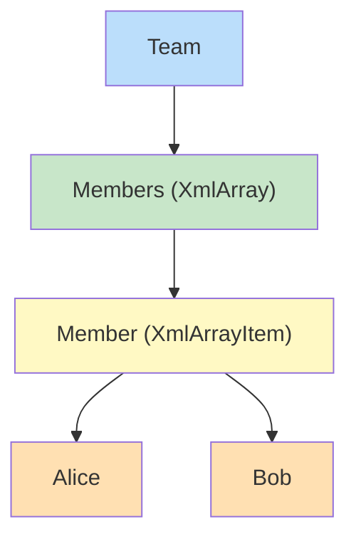
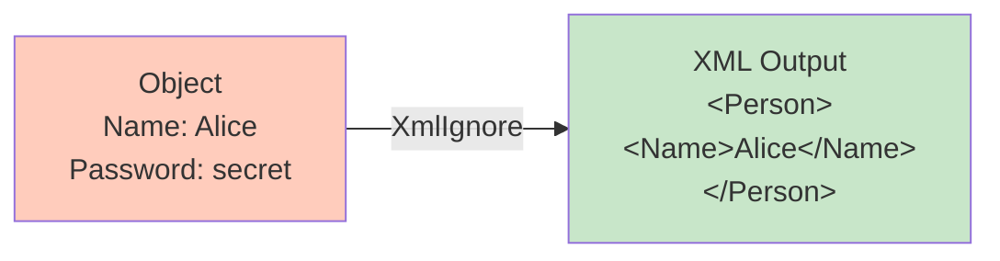
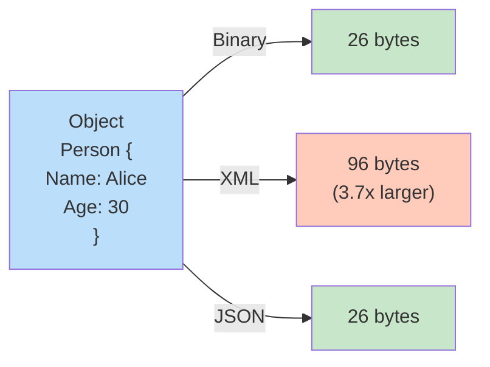
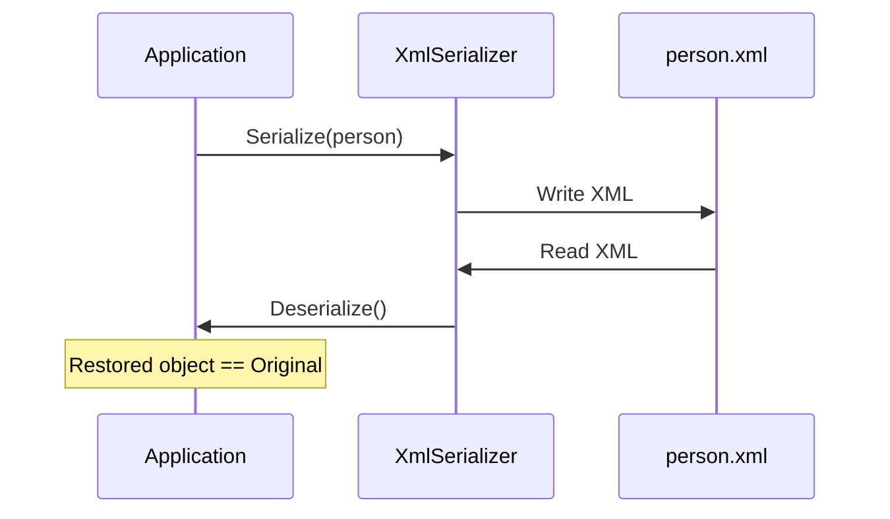
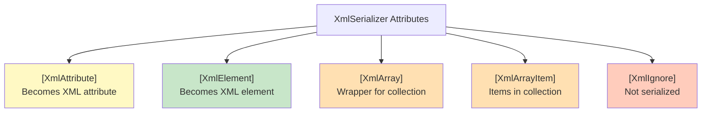
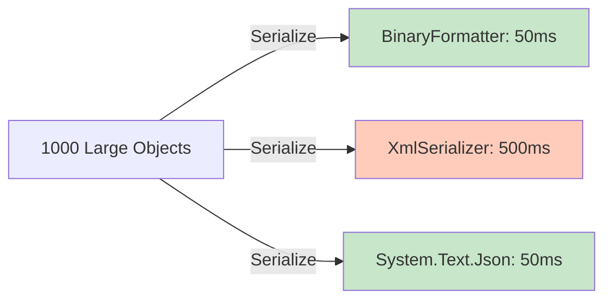

# Diagramy: XML Serialization

## Diagram 1: XmlSerializer Workflow

## Diagram 2: XmlAttribute vs XmlElement

## Diagram 3: XmlArray for Collections

## Diagram 4: XmlIgnore for Security

## Diagram 5: Size Comparison (Round-trip)

## Diagram 6: Round-trip Serialization

## Diagram 7: Attribute Types

## Diagram 8: Performance - XML vs JSON vs Binary

