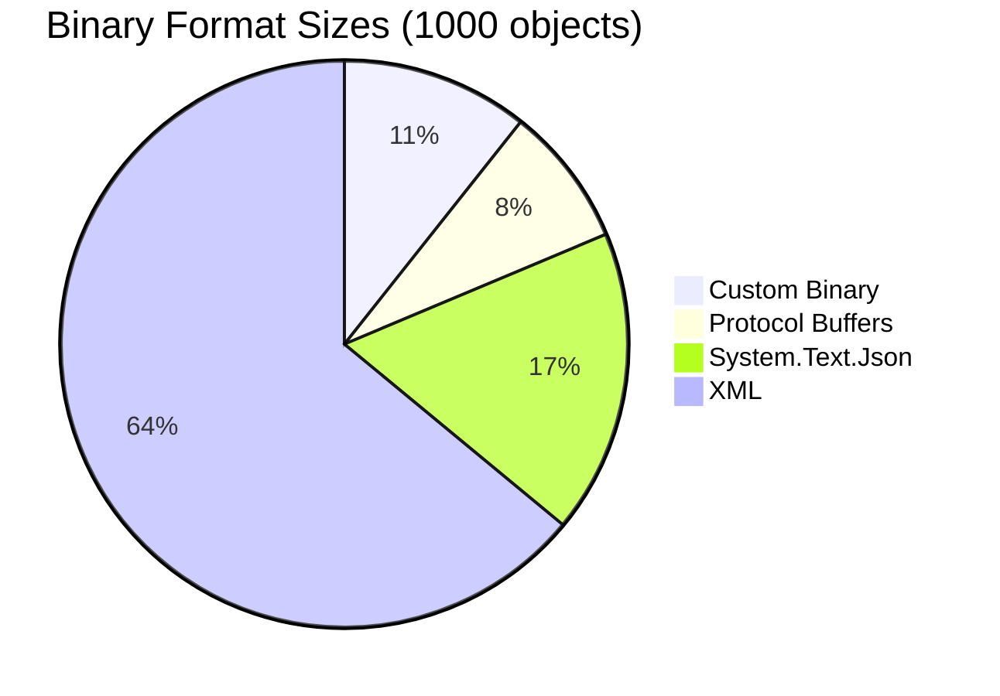
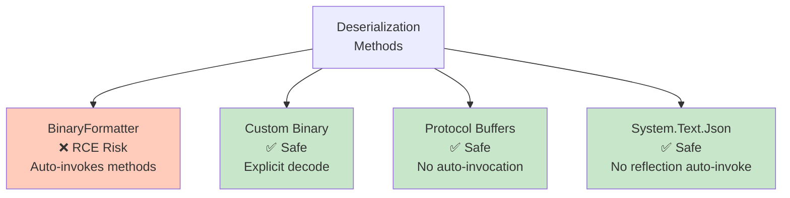
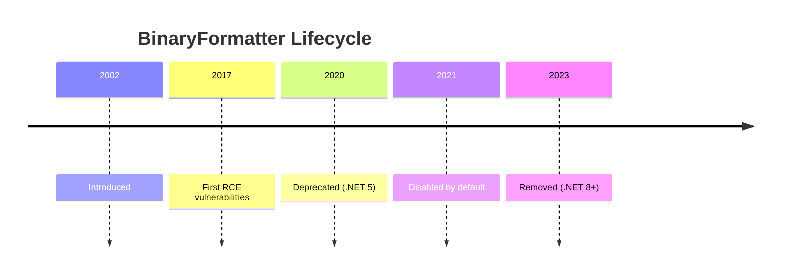
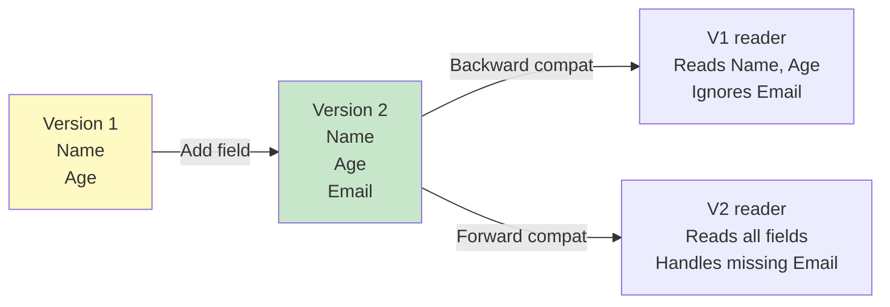
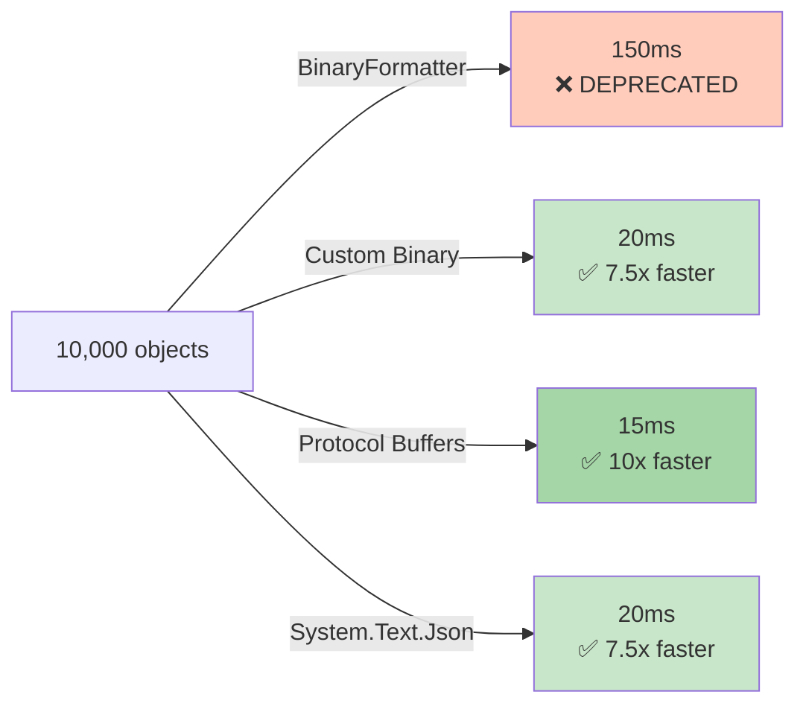
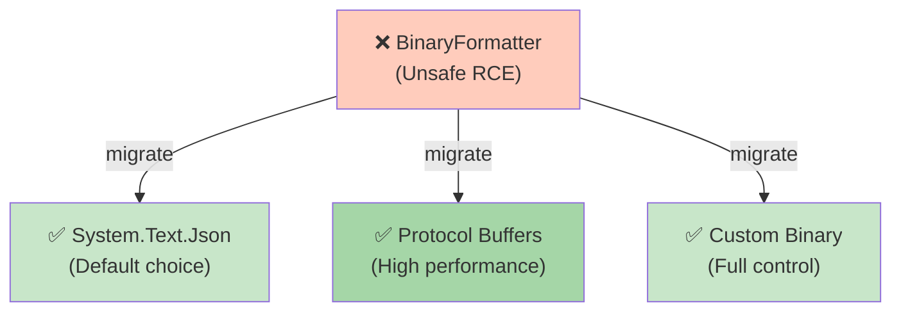

# Diagramy: Binary Serialization

## Diagram 1: BinaryFormatter RCE Vulnerability


## Diagram 2: Custom Binary Serialization Process

```mermaid
graph LR
    A["Object<br/>Person {<br/>Name: Alice<br/>Age: 30<br/>}"]
    
    A -->|Serialize()| B["Version Header<br/>01"]
    B -->|Write string| C["Name<br/>41 6C 69 63 65"]
    C -->|Write int32| D["Age<br/>1E 00 00 00"]
    D -->|Combine| E["Binary Stream<br/>01 41 6C... 1E..."]
    
    style A fill:#bbdefb
    style E fill:#c8e6c9
```

## Diagram 3: Binary Format Comparison



## Diagram 4: Security: BinaryFormatter vs Alternatives



## Diagram 5: BinaryFormatter Timeline



## Diagram 6: Versioning in Custom Binary



## Diagram 7: Performance: BinaryFormatter vs Alternatives



## Diagram 8: Migration Path from BinaryFormatter


