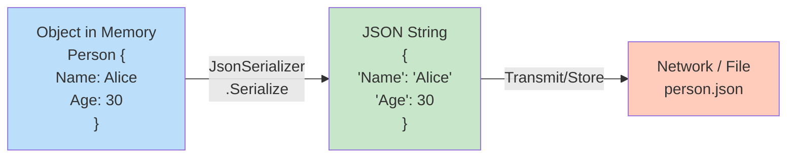
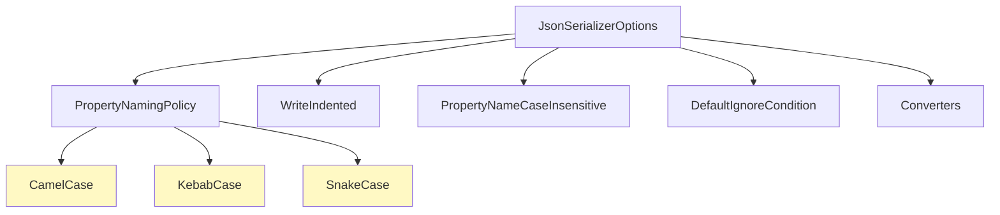
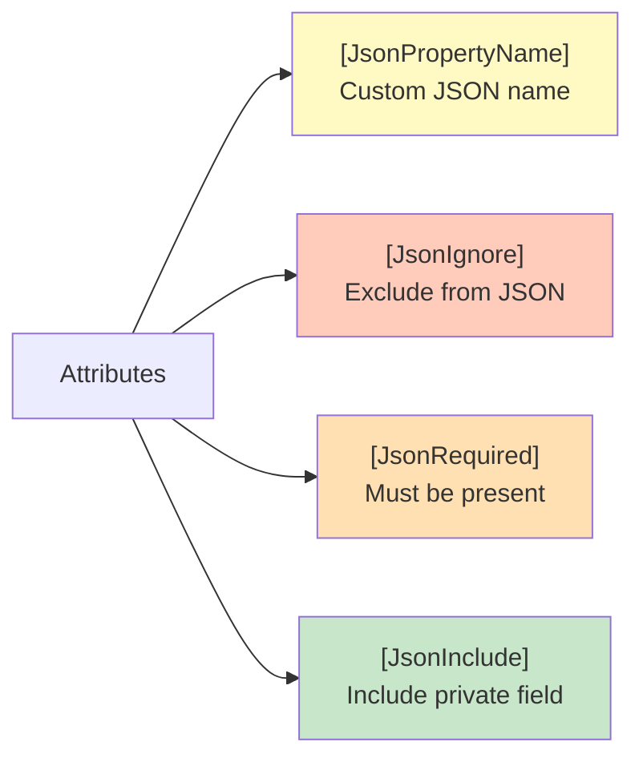
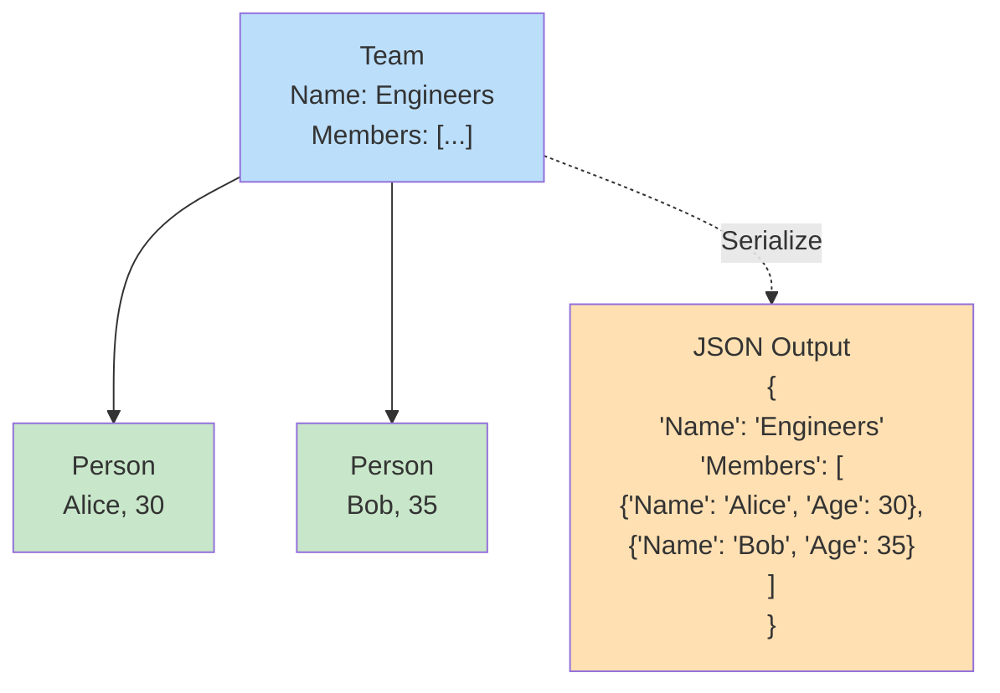
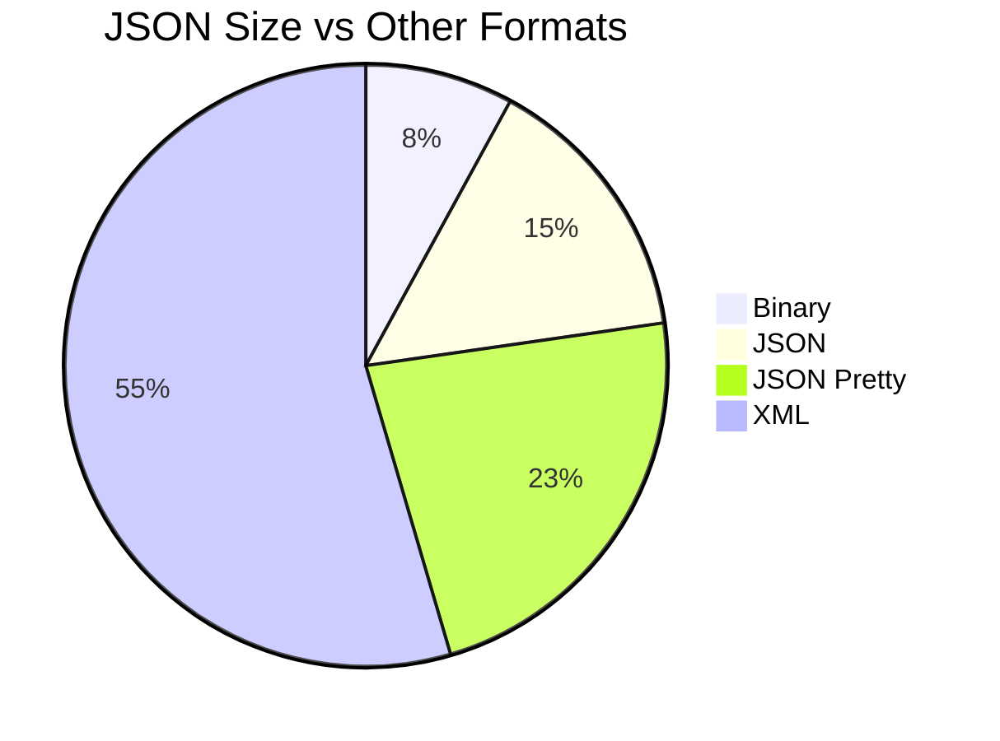
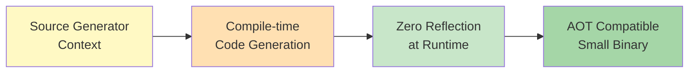
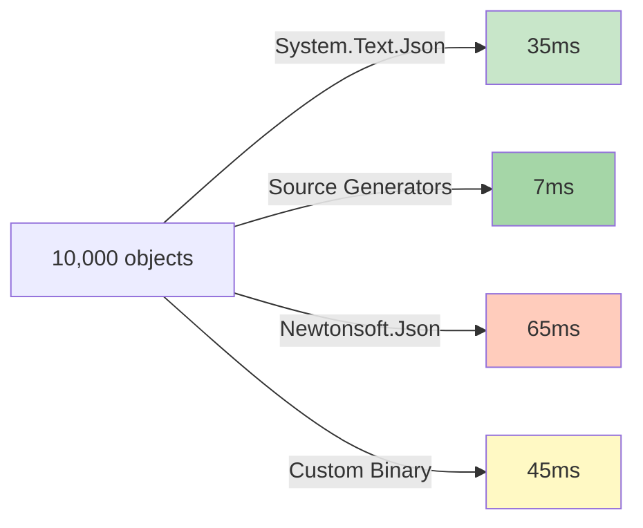
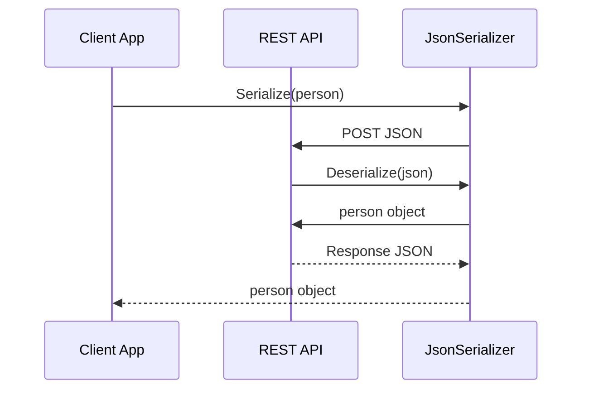

# Diagramy: JSON Serialization

## Diagram 1: JSON Serialization Flow

## Diagram 2: JsonSerializerOptions

## Diagram 3: Attributes Control

## Diagram 4: Nested Object Serialization

## Diagram 5: Size Comparison

## Diagram 6: Source Generators (Zero Reflection)

## Diagram 7: Performance: JSON Serialization (10,000 objects)

## Diagram 8: REST API JSON Flow

