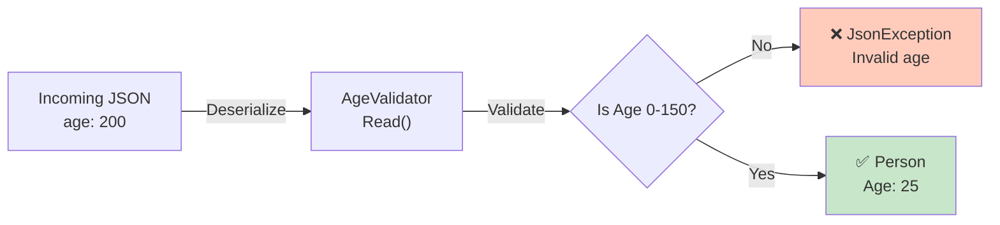
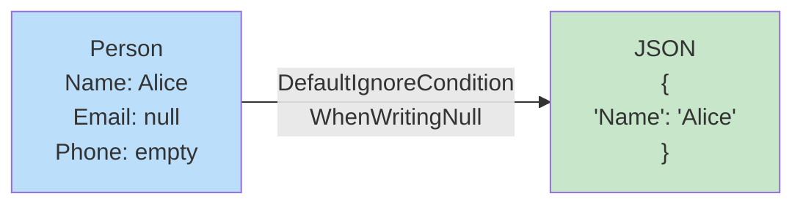
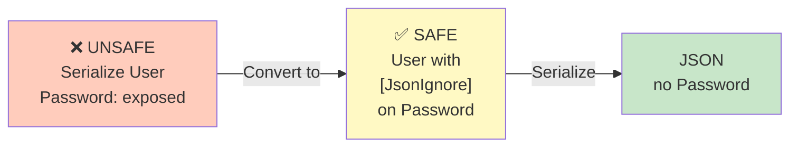
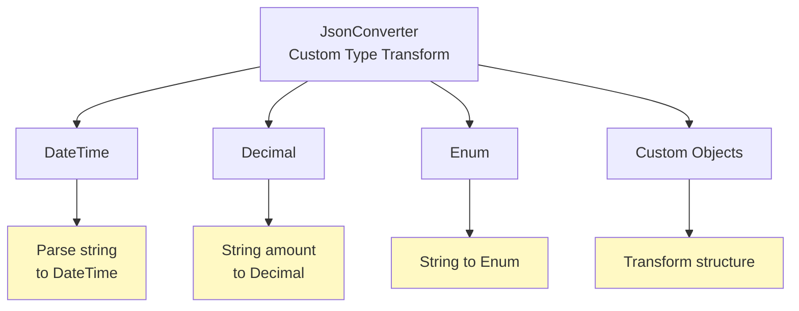
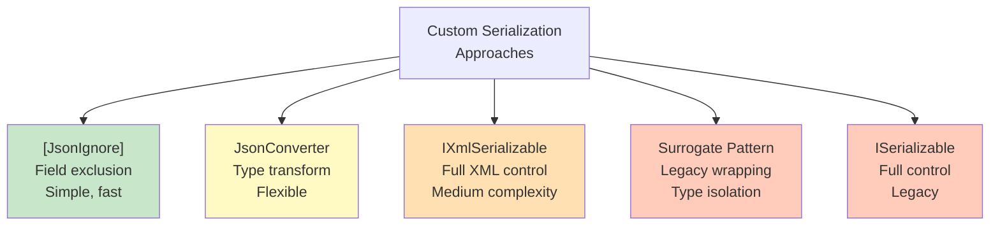

# Diagramy: Custom Serialization

## Diagram 1: JsonConverter Workflow

```mermaid
graph LR
    A["Person<br/>BirthDate: DateTime"]
    
    A -->|Write()| B["JSON String<br/>date: '1990-05-15'"]
    
    B -->|Read()| C["Parsed DateTime<br/>1990, 5, 15"]
    
    C -->|Validate| D["Valid/Invalid<br/>Exception if invalid"]
    
    style A fill:#bbdefb
    style B fill:#c8e6c9
    style C fill:#fff9c4
    style D fill:#ffccbc
```

## Diagram 2: IXmlSerializable Interface

```mermaid
graph TD
    A["Person Object"]
    
    A -->|WriteXml()| B["XML Output<br/>&lt;Person name='Alice' age='30' /&gt;"]
    
    B -->|ReadXml()| C["Restored Person<br/>Name: Alice, Age: 30"]
    
    style A fill:#bbdefb
    style B fill:#c8e6c9
    style C fill:#bbdefb
```

## Diagram 3: Surrogate Pattern

```mermaid
graph LR
    A["LegacyPerson<br/>(can't modify)"]
    
    A -->|FromPerson()| B["LegacyPersonSurrogate<br/>(wrapper)"]
    
    B -->|Serialize| C["JSON"]
    
    C -->|Deserialize| D["LegacyPersonSurrogate"]
    
    D -->|ToPerson()| E["LegacyPerson<br/>restored"]
    
    style A fill:#ffccbc
    style B fill:#fff9c4
    style C fill:#c8e6c9
    style D fill:#fff9c4
    style E fill:#a5d6a7
```

## Diagram 4: Custom Validation



## Diagram 5: Conditional Serialization



## Diagram 6: Security: Sensitive Data Handling



## Diagram 7: Converter Type Support



## Diagram 8: Custom Serialization Approaches


