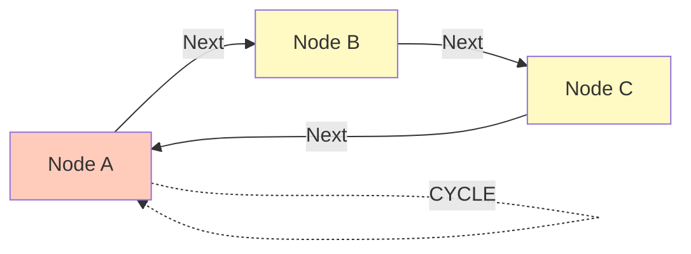
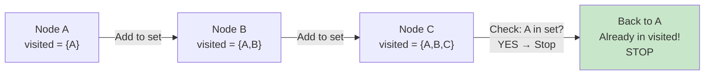
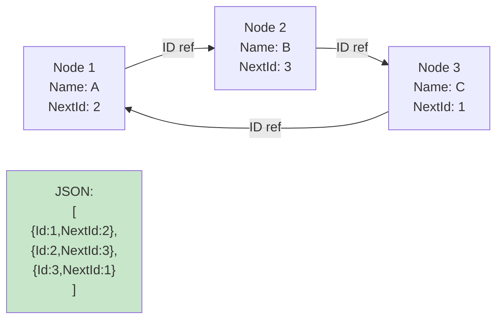
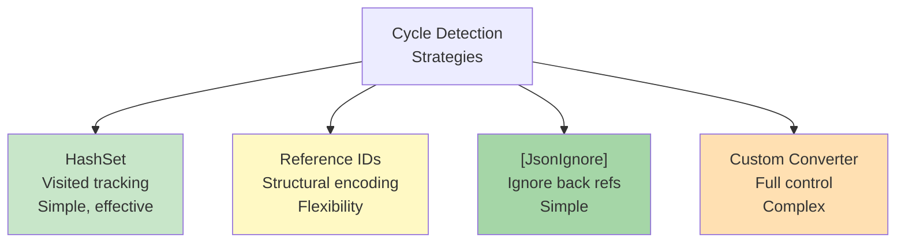
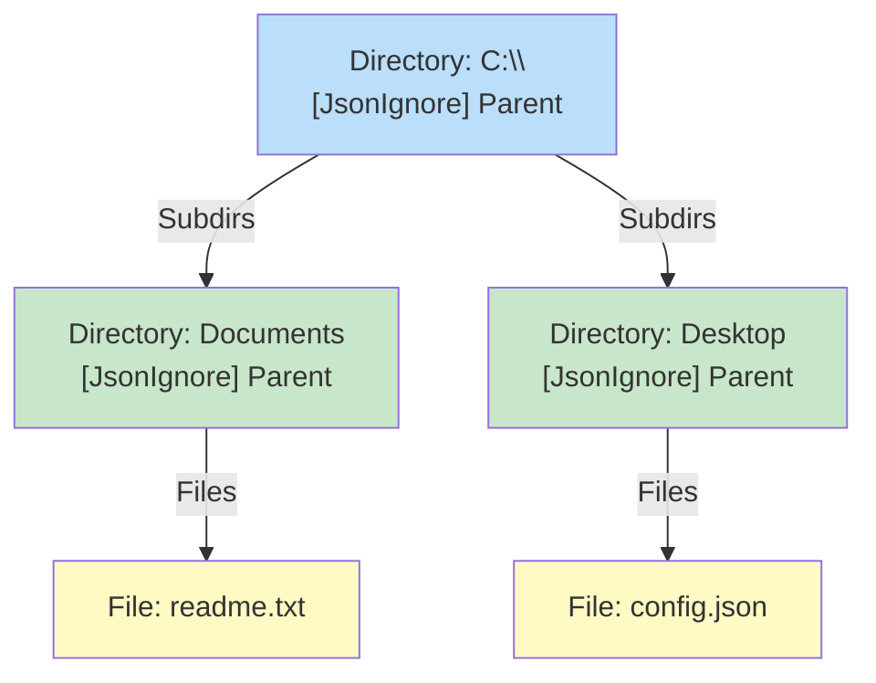

# Diagramy: Circular References

## Diagram 1: Cycle Problem Visualization



## Diagram 2: Naive Serialization (Infinite Loop)


## Diagram 3: Cycle Detection with HashSet



## Diagram 4: Reference ID Solution



## Diagram 5: Parent-Child [JsonIgnore]

```mermaid
graph TD
    A["Department<br/>Engineers"]
    B["Employee: Alice<br/>Department: ref"]
    C["Employee: Bob<br/>Department: ref"]
    
    A -->|Employees| B
    A -->|Employees| C
    B -.->|[JsonIgnore]| A
    C -.->|[JsonIgnore]| A
    
    style B fill:#c8e6c9
    style C fill:#c8e6c9
    style A fill:#fff9c4
```

## Diagram 6: DFS vs BFS Traversal

```mermaid
graph LR
    A["DFS<br/>Deep-first<br/>Stack-based"]
    B["BFS<br/>Broad-first<br/>Queue-based"]
    
    A -->|Order: A,B,C| C["A → B → C"]
    B -->|Order: A,(B,C)| D["A → B,C → ..."]
    
    style C fill:#fff9c4
    style D fill:#ffe0b2
```

## Diagram 7: Cycle Detection Strategies



## Diagram 8: Real-World Example: File System


