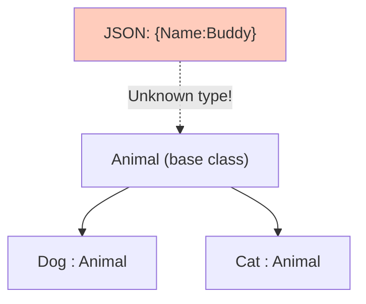
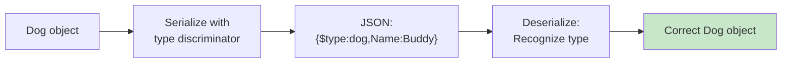
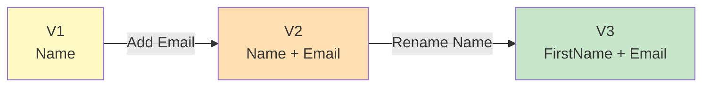
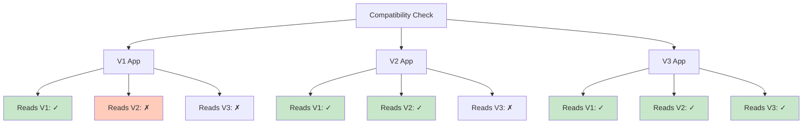
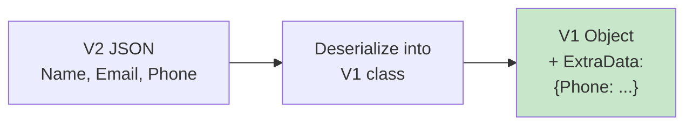
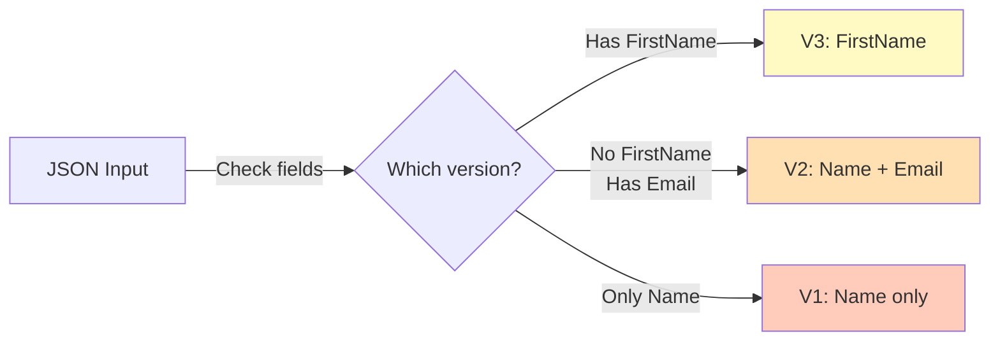
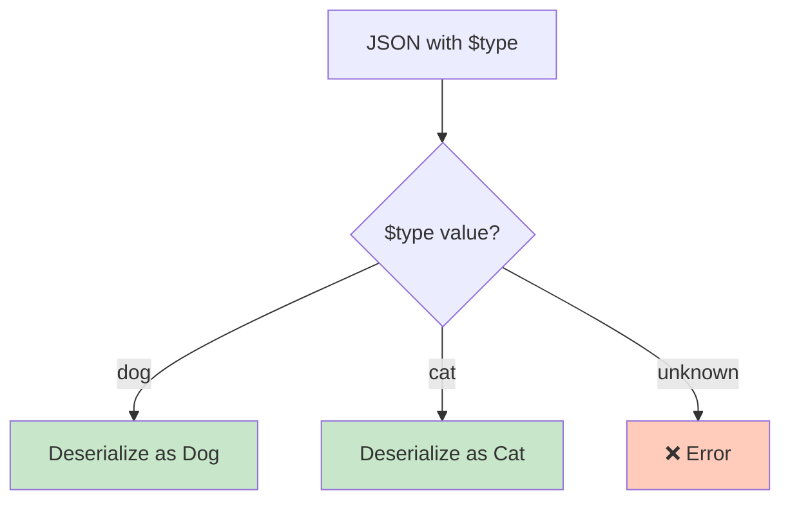
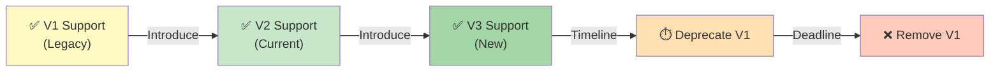

# Diagramy: Advanced Features

## Diagram 1: Polymorphism Challenge

## Diagram 2: Type Discriminator Solution

## Diagram 3: Versioning Timeline

## Diagram 4: Backward Compatibility Matrix

## Diagram 5: [JsonExtensionData] for Extra Fields

## Diagram 6: Version Detection

## Diagram 7: Type Discriminator Pattern

## Diagram 8: Gradual Migration Strategy

