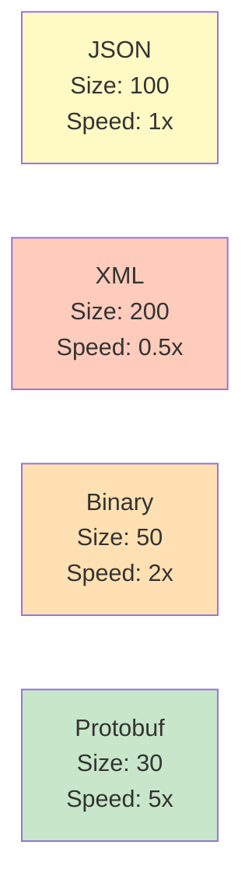
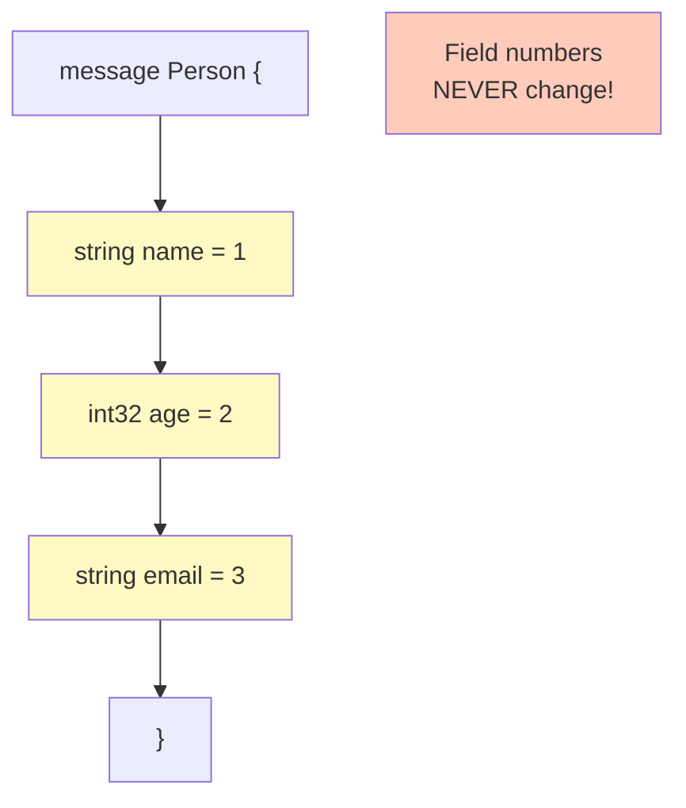
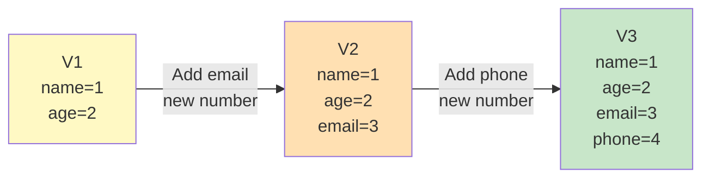
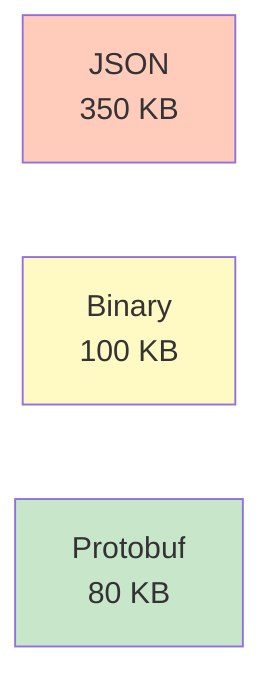
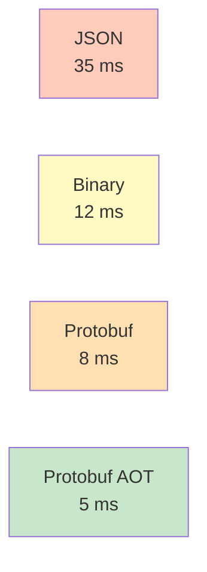
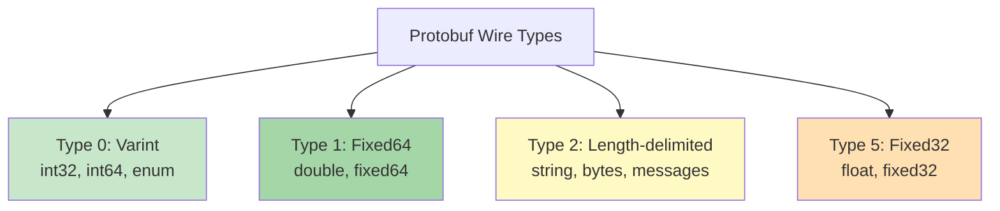
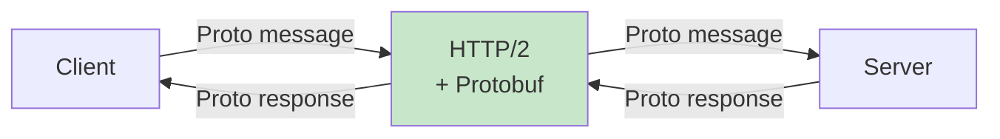
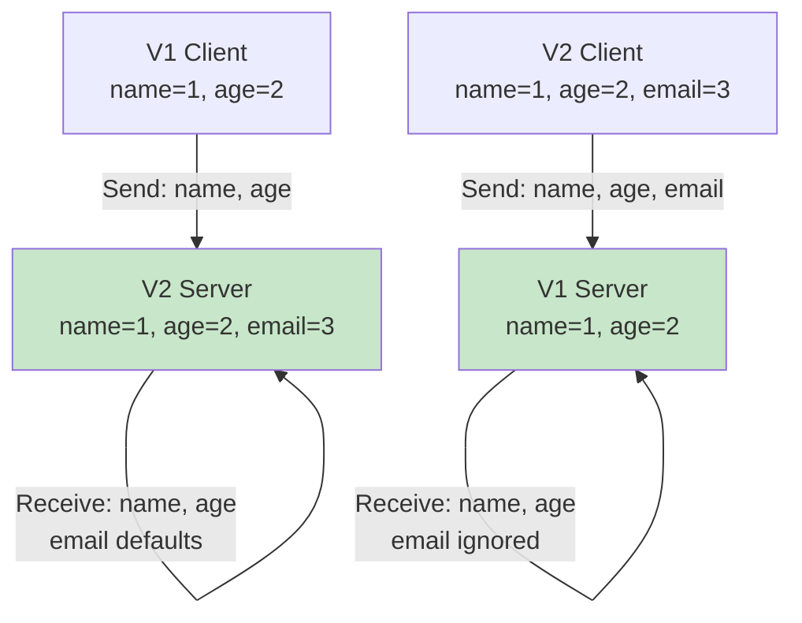

# Diagramy: Protocol Buffers

## Diagram 1: Protobuf vs JSON vs Binary

## Diagram 2: .proto Message Structure

## Diagram 3: Field Number Immutability

## Diagram 4: Size Comparison

## Diagram 5: Serialization Performance

## Diagram 6: Wire Types

## Diagram 7: gRPC Architecture

## Diagram 8: Version-Safe Evolution

