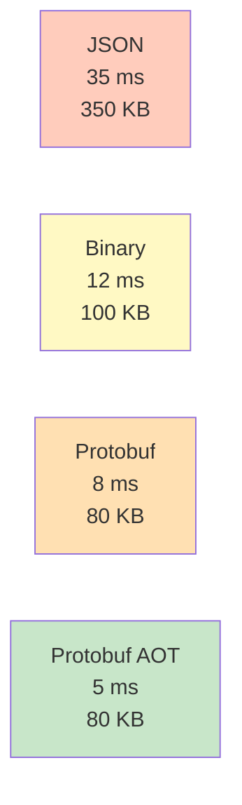
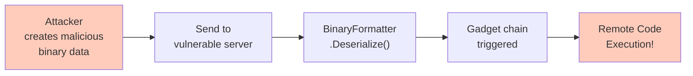
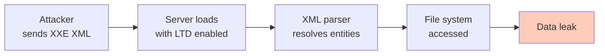
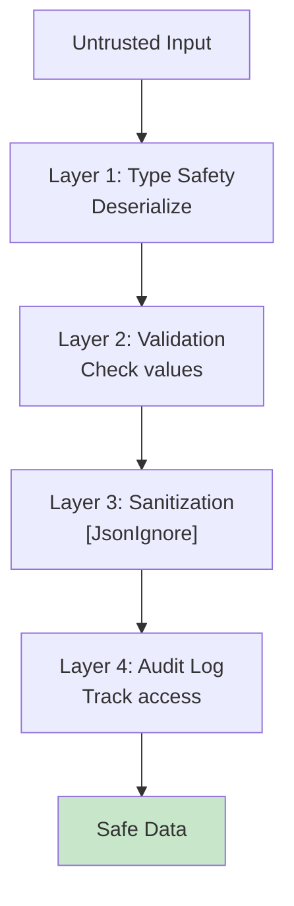
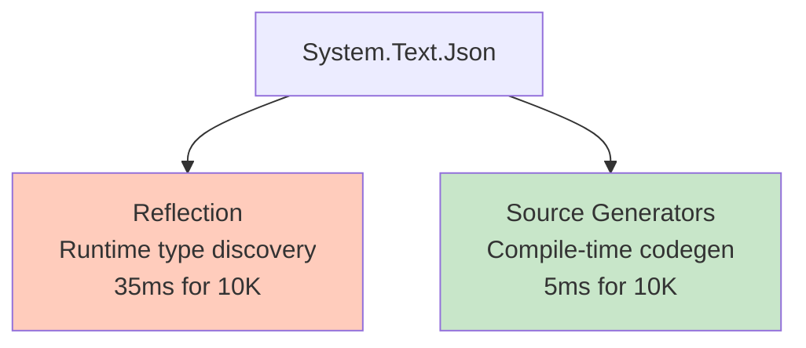
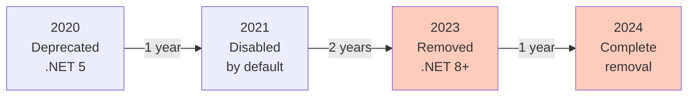
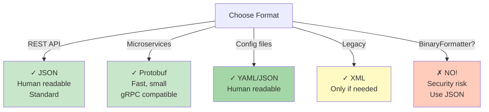
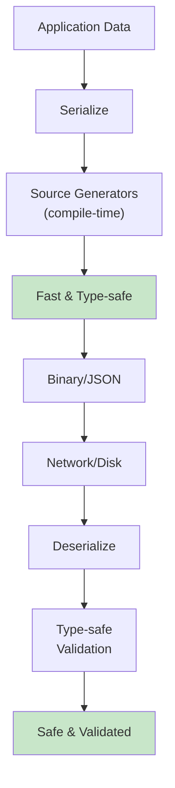

# Diagramy: Performance & Security

## Diagram 1: Performance Comparison

## Diagram 2: BinaryFormatter RCE Attack

## Diagram 3: XXE Attack Flow

## Diagram 4: Security Defense Layers

## Diagram 5: Source Generators vs Reflection

## Diagram 6: BinaryFormatter Timeline

## Diagram 7: Format Decision Tree

## Diagram 8: Production Serialization Stack

