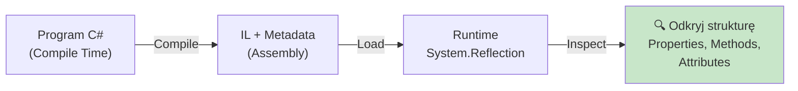
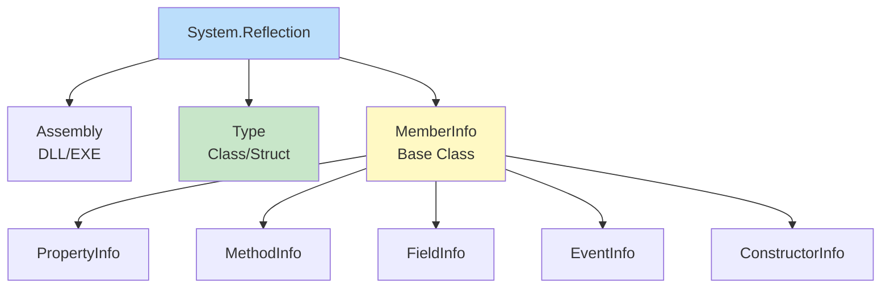
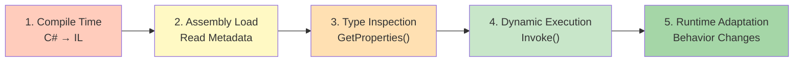
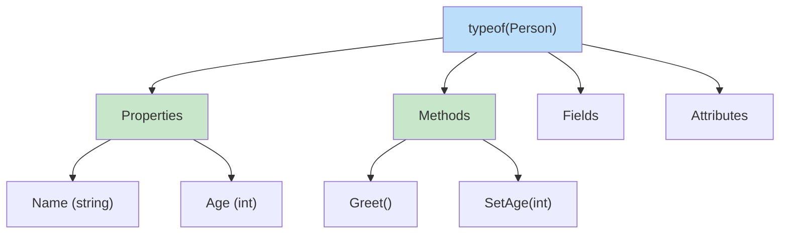
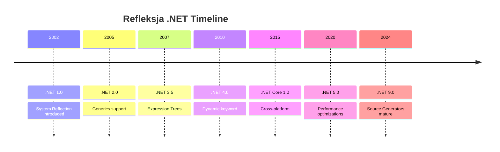
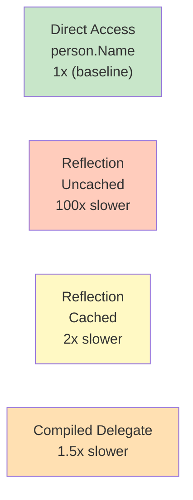
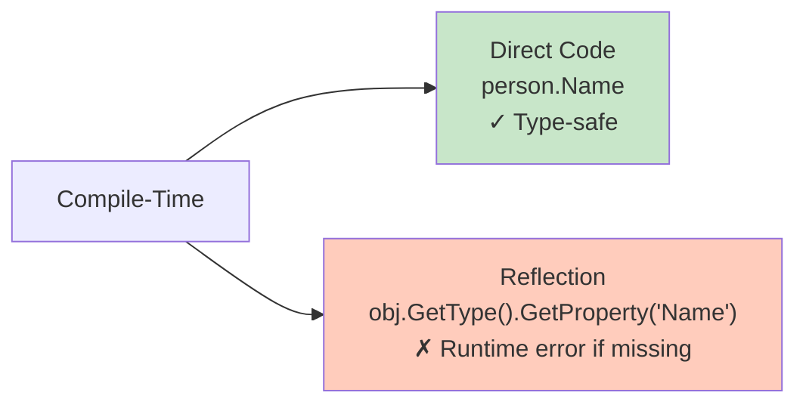
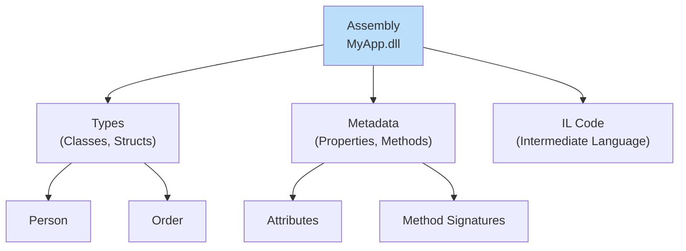

# Diagramy: Refleksja - Wprowadzenie

## Diagram 1: Czym jest Refleksja

## Diagram 2: System.Reflection Namespace Hierarchy

## Diagram 3: Refleksja Workflow

## Diagram 4: System.Type - Example

## Diagram 5: Historia .NET Reflection

## Diagram 6: Performance - Direct vs Reflection

## Diagram 7: Type Safety Loss

## Diagram 8: Assembly Structure

