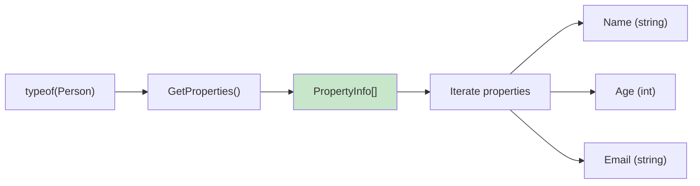
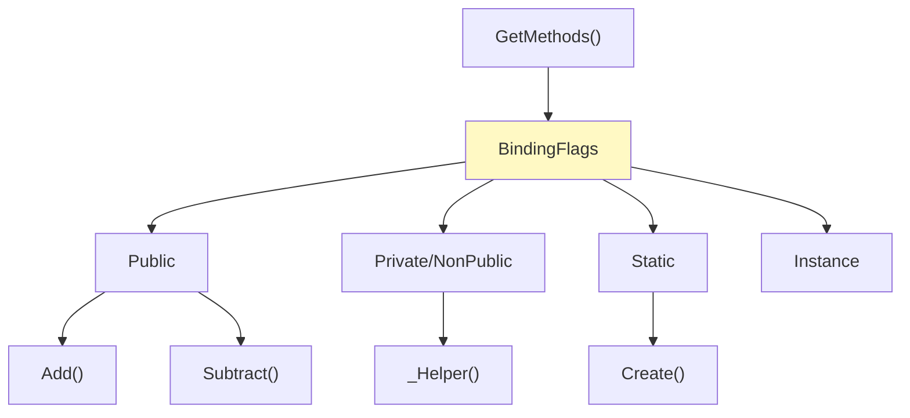
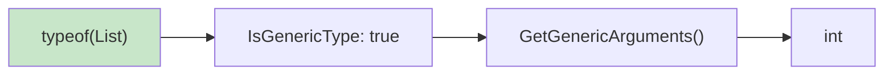
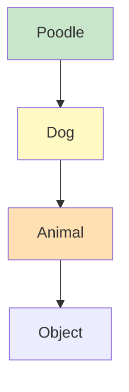
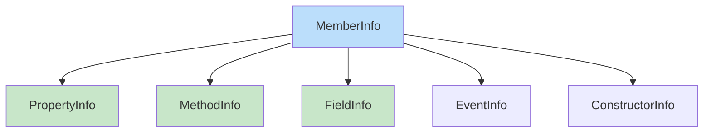
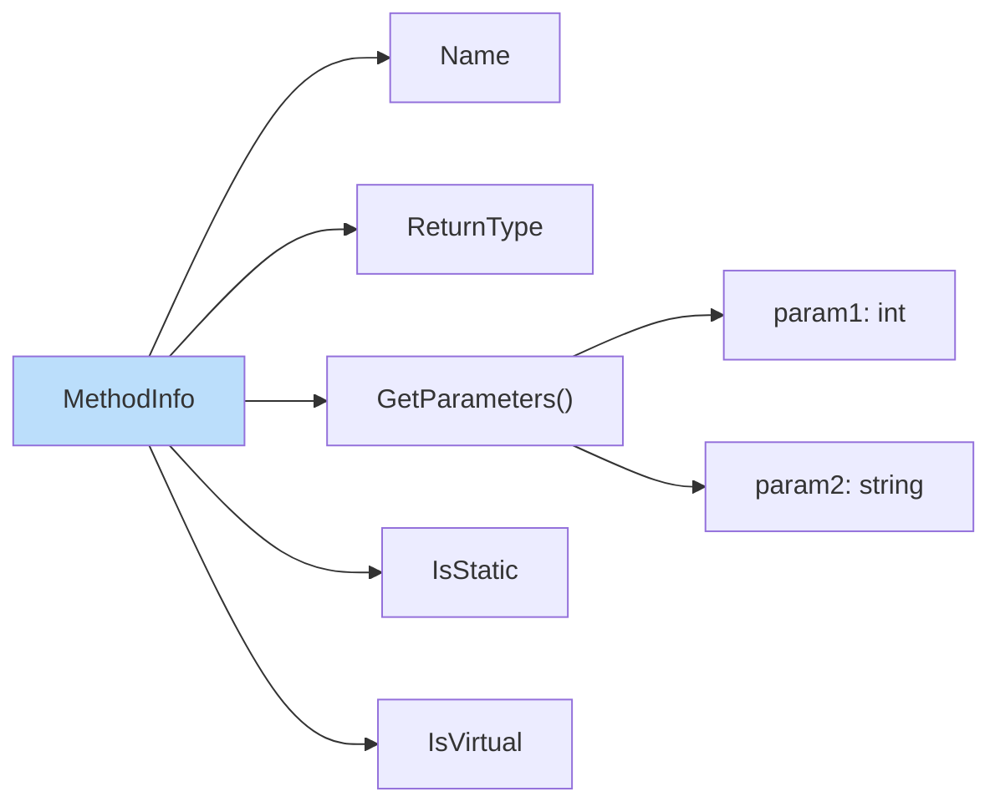
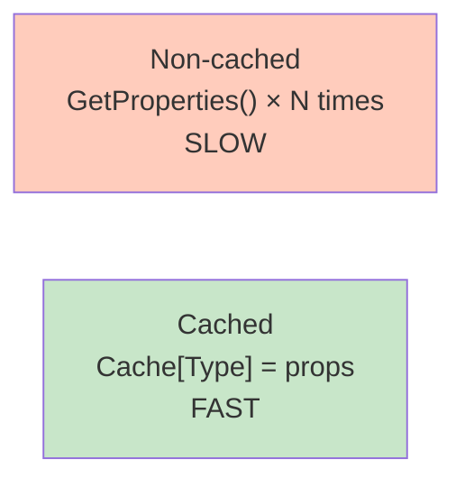
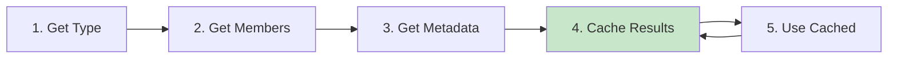

# Diagramy: Type Inspection

## Diagram 1: GetProperties() Workflow

## Diagram 2: GetMethods() with BindingFlags

## Diagram 3: Generic Type Inspection

## Diagram 4: Inheritance Hierarchy

## Diagram 5: MemberInfo Hierarchy

## Diagram 6: MethodInfo Details

## Diagram 7: Performance - Caching

## Diagram 8: Type Inspection Flow

