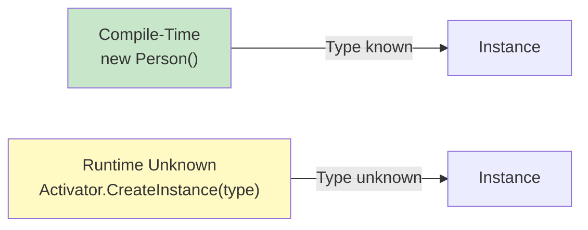
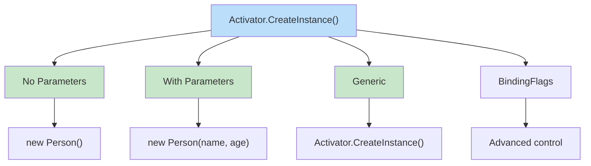
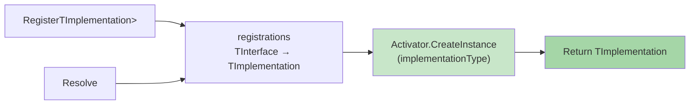
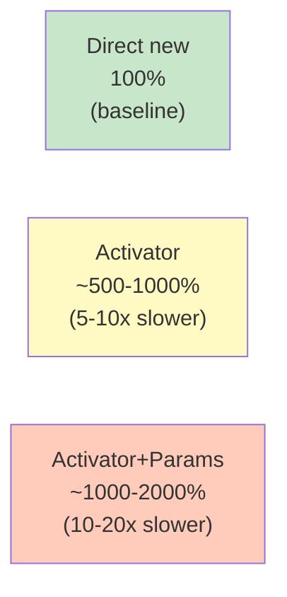
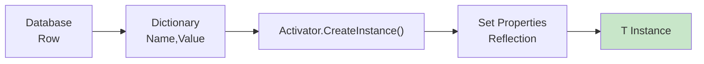
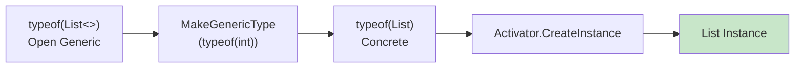
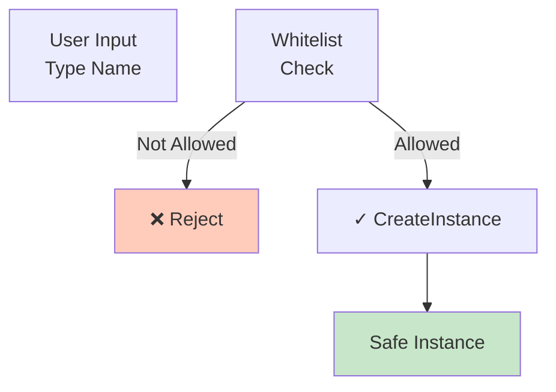

# Diagramy: System.Activator

## Diagram 1: new vs Activator.CreateInstance



## Diagram 2: CreateInstance Variants



## Diagram 3: Plugin System Architecture

```mermaid
graph LR
    App["Application"]
    Loader["PluginLoader"]
    Assembly["Loaded Assembly"]
    Plugin["IPlugin Instance"]
    
    App --> Loader
    Loader -->|LoadFrom| Assembly
    Assembly -->|GetType()| IPlugin["IPlugin Type"]
    IPlugin -->|Activator.CreateInstance| Plugin
    Plugin -->|Execute| Result["Result"]
    
    style Plugin fill:#c8e6c9
```

## Diagram 4: DI Container with Activator



## Diagram 5: Performance - new vs Activator



## Diagram 6: ORM Mapping Flow



## Diagram 7: Generic Type Creation



## Diagram 8: Security - Type Validation


