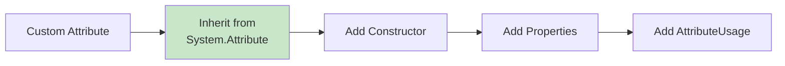
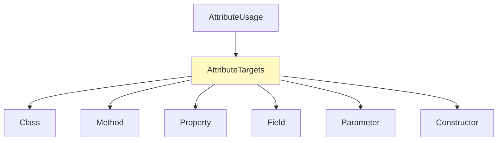
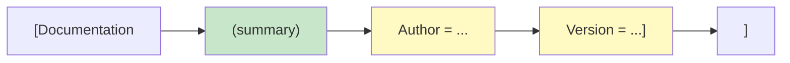
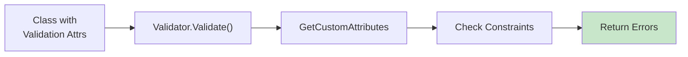
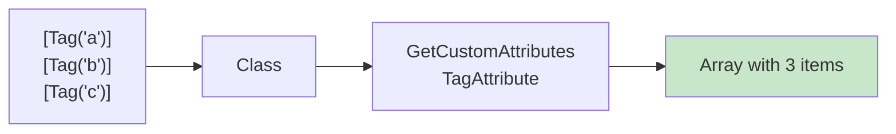
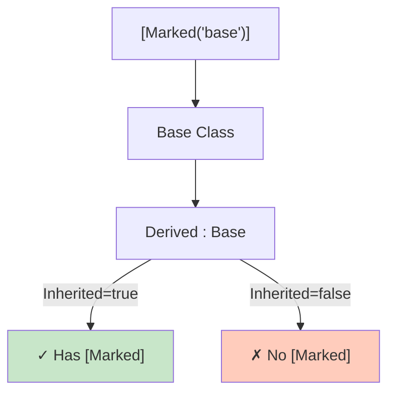
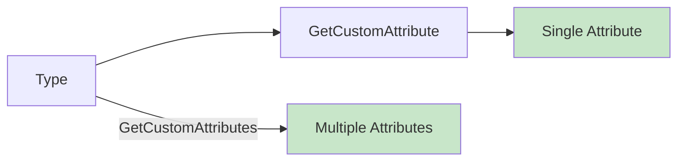
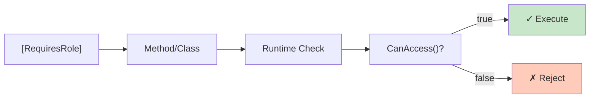

# Diagramy: Custom Attributes

## Diagram 1: Attribute Structure

## Diagram 2: AttributeUsage & AttributeTargets

## Diagram 3: Attribute with Constructor & Named Params

## Diagram 4: Validation Attribute Workflow

## Diagram 5: AllowMultiple = true

## Diagram 6: Inherited = true/false

## Diagram 7: Attribute Reading Flow

## Diagram 8: Security Attributes

