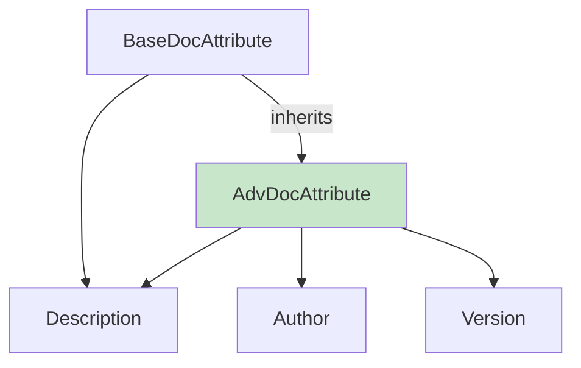
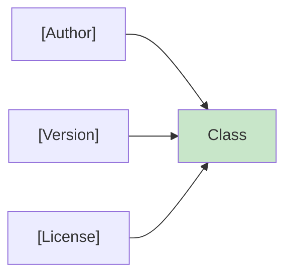
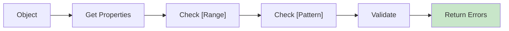
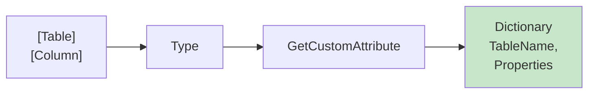
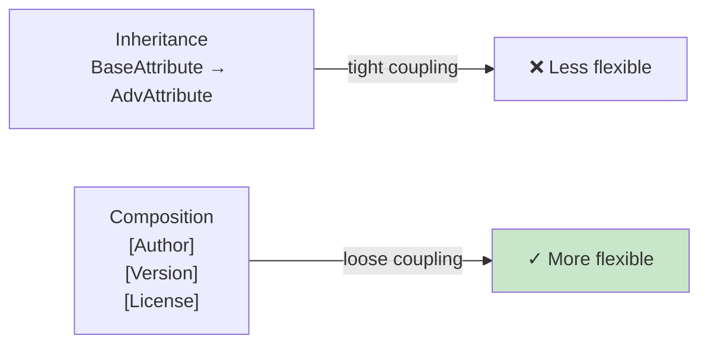
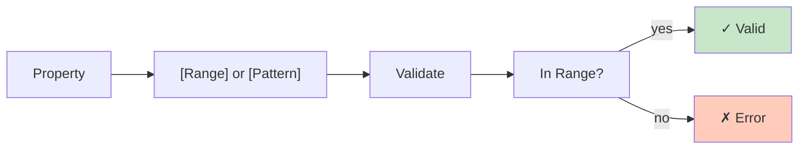
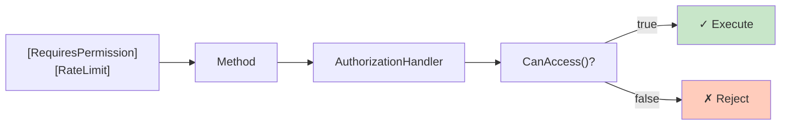
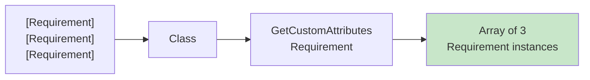

# Diagramy: Advanced Attributes

## Diagram 1: Attribute Inheritance

## Diagram 2: Attribute Stacking

## Diagram 3: Advanced Validation Flow

## Diagram 4: ORM Metadata Extraction

## Diagram 5: Composition vs Inheritance

## Diagram 6: Constraint Validation

## Diagram 7: Security Attributes

## Diagram 8: AllowMultiple Attributes

