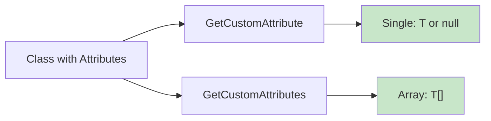
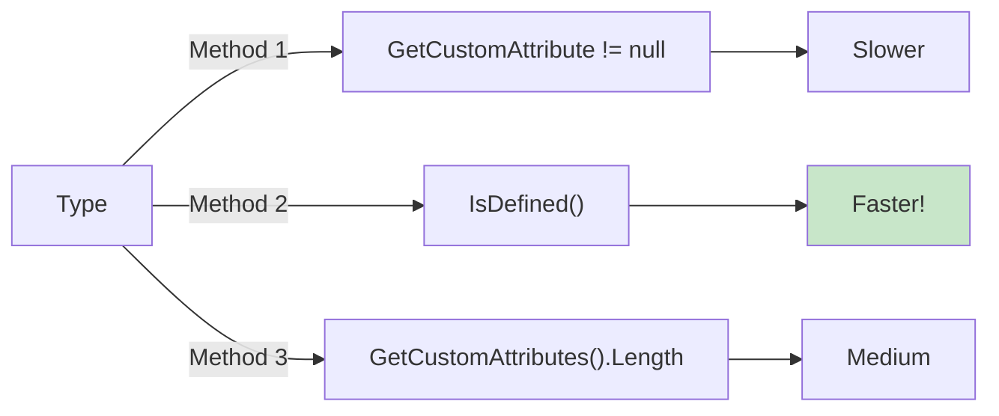
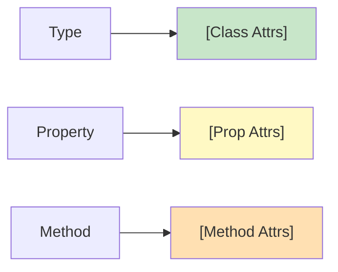
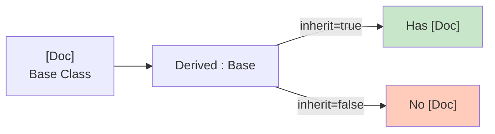
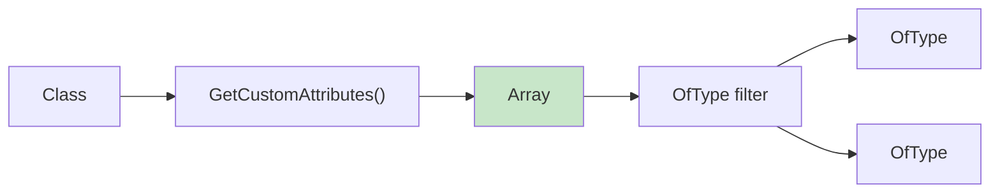
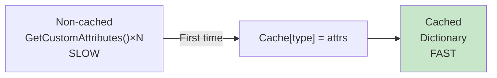
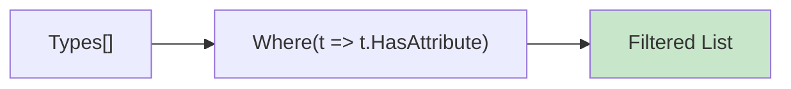
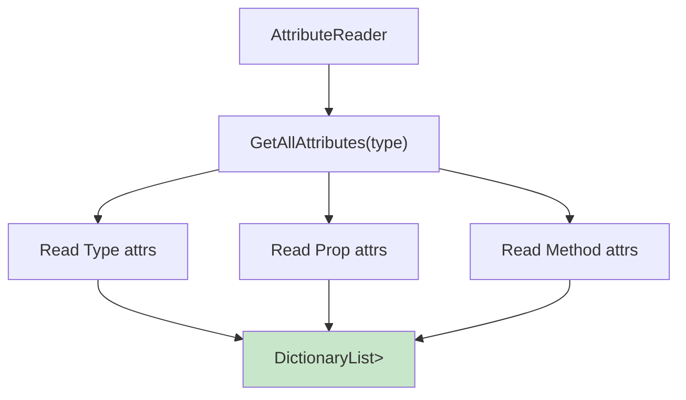

# Diagramy: Reading Attributes

## Diagram 1: GetCustomAttribute vs GetCustomAttributes

## Diagram 2: Attribute Existence Check

## Diagram 3: Reading Attributes at Different Levels

## Diagram 4: Inherit Parameter Effect

## Diagram 5: GetCustomAttributes Untyped

## Diagram 6: Attribute Caching

## Diagram 7: LINQ Filtering Pattern

## Diagram 8: AttributeReader Pattern

