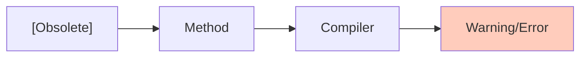
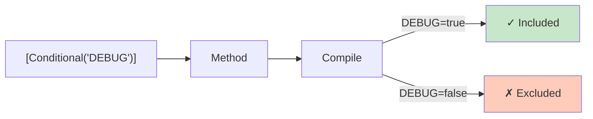
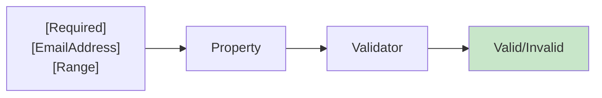
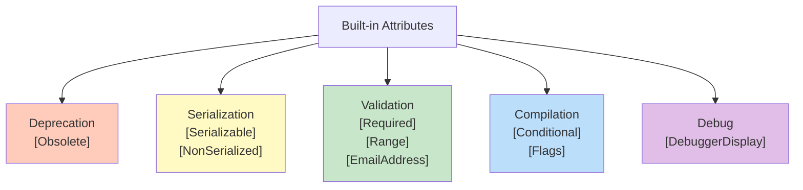
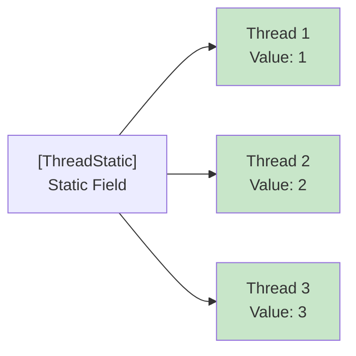
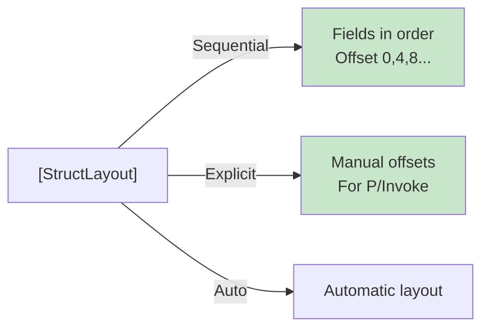

# Diagramy: Built-in Attributes

## Diagram 1: [Obsolete] Deprecation



## Diagram 2: [Flags] Enum Benefits

```mermaid
graph LR
    A["Enum"]
    
    A -->|Without [Flags]| Bad["Output: 3"]
    A -->|With [Flags]| Good["Output: Read, Write"]
    
    style Good fill:#c8e6c9
    style Bad fill:#ffccbc
```

## Diagram 3: [Conditional] Compilation



## Diagram 4: DataAnnotations Validation



## Diagram 5: Serialization Attributes

```mermaid
graph LR
    A["[Serializable]"]
    B["Class"]
    C["BinaryFormatter"]
    D["Serialized"]
    
    A --> B --> C --> D
    
    B -->|[NonSerialized]| Skip["Skip field"]
    
    style D fill:#c8e6c9
```

## Diagram 6: Built-in Attributes Categories



## Diagram 7: [ThreadStatic] Storage



## Diagram 8: [StructLayout] Memory Control


