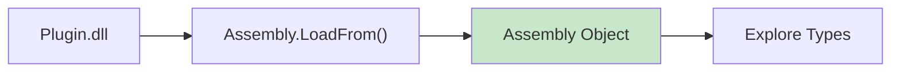
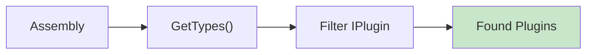
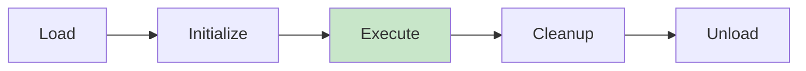
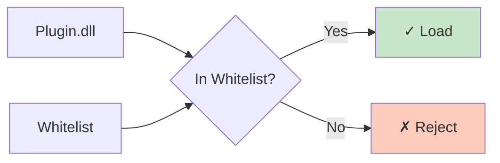
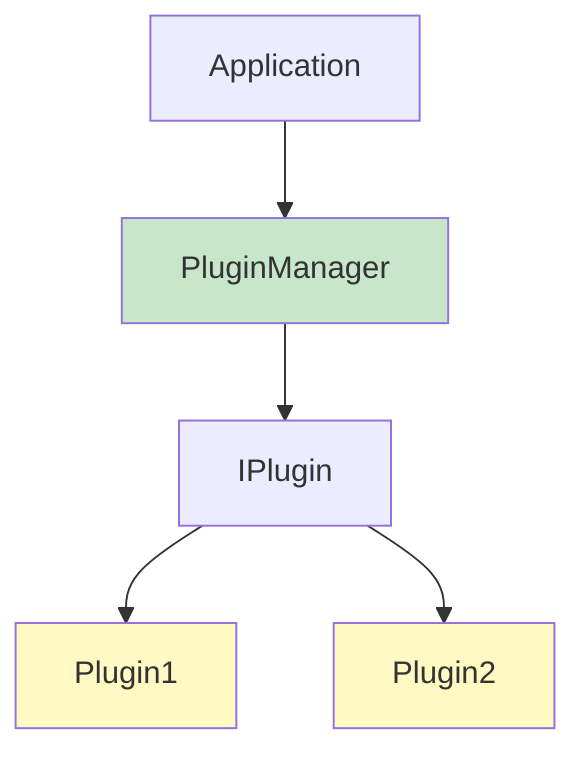
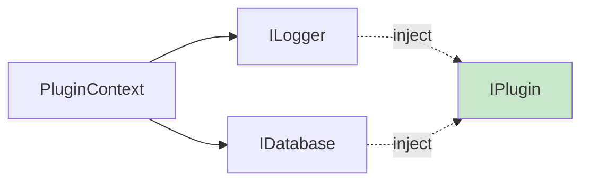
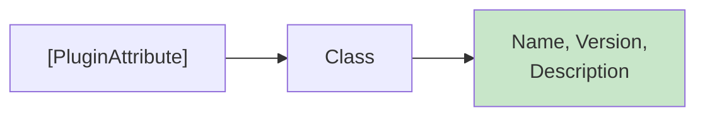
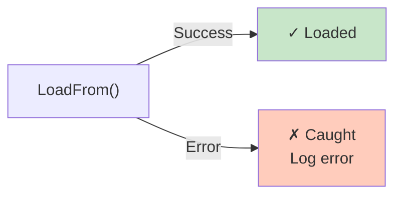

# Diagramy: Plugin System

## Diagram 1: Assembly Loading Flow

## Diagram 2: Plugin Discovery

## Diagram 3: Plugin Manager Lifecycle

## Diagram 4: Security Whitelisting

## Diagram 5: Plugin Architecture

## Diagram 6: Dependency Injection

## Diagram 7: Plugin Attributes

## Diagram 8: Error Handling

