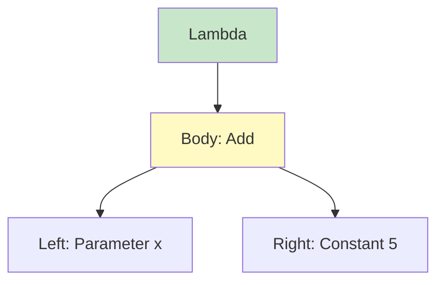
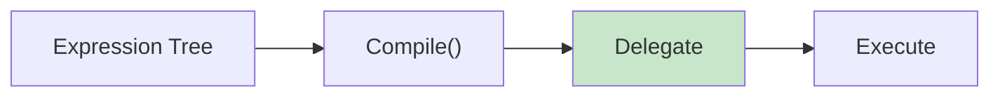
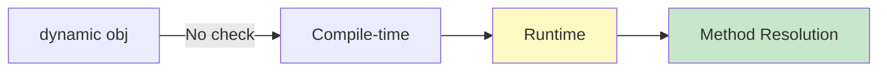
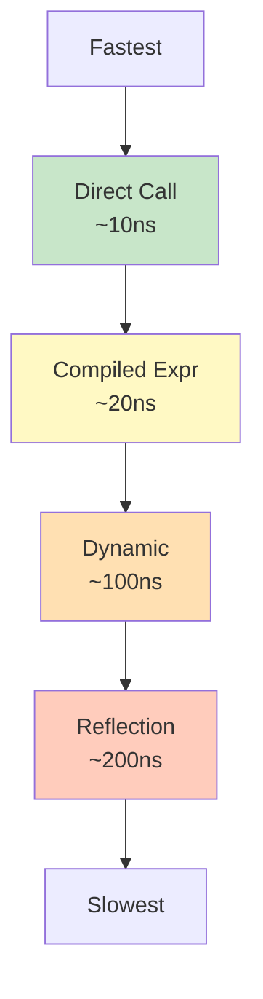
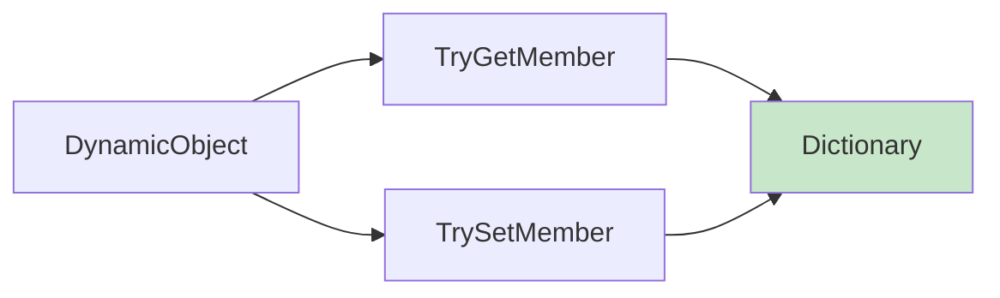
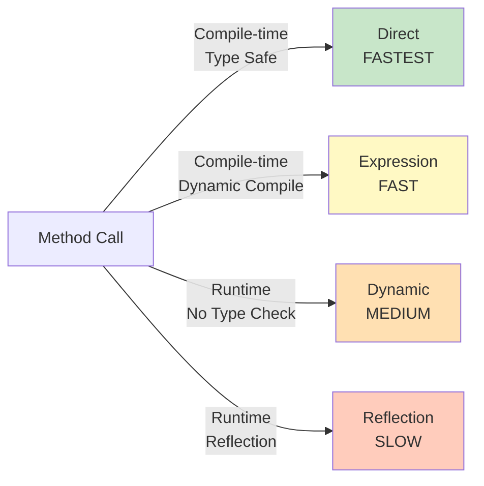
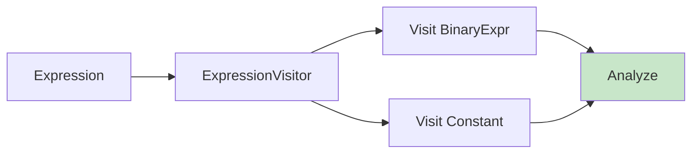
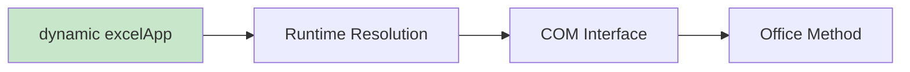

# Diagramy: Expression Trees & Dynamic

## Diagram 1: Expression Tree Structure

## Diagram 2: Expression Compilation

## Diagram 3: Dynamic Type Resolution

## Diagram 4: Performance Hierarchy

## Diagram 5: DynamicObject Override

## Diagram 6: Reflection vs Expression vs Dynamic

## Diagram 7: Expression Visitor

## Diagram 8: COM Interop with Dynamic

