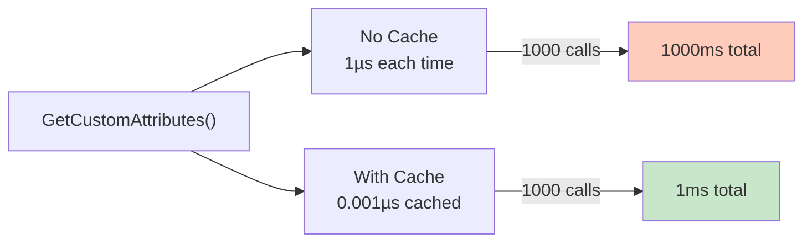
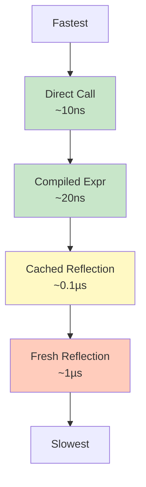
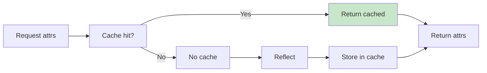
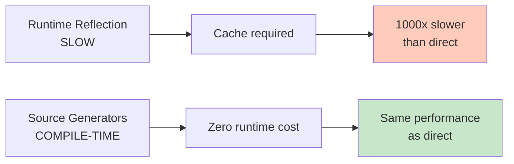
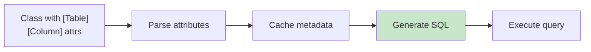
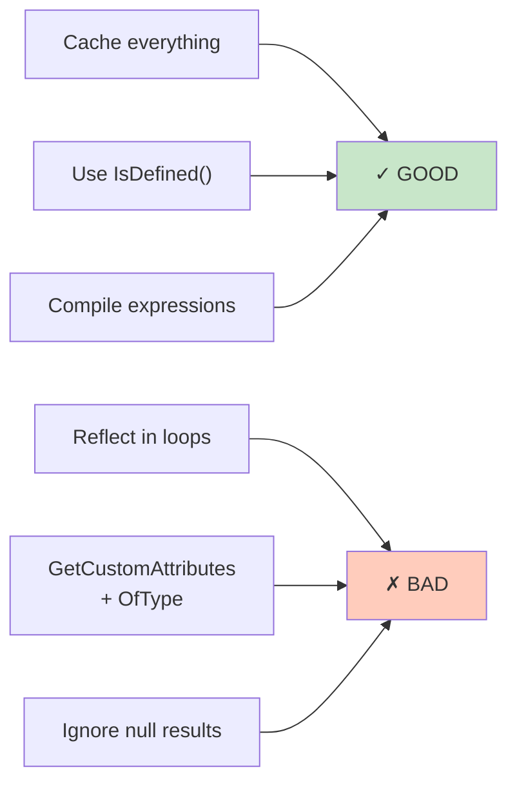
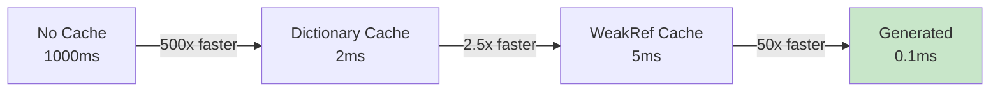

# Diagramy: Performance & Best Practices

## Diagram 1: Caching Impact



## Diagram 2: Reflection Performance Hierarchy



## Diagram 3: Caching Strategy



## Diagram 4: Source Generators Alternative



## Diagram 5: ORM Pattern



## Diagram 6: DO's and DON'Ts



## Diagram 7: Benchmark Results



## Diagram 8: AOT Compatibility

```mermaid
graph LR
    A["Reflection Code"]
    
    A -->|Runtime<br/>GetMethods()| Bad["❌ AOT Problem"]
    A -->|Annotated<br/>[DynamicallyAccessedMembers]| Good["✓ AOT Safe"]
    
    style Good fill:#c8e6c9
    style Bad fill:#ffccbc
```
