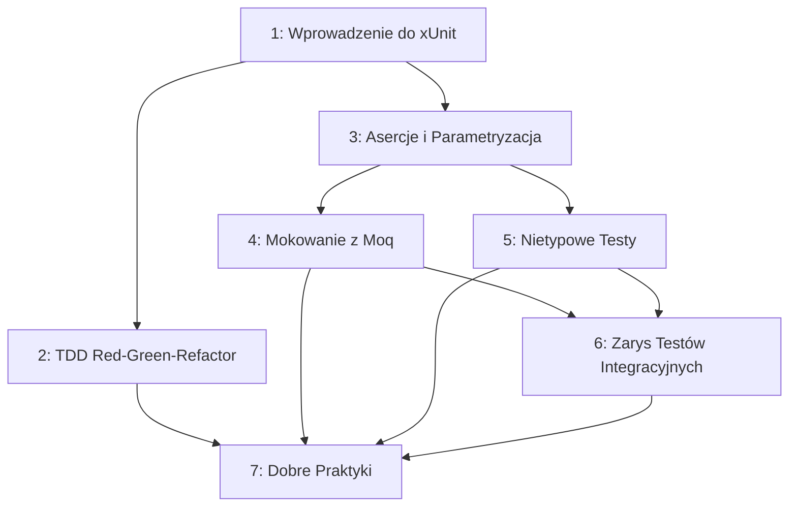

# Testy Jednostkowe i TDD w C#

## 📚 Wprowadzenie

Moduł kompleksowo omawia **testy jednostkowe (unit tests)** i podejście **Test-Driven Development (TDD)** z wykorzystaniem **xUnit** – standardowego frameworku testowego w ekosystemie .NET.

Od filozofii testowania i cyklu Red-Green-Refactor, przez asercje i parametryzację, mokowanie zależności za pomocą **Moq**, nietypowe scenariusze testowe (wyjątki, asynchroniczność, czas, losowość), aż po zarys testów integracyjnych i dobre praktyki poparte sugestywnymi przykładami.

Wszystkie tematy korzystają ze wspólnego, spójnego przykładu domenowego – systemu obsługi zamówień (`OrderService`) – aby pokazać jak te same klasy testuje się na różne sposoby w zależności od potrzeby.

---

## 📋 Tematy (7 wykładów)

| # | Temat | Opis |
|---|-------|------|
| 1 | [Testy Jednostkowe – Wprowadzenie i Filozofia](_01_testing_fundamentals/README.md) | Po co testować, piramida testów, xUnit: `[Fact]`, `Assert`, uruchamianie `dotnet test` |
| 2 | [Test-Driven Development: Red-Green-Refactor](_02_tdd_red_green_refactor/README.md) | Cykl TDD, pisanie testu przed kodem, refaktoryzacja pod ochroną testów |
| 3 | [Asercje, Organizacja i Parametryzacja Testów](_03_assertions_test_organization/README.md) | Biblioteka `Assert`, `[Theory]`, `InlineData`, `MemberData`, wzorzec Arrange-Act-Assert |
| 4 | [Mokowanie Zależności z Moq](_04_mocking_dependencies/README.md) | Interfejsy jako punkt izolacji, `Mock<T>`, `Setup`, `Verify`, `Callback`, `It.Is` |
| 5 | [Nietypowe Testy: Wyjątki, Czas, Async](_05_unusual_tests/README.md) | `Assert.Throws`, testy asynchroniczne, testowanie `DateTime`/`Random` przez abstrakcję, `IClassFixture` |
| 6 | [Zarys Testów Integracyjnych](_06_integration_tests_overview/README.md) | Unit vs integration, testy z realnym I/O, `WebApplicationFactory`, EF Core InMemory, Testcontainers |
| 7 | [Dobre Praktyki i Sugestywne Przykłady](_07_best_practices_examples/README.md) | Zasady F.I.R.S.T., anti-patterns, pokrycie kodu, czytelne nazewnictwo testów |

---

## 🗺️ Mapa Zależności Tematów



---

## 🎯 Cele Modułu

Po ukończeniu tego modułu:
- Zrozumiesz **po co** i **kiedy** pisać testy jednostkowe
- Nauczysz się pisać testy w **xUnit** (`[Fact]`, `[Theory]`, `Assert`)
- Poznasz cykl **TDD** (Red-Green-Refactor) i będziesz umiał go stosować
- Nauczysz się **mokować zależności** za pomocą **Moq**, aby izolować testowany kod
- Będziesz umiał testować **nietypowe scenariusze**: wyjątki, kod asynchroniczny, czas, losowość
- Poznasz różnicę między **testami jednostkowymi a integracyjnymi** oraz kiedy stosować które
- Unikniesz najczęstszych **anti-patterns** w testowaniu

---

## 🔗 Powiązania z Innymi Modułami

**Wymaga:**
- [Moduł 1: Klasy i Obiekty](../01-klasy/README.md) – podstawy OOP
- [Moduł 7: Interfejsy i Abstrakcja](../07-interfejsy_abstrakcje/README.md) – niezbędne do zrozumienia mokowania (mockujemy interfejsy, nie klasy konkretne)

**Wzbogaca:**
- Wszystkie moduły 1-13 – każdy z nich zawiera kod, który można przećwiczyć testami z tego modułu
- [Moduł A01: ASP.NET Core](../A01-aspnet_core/README.md) – testy jednostkowe kontrolerów/serwisów i testy integracyjne z `WebApplicationFactory`

---

## 🚀 Wymagania

- .NET SDK 9.0 lub nowszy
- Pakiety NuGet: `xunit`, `xunit.runner.visualstudio`, `Microsoft.NET.Test.Sdk`, a od Tematu 4: `Moq`
- Znajomość interfejsów (Moduł 7)

## 📦 Uruchamianie Przykładów

```bash
cd _01_testing_fundamentals/code
dotnet test        # uruchamia testy xUnit
dotnet run          # uruchamia demonstrację w Main()
```

Każdy temat zawiera `README.md`, `code/` (Program.cs + testy xUnit + csproj), `diagrams/` (Mermaid) i `tasks/` (ćwiczenia z rozwiązaniami).
