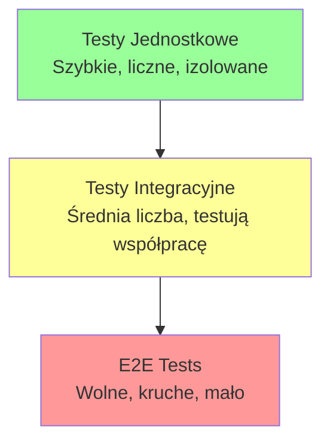
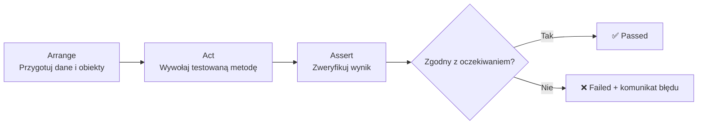
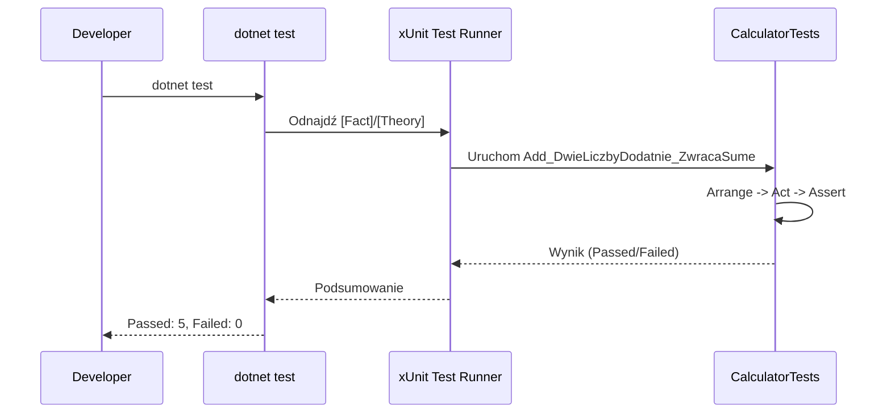

# Diagramy - Testy Jednostkowe: Wprowadzenie i Filozofia

## 1. Piramida Testów

```mermaid
graph TD
    E2E["E2E Tests<br/>Wolne, kruche, mało"]
    INT["Testy Integracyjne<br/>Średnia liczba, testują współpracę"]
    UNIT["Testy Jednostkowe<br/>Szybkie, liczne, izolowane"]

    UNIT --> INT --> E2E

    style UNIT fill:#9f9
    style INT fill:#ff9
    style E2E fill:#f99
```

## 2. Cykl Wykonania Testu (Arrange-Act-Assert)

```mermaid
graph LR
    A["Arrange<br/>Przygotuj dane i obiekty"] --> B["Act<br/>Wywołaj testowaną metodę"]
    B --> C["Assert<br/>Zweryfikuj wynik"]
    C --> D{"Zgodny z oczekiwaniem?"}
    D -->|Tak| E["✅ Passed"]
    D -->|Nie| F["❌ Failed + komunikat błędu"]
```

## 3. Przepływ `dotnet test`

```mermaid
sequenceDiagram
    participant Dev as Developer
    participant CLI as dotnet test
    participant Runner as xUnit Test Runner
    participant Test as CalculatorTests

    Dev->>CLI: dotnet test
    CLI->>Runner: Odnajdź [Fact]/[Theory]
    Runner->>Test: Uruchom Add_DwieLiczbyDodatnie_ZwracaSume
    Test->>Test: Arrange -> Act -> Assert
    Test-->>Runner: Wynik (Passed/Failed)
    Runner-->>CLI: Podsumowanie
    CLI-->>Dev: Passed: 5, Failed: 0
```
