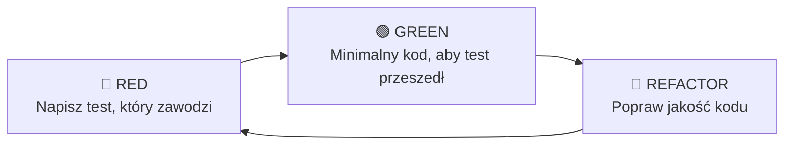
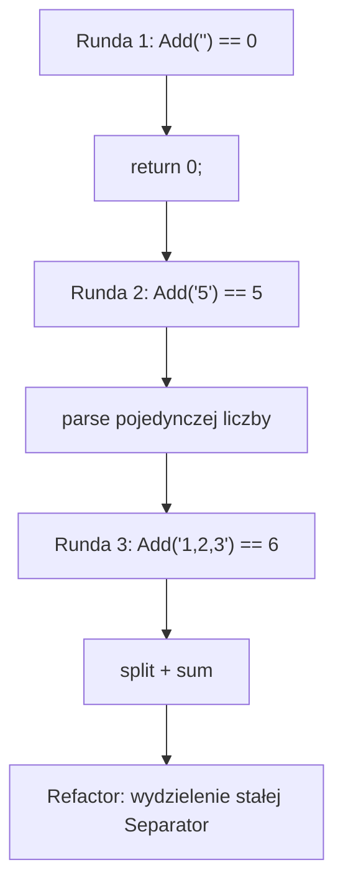
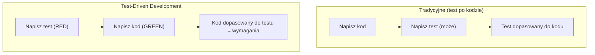

# Diagramy - TDD: Red-Green-Refactor

## 1. Cykl TDD

```mermaid
graph LR
    RED["🔴 RED<br/>Napisz test, który zawodzi"] --> GREEN["🟢 GREEN<br/>Minimalny kod, aby test przeszedł"]
    GREEN --> REFACTOR["🔵 REFACTOR<br/>Popraw jakość kodu"]
    REFACTOR --> RED
```

## 2. Ewolucja `StringCalculator` w Kolejnych Rundach

```mermaid
graph TD
    R1["Runda 1: Add('') == 0"] --> I1["return 0;"]
    R2["Runda 2: Add('5') == 5"] --> I2["parse pojedynczej liczby"]
    R3["Runda 3: Add('1,2,3') == 6"] --> I3["split + sum"]

    I1 --> R2
    I2 --> R3
    I3 --> F["Refactor: wydzielenie stałej Separator"]
```

## 3. TDD vs Tradycyjne Podejście

```mermaid
graph TB
    subgraph Traditional["Tradycyjne (test po kodzie)"]
        TC1["Napisz kod"] --> TC2["Napisz test (może)"] --> TC3["Test dopasowany do kodu"]
    end

    subgraph TDD["Test-Driven Development"]
        TD1["Napisz test (RED)"] --> TD2["Napisz kod (GREEN)"] --> TD3["Kod dopasowany do testu = wymagania"]
    end
```
