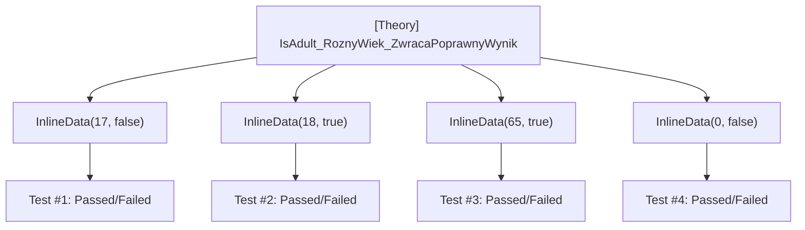
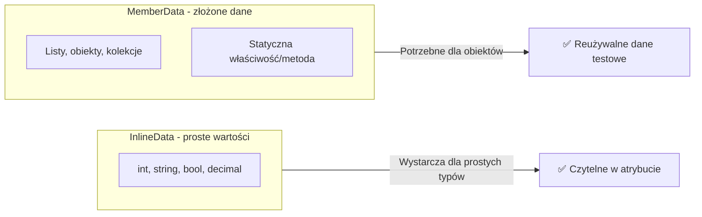
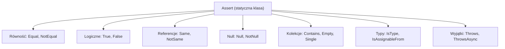

# Diagramy - Asercje, Organizacja i Parametryzacja Testów

## 1. `[Theory]` Uruchamia Wiele Przypadków z Jednej Metody

```mermaid
graph TD
    T["[Theory] IsAdult_RoznyWiek_ZwracaPoprawnyWynik"]
    T --> D1["InlineData(17, false)"]
    T --> D2["InlineData(18, true)"]
    T --> D3["InlineData(65, true)"]
    T --> D4["InlineData(0, false)"]

    D1 --> R1["Test #1: Passed/Failed"]
    D2 --> R2["Test #2: Passed/Failed"]
    D3 --> R3["Test #3: Passed/Failed"]
    D4 --> R4["Test #4: Passed/Failed"]
```

## 2. `InlineData` vs `MemberData`

```mermaid
graph LR
    subgraph InlineData["InlineData - proste wartości"]
        I1["int, string, bool, decimal"]
    end

    subgraph MemberData["MemberData - złożone dane"]
        M1["Listy, obiekty, kolekcje"]
        M2["Statyczna właściwość/metoda"]
    end

    InlineData -->|"Wystarcza dla prostych typów"| Simple["✅ Czytelne w atrybucie"]
    MemberData -->|"Potrzebne dla obiektów"| Complex["✅ Reużywalne dane testowe"]
```

## 3. Hierarchia Asercji xUnit

```mermaid
graph TD
    Assert["Assert (statyczna klasa)"]
    Assert --> Equality["Równość: Equal, NotEqual"]
    Assert --> Boolean["Logiczne: True, False"]
    Assert --> Reference["Referencje: Same, NotSame"]
    Assert --> Nullability["Null: Null, NotNull"]
    Assert --> Collections["Kolekcje: Contains, Empty, Single"]
    Assert --> Types["Typy: IsType, IsAssignableFrom"]
    Assert --> Exceptions["Wyjątki: Throws, ThrowsAsync"]
```
