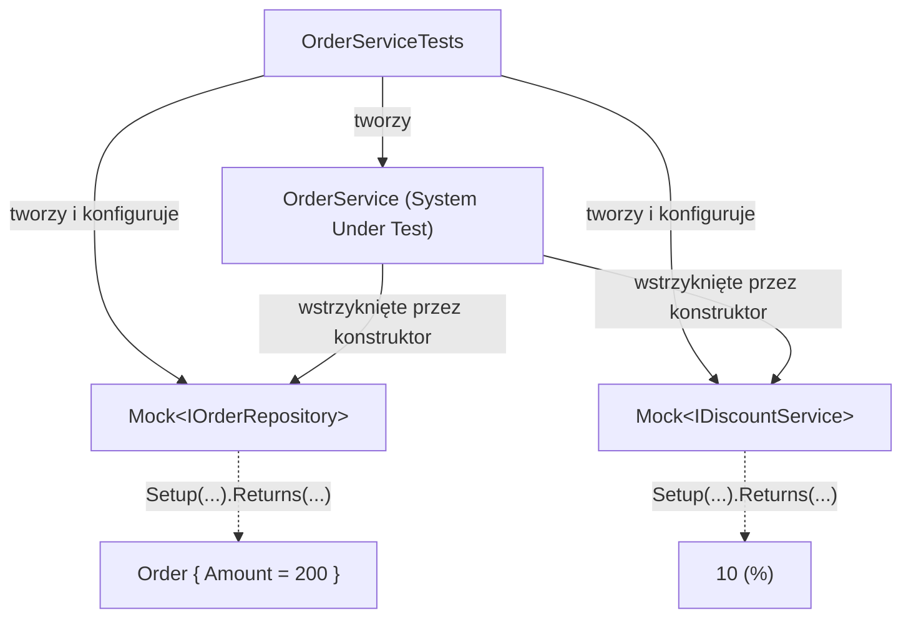
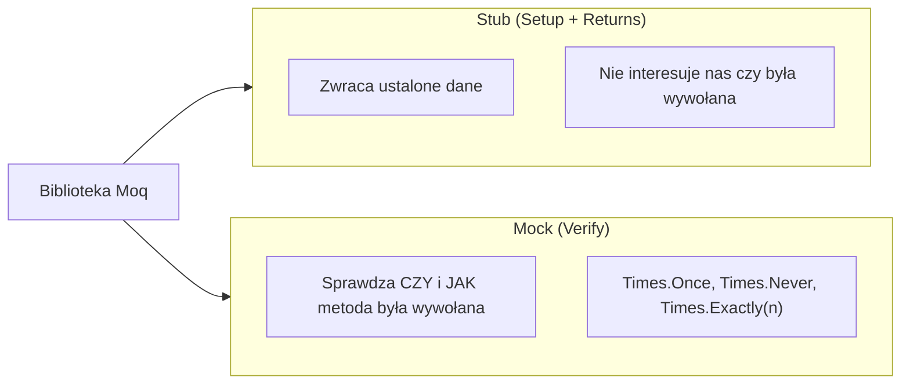

# Diagramy - Mokowanie Zależności z Moq

## 1. System Under Test z Mockowanymi Zależnościami



## 2. Przepływ Setup → Act → Verify

```mermaid
sequenceDiagram
    participant Test as Test xUnit
    participant Mock as Mock&lt;IEmailSender&gt;
    participant SUT as OrderNotifier

    Test->>Mock: new Mock<IEmailSender>()
    Test->>SUT: new OrderNotifier(mock.Object)
    Test->>SUT: NotifyCustomer("jan@example.com", 150m)
    SUT->>Mock: Send("jan@example.com", "...")
    Test->>Mock: Verify(Send(...), Times.Once)
    Mock-->>Test: ✅ Zweryfikowano wywołanie
```

## 3. Stub vs Mock (Terminologia)


