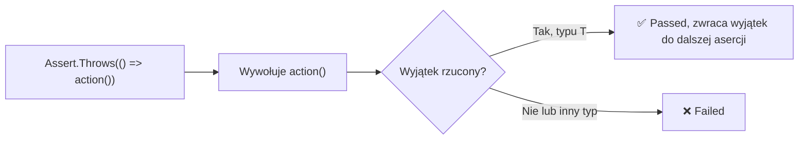
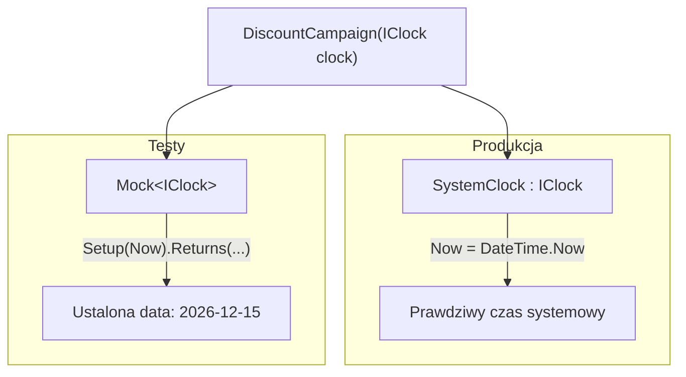
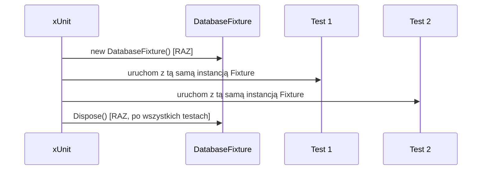

# Diagramy - Nietypowe Testy: Wyjątki, Czas, Async

## 1. Testowanie Wyjątków

```mermaid
graph LR
    Test["Assert.Throws<T>(() => action())"]
    Test --> Call["Wywołuje action()"]
    Call --> Ex{"Wyjątek rzucony?"}
    Ex -->|Tak, typu T| Pass["✅ Passed, zwraca wyjątek do dalszej asercji"]
    Ex -->|Nie lub inny typ| Fail["❌ Failed"]
```

## 2. Izolacja Niedeterministycznej Zależności (Czas)

```mermaid
graph TD
    subgraph Prod["Produkcja"]
        SC["SystemClock : IClock"] -->|"Now = DateTime.Now"| Real["Prawdziwy czas systemowy"]
    end

    subgraph Test["Testy"]
        MC["Mock&lt;IClock&gt;"] -->|"Setup(Now).Returns(...)"| Fixed["Ustalona data: 2026-12-15"]
    end

    DiscountCampaign["DiscountCampaign(IClock clock)"] --> SC
    DiscountCampaign --> MC
```

## 3. `IClassFixture` – Współdzielony Kontekst

```mermaid
sequenceDiagram
    participant xUnit
    participant Fixture as DatabaseFixture
    participant T1 as Test 1
    participant T2 as Test 2

    xUnit->>Fixture: new DatabaseFixture() [RAZ]
    xUnit->>T1: uruchom z tą samą instancją Fixture
    xUnit->>T2: uruchom z tą samą instancją Fixture
    xUnit->>Fixture: Dispose() [RAZ, po wszystkich testach]
```
