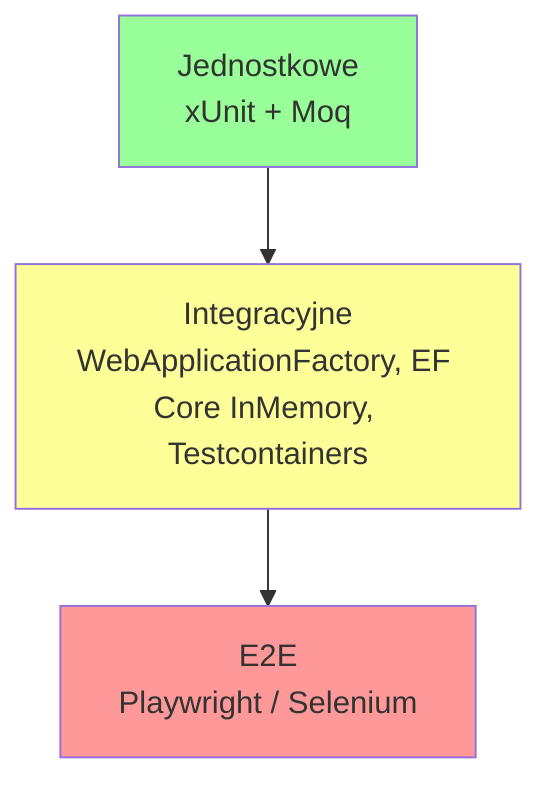
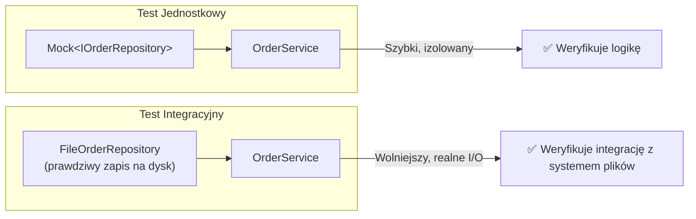
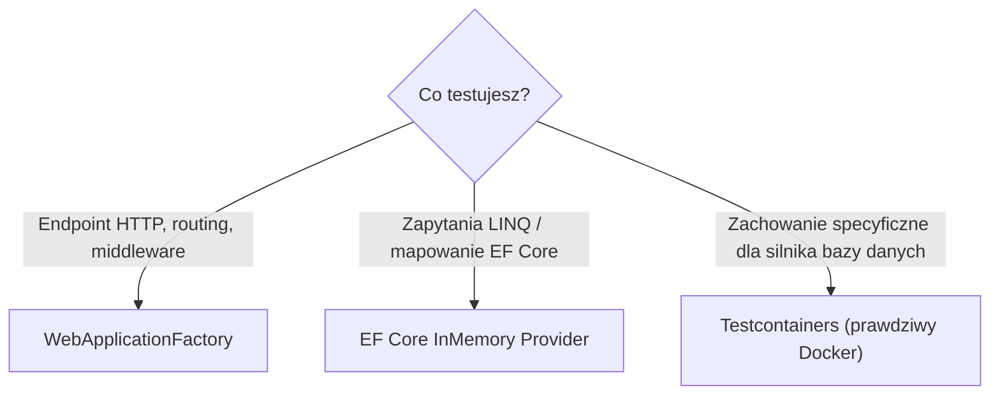

# Diagramy - Zarys Testów Integracyjnych

## 1. Piramida Testów z Przykładami Narzędzi

```mermaid
graph TD
    E2E["E2E<br/>Playwright / Selenium"]
    INT["Integracyjne<br/>WebApplicationFactory, EF Core InMemory, Testcontainers"]
    UNIT["Jednostkowe<br/>xUnit + Moq"]

    UNIT --> INT --> E2E

    style UNIT fill:#9f9
    style INT fill:#ff9
    style E2E fill:#f99
```

## 2. Ten Sam System, Dwa Rodzaje Testów

```mermaid
graph LR
    subgraph UnitTest["Test Jednostkowy"]
        MockRepo["Mock&lt;IOrderRepository&gt;"] --> OrderServiceA["OrderService"]
    end

    subgraph IntegrationTest["Test Integracyjny"]
        RealRepo["FileOrderRepository<br/>(prawdziwy zapis na dysk)"] --> OrderServiceB["OrderService"]
    end

    OrderServiceA -->|"Szybki, izolowany"| ResultA["✅ Weryfikuje logikę"]
    OrderServiceB -->|"Wolniejszy, realne I/O"| ResultB["✅ Weryfikuje integrację z systemem plików"]
```

## 3. Wybór Narzędzia do Testu Integracyjnego w ASP.NET Core

```mermaid
graph TD
    Q1{"Co testujesz?"}
    Q1 -->|"Endpoint HTTP, routing, middleware"| WAF["WebApplicationFactory"]
    Q1 -->|"Zapytania LINQ / mapowanie EF Core"| InMemory["EF Core InMemory Provider"]
    Q1 -->|"Zachowanie specyficzne dla silnika bazy danych"| TC["Testcontainers (prawdziwy Docker)"]
```
