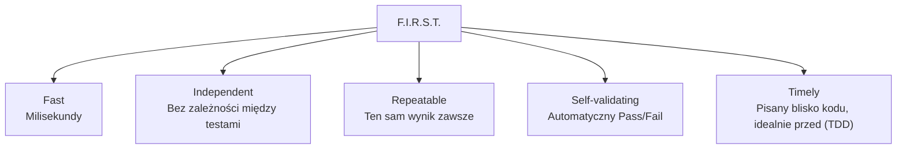
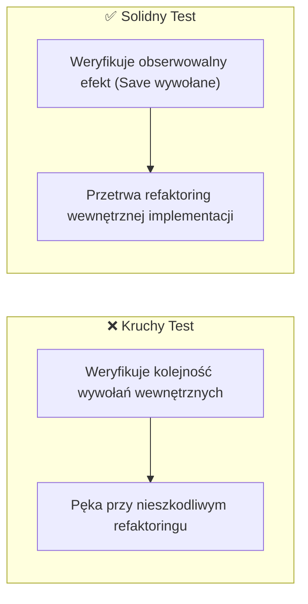
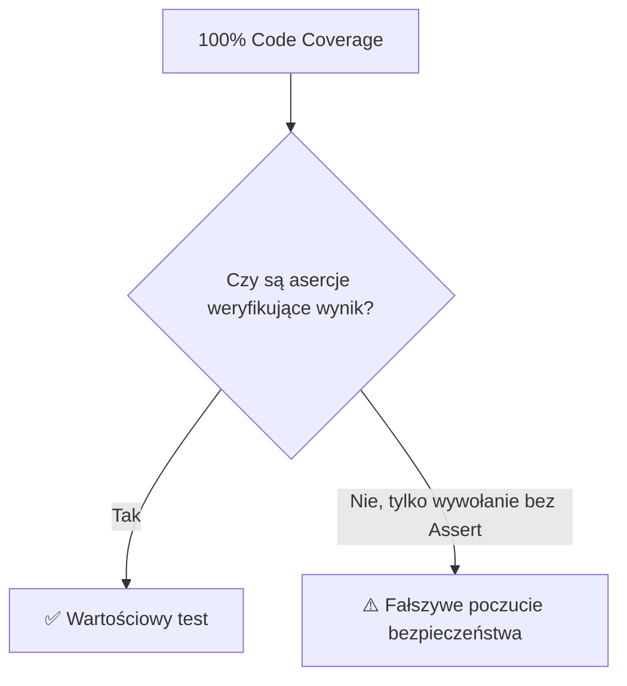

# Diagramy - Dobre Praktyki i Sugestywne Przykłady

## 1. Zasady F.I.R.S.T.

```mermaid
graph TD
    FIRST["F.I.R.S.T."]
    FIRST --> F["Fast<br/>Milisekundy"]
    FIRST --> I["Independent<br/>Bez zależności między testami"]
    FIRST --> R["Repeatable<br/>Ten sam wynik zawsze"]
    FIRST --> S["Self-validating<br/>Automatyczny Pass/Fail"]
    FIRST --> T["Timely<br/>Pisany blisko kodu, idealnie przed (TDD)"]
```

## 2. Anti-Pattern: Fragile Test

```mermaid
graph LR
    subgraph Fragile["❌ Kruchy Test"]
        F1["Weryfikuje kolejność wywołań wewnętrznych"] --> F2["Pęka przy nieszkodliwym refaktoringu"]
    end

    subgraph Robust["✅ Solidny Test"]
        R1["Weryfikuje obserwowalny efekt (Save wywołane)"] --> R2["Przetrwa refaktoring wewnętrznej implementacji"]
    end
```

## 3. Code Coverage - Fałszywe Poczucie Bezpieczeństwa

```mermaid
graph TD
    Coverage["100% Code Coverage"]
    Coverage --> Q{"Czy są asercje weryfikujące wynik?"}
    Q -->|"Tak"| Good["✅ Wartościowy test"]
    Q -->|"Nie, tylko wywołanie bez Assert"| Bad["⚠️ Fałszywe poczucie bezpieczeństwa"]
```
