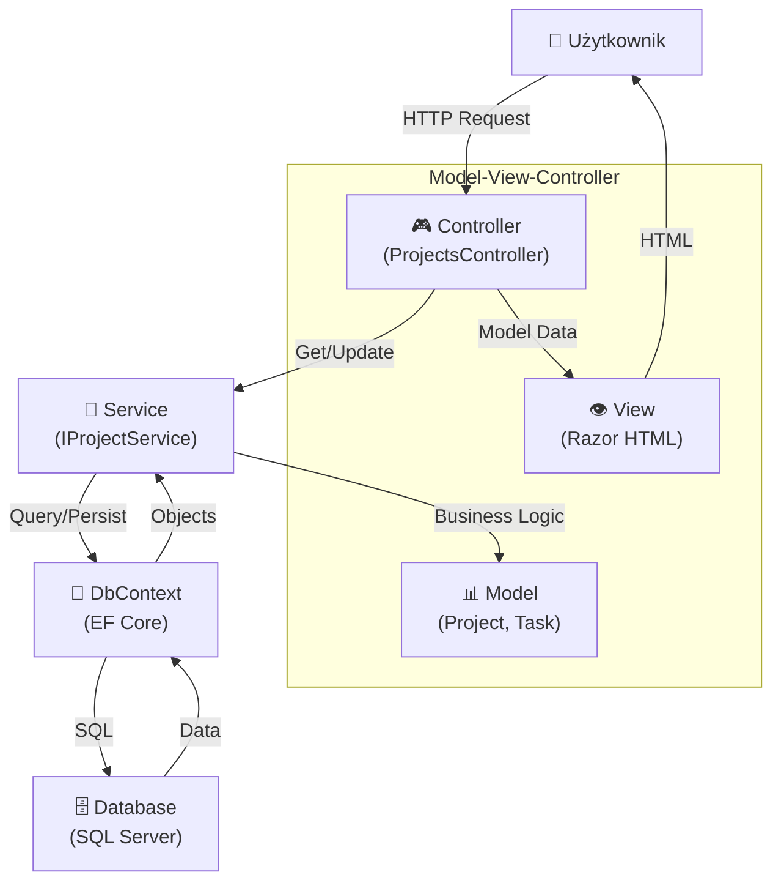

# A01: ASP.NET Core - Od Zera do CRUD Aplikacji z MVC i Blazor

## 📚 Spis Treści

1. [Wprowadzenie](#wprowadzenie)
2. [Fundamenty ASP.NET Core](#fundamenty-aspnet-core)
3. [Architektura MVC](#architektura-mvc)
4. [Entity Framework Core i Baza Danych](#entity-framework-core)
5. [Implementacja Step-by-Step](#implementacja)
6. [LINQ - Language Integrated Query](#linq)
7. [Razor vs Blazor](#razor-vs-blazor)
8. [Kompletna Aplikacja](#kompletna-aplikacja)
9. [Uruchomienie i Testowanie](#uruchomienie)
10. [Ćwiczenia Praktyczne](#ćwiczenia)

---

## Wprowadzenie

ASP.NET Core to nowoczesny, open-source framework do budowania aplikacji webowych w C#. Obsługuje:
- **Model-View-Controller (MVC)** - tradycyjne aplikacje webowe
- **Razor Pages** - uproszczony model programowania
- **Blazor** - interaktywne UI w C# (zamiast JavaScript)
- **Web API** - REST endpoints
- **Real-time features** - SignalR

### Dlaczego ASP.NET Core?

```csharp
// 1. Unified Platform
var app = WebApplication.CreateBuilder(args).Build();
// Jednolita platforma dla front-end i back-end

// 2. Dependency Injection Built-in
builder.Services.AddScoped<IProjectService, ProjectService>();
// DI kontener już wbudowany, nie potrzeba dodatkowych bibliotek

// 3. Entity Framework Core
var projects = await _context.Projects
    .Include(p => p.Tasks)
    .Where(p => p.Status == ProjectStatus.Active)
    .ToListAsync();
// ORM z LINQ support w jednym pakiecie

// 4. Cross-platform
// Działa na Windows, Linux, macOS
```

---

## Fundamenty ASP.NET Core

### Request Pipeline - Krok Po Kroku

Każde żądanie HTTP przechodzi przez **pipeline middleware'ów**. To jak droga przesyłki:

```
┌─────────────────────────────────────────────────────────────┐
│  1. REQUEST PRZYCHODZI                                       │
│     GET /projects/123                                       │
└──────────────────────┬──────────────────────────────────────┘
                       ↓
┌─────────────────────────────────────────────────────────────┐
│  2. HTTPS REDIRECTION                                        │
│     HTTP → HTTPS (bezpieczna połączenie)                     │
└──────────────────────┬──────────────────────────────────────┘
                       ↓
┌─────────────────────────────────────────────────────────────┐
│  3. STATIC FILES                                             │
│     CSS, JS, obrazy - podaj bezpośrednio                     │
│     Jeśli plik → koniec, jeśli nie → dalej                   │
└──────────────────────┬──────────────────────────────────────┘
                       ↓
┌─────────────────────────────────────────────────────────────┐
│  4. ROUTING                                                  │
│     Dopasuj ścieżę do kontrolera                             │
│     /projects/{id} → ProjectsController.Details(id)          │
└──────────────────────┬──────────────────────────────────────┘
                       ↓
┌─────────────────────────────────────────────────────────────┐
│  5. AUTHENTICATION (Kto jesteś?)                             │
│     Sprawdź cookies/tokens                                   │
│     Ustaw HttpContext.User (Anonymous lub konkretny user)    │
└──────────────────────┬──────────────────────────────────────┘
                       ↓
┌─────────────────────────────────────────────────────────────┐
│  6. AUTHORIZATION (Co możesz robić?)                         │
│     Sprawdź atrybuty [Authorize], [AllowAnonymous]          │
│     Jeśli brak uprawnień → 403 Forbidden                     │
└──────────────────────┬──────────────────────────────────────┘
                       ↓
┌─────────────────────────────────────────────────────────────┐
│  7. CONTROLLER EXECUTION                                     │
│     ProjectsController.Details(123)                          │
│     Metoda przygotowuje dane                                 │
└──────────────────────┬──────────────────────────────────────┘
                       ↓
┌─────────────────────────────────────────────────────────────┐
│  8. VIEW RENDERING                                           │
│     Razor template + Model Data → HTML                       │
└──────────────────────┬──────────────────────────────────────┘
                       ↓
┌─────────────────────────────────────────────────────────────┐
│  9. RESPONSE WYSYŁANY                                        │
│     200 OK + HTML document                                   │
│     Browser renderuje stronę                                 │
└─────────────────────────────────────────────────────────────┘
```

**Ważne**: Middleware jest **uporządkowany** - porządek ma znaczenie!

### Middleware Konfiguracja

```csharp
var app = builder.Build();

// ⚠️ PORZĄDEK MIDDLEWARE'ÓW JEST KRYTYCZNY!

// 1. HTTPS - zawsze najpierw (bezpieczeństwo)
app.UseHttpsRedirection();

// 2. Statyczne pliki - jeśli plik → koniec
app.UseStaticFiles();
// Jeśli request to /css/style.css, tutaj się zatrzyma

// 3. Routing - gdzie jedziesz?
app.UseRouting();

// 4. Authentication - kto jesteś?
app.UseAuthentication();
// Ustaw HttpContext.User

// 5. Authorization - co możesz?
app.UseAuthorization();
// [Authorize] atrybuty

// 6. MVC - wykonaj kontroler
app.MapControllerRoute(
    name: "default",
    pattern: "{controller=Projects}/{action=Index}/{id?}");
```

**Czasowy diagram wykonania middleware'ów dla request GET /projects/123:**

```
REQUEST IN          MIDDLEWARE          EXIT & RESPONSE
    ↓                   ↓
    HttpsRedirect → ✓ ← ✓ (HTTP→HTTPS)
    ↓
    StaticFiles → ✗ (nie plik) → dalej
    ↓
    Routing → ✓ Znaleźliśmy route
    ↓
    Authentication → ✓ User = Anonymous
    ↓
    Authorization → ✓ PublicRoute
    ↓
    MvcMiddleware → ProjectsController.Details(123)
        ↓
        Service.GetProjectAsync(123)
        ↓
        Database → Project object
        ↓
        RenderView(Details.cshtml, project)
        ↓
        200 OK + HTML
    ↓
    ← Middleware wychodzący (response transform)
    ↓
RESPONSE OUT (przesyłaj do browsera)
```

### Dependency Injection - Dlaczego to Ważne?

**Problem bez DI:**

```csharp
// ❌ SŁABE - Hard-coded zależności
public class ProjectsController : Controller
{
    private ApplicationDbContext _context;
    private ProjectService _service;
    
    public ProjectsController()
    {
        // Kontroler MUSI wiedzieć jak stworzyć DbContext
        _context = new ApplicationDbContext();
        
        // Kontroler MUSI wiedzieć jak stworzyć Service
        _service = new ProjectService(_context);
    }
    
    // Problemy:
    // 1. Trudne do testowania (nie możesz zmienić implementacji)
    // 2. Jeśli zmienisz konstruktor ProjectService, wszystko się psuje
    // 3. Duplikowanie kodu (każdy kontroler pisze to samo)
    // 4. Ciężko testować - musisz tworzyć real DbContext
}
```

**Rozwiązanie z DI:**

```csharp
// ✅ DOBRZE - Wstrzykiwanie zależności
public class ProjectsController : Controller
{
    private readonly IProjectService _service;
    
    // Kontroler NIE wie jak stworzyć Service
    // Framework dostarcza gotowy!
    public ProjectsController(IProjectService service)
    {
        _service = service;  // Automatycznie injected
    }
    
    public async Task<IActionResult> Index()
    {
        var projects = await _service.GetAllProjectsAsync();
        return View(projects);
    }
    
    // Korzyści:
    // 1. Łatwe do testowania - możesz podać Mock<IProjectService>
    // 2. Elastyczne - zmień implementację bez zmiany kodu
    // 3. Reużywalny kod - DI robi rejestrację raz
    // 4. Mniej boilerplate'u
}
```

### Lifecycle Zależności - Co Oznacza Każdy Typ?

**Scoped** - *Nowa instancja na każde żądanie HTTP*

```csharp
// Rejestracja
builder.Services.AddScoped<IProjectService, ProjectService>();

// Execution
Request 1 (GET /projects)
  ↓
  ProjectService instancja #1 tworzona
  ↓
  Metoda Index() korzysta z instancji #1
  ↓
  Response wysyłany
  ↓
  Instancja #1 usunięta (GC)

Request 2 (GET /projects/123)
  ↓
  ProjectService instancja #2 tworzona (NOWA!)
  ↓
  Metoda Details() korzysta z instancji #2
  ↓
  Response wysyłany
  ↓
  Instancja #2 usunięta (GC)

// Use case: DbContext (każde żądanie → nowy context)
```

**Singleton** - *Jedna instancja dla całej aplikacji*

```csharp
builder.Services.AddSingleton<IConfigurationService, ConfigurationService>();

// Execution
Aplikacja uruchamia się
  ↓
  ConfigurationService instancja #1 tworzona
  ↓
  Request 1 → używa instancji #1
  ↓
  Request 2 → używa TEJ SAMEJ instancji #1
  ↓
  Request 3 → używa TEJ SAMEJ instancji #1
  ↓
  Aplikacja się zamyka
  ↓
  Instancja #1 usunięta

// Use case: Configuration, caching, logger (stateless)
// ⚠️ UWAGA: Musi być thread-safe!
```

**Transient** - *Nowa instancja za każdym razem*

```csharp
builder.Services.AddTransient<IGuidGenerator, GuidGenerator>();

// Execution
Request 1
  ↓
  Kontroler potrzebuje IGuidGenerator
    ↓ Tworzona instancja #1
  ↓
  Service potrzebuje IGuidGenerator
    ↓ Tworzona instancja #2 (NOWA!)
  ↓
  Dwie RÓŻNE instancje w obrębie jednego requestu
  ↓
  Instancja #1 usunięta
  ↓
  Instancja #2 usunięta

// Use case: Lightweight stateless utilities
```

### ASP.NET Core DI Container w Praktyce

```csharp
// Program.cs - Rejestracja wszystkich zależności

var builder = WebApplication.CreateBuilder(args);

// 🔵 Data Layer - Scoped (każde żądanie nowy context)
builder.Services.AddDbContext<ApplicationDbContext>(options =>
    options.UseSqlServer(
        builder.Configuration.GetConnectionString("DefaultConnection")));

// 🟢 Business Layer - Scoped (zależy od DbContext)
builder.Services.AddScoped<IProjectService, ProjectService>();

// 🟡 Utilities - Singleton (konfiguracja nie zmienia się)
builder.Services.AddSingleton<IConfigurationService, ConfigurationService>();

// 🟠 Controllers - Automatycznie rejestrowane
builder.Services.AddControllers();

var app = builder.Build();

// ============================================

// ProjectsController.cs - Wszystko zarejestrowane, gotowe do injection
public class ProjectsController : Controller
{
    private readonly IProjectService _service;
    
    // Framework szuka w DI container:
    // - Znaleziono IProjectService? TAK
    // - Jak go stworzyć? Scoped ProjectService
    // - A on potrzebuje? ApplicationDbContext (Scoped)
    // - Framework tworzy oba i injektuje
    public ProjectsController(IProjectService service)
    {
        _service = service;
    }
}
```

### Dependency Injection Diagram

```
┌─────────────────────────────────────────────────────┐
│  DI Container (IServiceProvider)                     │
├─────────────────────────────────────────────────────┤
│                                                     │
│  "IProjectService"                                  │
│       ↓                                              │
│  ProjectService                                     │
│       ↓ (potrzebuje)                                │
│  ApplicationDbContext                               │
│       ↓ (potrzebuje)                                │
│  SqlServerConnection                                │
│                                                     │
│  Gdy kontroler mówi: "daj mi IProjectService"       │
│  Container:                                         │
│  1. Sprawdza czy jest w container'ze ✓              │
│  2. Sprawdza czy potrzebuje inne rzeczy             │
│  3. Konstruuje cały graf zależności                  │
│  4. Zwraca gotową instancję                         │
│                                                     │
└─────────────────────────────────────────────────────┘
```

ASP.NET Core ma **wbudowany DI** - nie potrzebujesz Autofac, ninject, czy innych bibliotek!

---

## MVC Controllers - HTTP Handlers

### Czym Jest Controller?

Controller to **HTTP Handler** - odpowiada na HTTP requests (GET, POST, DELETE, etc.):

```
HTTP Request              Controller                Response
────────────              ──────────                ────────

GET /projects       →     Index()         →        List<Project>
GET /projects/123   →     Details(id)     →        Project details
GET /projects/create →    Create()        →        Form HTML
POST /projects      →     Create(model)   →        Redirect
GET /projects/edit/123 →  Edit(id)        →        Edit form
POST /projects/123  →     Edit(model)     →        Redirect
POST /projects/delete/123 → Delete(id)    →        Redirect
```

### Struktura Kontrolera

```csharp
[Route("projects")]  // ← URL base path
[ApiExplorerSettings(IgnoreApi = true)]  // ← Mark as MVC not API
public class ProjectsController : Controller
{
    // KROK 1: Dependency Injection - framework dostarcza zależności
    private readonly IProjectService _service;
    
    public ProjectsController(IProjectService service)
    {
        _service = service;  // Automatic injection
    }
    
    // ============================================
    // KROK 2: Action Methods - obsługują HTTP requests
    // ============================================
    
    // GET /projects (lista wszystkich)
    [HttpGet("")]              // ← HTTP method + route
    [HttpGet("index")]         // ← Alternatywna ścieżka
    public async Task<IActionResult> Index(
        string? searchTerm,    // Query param: ?searchTerm=CRM
        string? sortBy)        // Query param: ?sortBy=name
    {
        // KROK 3A: Get data from service
        List<Project> projects;
        
        if (!string.IsNullOrEmpty(searchTerm))
            projects = await _service.SearchProjectsAsync(searchTerm);
        else
            projects = await _service.GetAllProjectsAsync();
        
        // KROK 3B: Apply sorting
        if (!string.IsNullOrEmpty(sortBy))
            projects = await _service.GetProjectsBySortAsync(sortBy);
        
        // KROK 4: Prepare data for view
        ViewData["SearchTerm"] = searchTerm;
        ViewData["CurrentSort"] = sortBy;
        
        // KROK 5: Return view with model
        return View(projects);  // Projects/Index.cshtml + model
    }
    
    // GET /projects/create (pusta forma)
    [HttpGet("create")]
    public IActionResult Create()
    {
        return View();  // Projects/Create.cshtml (empty form)
    }
    
    // POST /projects/create (zapis nowego)
    [HttpPost("create")]
    [ValidateAntiForgeryToken]  // ← Security: prevent CSRF attacks
    public async Task<IActionResult> Create(Project project)
    {
        // KROK 1: Model binding - ASP.NET Core automatycznie mapuje
        // dane z form na właściwości Project obiektu
        
        // KROK 2: Walidacja - sprawdzenie atrybutów [Required], [StringLength], etc.
        if (!ModelState.IsValid)
        {
            // Zwróć formę z błędami
            return View(project);
        }
        
        // KROK 3: Custom validation
        if (project.EndDate.HasValue && project.EndDate < project.StartDate)
        {
            ModelState.AddModelError("EndDate", 
                "End date must be after start date");
            return View(project);
        }
        
        // KROK 4: Save via service
        try
        {
            await _service.CreateProjectAsync(project);
        }
        catch (Exception ex)
        {
            ModelState.AddModelError("", "Error saving project: " + ex.Message);
            return View(project);
        }
        
        // KROK 5: Redirect (Pro-Post-Redirect pattern)
        return RedirectToAction(nameof(Index));
        // Generuje: HTTP 302 Redirect → GET /projects
    }
    
    // GET /projects/{id} (szczegóły)
    [HttpGet("{id}")]
    public async Task<IActionResult> Details(int id)
    {
        // KROK 1: Route parameter binding - {id} z URL
        // Jeśli URL to /projects/123, to id = 123 (automatic)
        
        // KROK 2: Fetch data
        var project = await _service.GetProjectByIdAsync(id);
        if (project == null)
            return NotFound();  // 404
        
        // KROK 3: Get analytics
        var analytics = await _service.GetProjectAnalyticsAsync(id);
        
        // KROK 4: Create ViewModel (combine project + analytics)
        var viewModel = new ProjectDetailsViewModel
        {
            Project = project,
            Analytics = analytics,
            UpcomingTasks = project.Tasks
                .Where(t => t.DueDate >= DateTime.Now && t.Status != TaskStatus.Done)
                .OrderBy(t => t.DueDate)
                .ToList(),
            OverdueTasks = project.Tasks
                .Where(t => t.DueDate < DateTime.Now && t.Status != TaskStatus.Done)
                .OrderByDescending(t => t.DueDate)
                .ToList()
        };
        
        // KROK 5: Return view with ViewModel
        return View(viewModel);  // Projects/Details.cshtml
    }
    
    // POST /projects/delete/{id} (usunięcie)
    [HttpPost("delete/{id}")]
    [ValidateAntiForgeryToken]
    public async Task<IActionResult> Delete(int id)
    {
        var project = await _service.GetProjectByIdAsync(id);
        if (project == null)
            return NotFound();
        
        await _service.DeleteProjectAsync(id);
        return RedirectToAction(nameof(Index));
    }
}
```

### HTTP Methods - Co Każdy Robi?

```
GET        /projects          Pobierz listę projektów
GET        /projects/123      Pobierz projekt #123
GET        /projects/create   Pokaż formularz tworzenia
POST       /projects          Stwórz nowy projekt
GET        /projects/123/edit Pokaż formularz edycji
POST       /projects/123      Aktualizuj projekt #123
POST       /projects/123/delete Usuń projekt #123

Standard REST Convention:
- GET = Pobierz (read)
- POST = Stwórz/Aktualizuj (create/update)
- DELETE = Usuń (delete)
```

### Action Results - Jakie Odpowiedzi?

```csharp
return View(model);           // 200 OK + View + Model
return View("Custom");        // Custom view (nie default)
return RedirectToAction(...); // 302 Redirect
return Redirect(url);         // 302 Redirect
return NotFound();            // 404 Not Found
return Unauthorized();        // 401 Unauthorized
return BadRequest();          // 400 Bad Request
return Ok(data);              // 200 OK (API)
return Json(data);            // 200 OK + JSON
```

### Model Binding - Automatyczne Mapowanie

ASP.NET Core automatycznie konwertuje HTTP data na obiekty C#:

```html
<!-- Form HTML -->
<form method="post" action="/projects">
    <input name="Name" value="CRM System" />
    <input name="ProgressPercentage" value="50" />
    <select name="Status">
        <option value="Active">Active</option>
    </select>
</form>
```

```csharp
// Controller receives:
[HttpPost]
public async Task<IActionResult> Create(Project project)
{
    // ASP.NET Core automatycznie stworzył:
    // project.Name = "CRM System"
    // project.ProgressPercentage = 50
    // project.Status = ProjectStatus.Active
    
    // Model binding sources (w kolejności):
    // 1. Route values
    // 2. Form data
    // 3. Query string
    // 4. Uploaded files
}
```

### Validacja - DataAnnotations Automatic

```csharp
public class Project
{
    [Required(ErrorMessage = "Name is required")]
    [StringLength(100, MinimumLength = 3)]
    public string Name { get; set; }
    
    [Range(0, 100)]
    public int ProgressPercentage { get; set; }
}

// Controller action:
[HttpPost]
public async Task<IActionResult> Create(Project project)
{
    // ASP.NET Core AUTOMATYCZNIE waliduje:
    if (!ModelState.IsValid)
    {
        // ModelState zawiera błędy:
        // - Name is required
        // - ProgressPercentage must be 0-100
        
        return View(project);  // Zwróć formularz z błędami
    }
    
    // Kod jest wykonany tylko jeśli walidacja przeszła
}

// View wyświetla błędy automatycznie:
<div asp-validation-summary="ModelOnly" class="alert alert-danger"></div>
<input asp-for="Name" />
<span asp-validation-for="Name" class="text-danger"></span>
```

---

### Model-View-Controller Pattern



### Controller: HTTP Entry Point

```csharp
[Route("projects")]
public class ProjectsController : Controller
{
    private readonly IProjectService _service;
    
    public ProjectsController(IProjectService service)
    {
        _service = service;
    }
    
    // GET /projects
    [HttpGet("")]
    public async Task<IActionResult> Index(
        string? searchTerm, 
        string? sortBy)
    {
        // Filtrowanie i sortowanie
        List<Project> projects;
        
        if (!string.IsNullOrEmpty(searchTerm))
            projects = await _service.SearchProjectsAsync(searchTerm);
        else
            projects = await _service.GetAllProjectsAsync();
            
        if (!string.IsNullOrEmpty(sortBy))
            projects = await _service.GetProjectsBySortAsync(sortBy);
        
        return View(projects);  // View(Model)
    }
    
    // GET /projects/create
    [HttpGet("create")]
    public IActionResult Create()
    {
        return View();  // Pusta forma
    }
    
    // POST /projects/create
    [HttpPost("create")]
    [ValidateAntiForgeryToken]
    public async Task<IActionResult> Create(Project project)
    {
        // Walidacja automatyczna z DataAnnotations
        if (!ModelState.IsValid)
            return View(project);  // Pokaż błędy
        
        // Custom walidacja
        if (project.EndDate < project.StartDate)
        {
            ModelState.AddModelError(
                "EndDate", 
                "End date cannot be before start date");
            return View(project);
        }
        
        // Zapis
        await _service.CreateProjectAsync(project);
        return RedirectToAction(nameof(Index));
    }
}
```

### Model: DataAnnotations Validation

```csharp
public class Project
{
    public int Id { get; set; }
    
    [Required(ErrorMessage = "Nazwa projektu jest wymagana")]
    [StringLength(100, MinimumLength = 3)]
    public string Name { get; set; }
    
    [StringLength(500)]
    public string Description { get; set; }
    
    [DataType(DataType.Date)]
    public DateTime StartDate { get; set; }
    
    [DataType(DataType.Date)]
    public DateTime? EndDate { get; set; }
    
    [Range(0, 100, ErrorMessage = "Postęp musi być 0-100")]
    [Display(Name = "Postęp (%)")]
    public int ProgressPercentage { get; set; }
    
    public ProjectStatus Status { get; set; }
    
    // 1:N Relationship
    public ICollection<Task> Tasks { get; set; } = new List<Task>();
}

public class Task
{
    public int Id { get; set; }
    
    [Required]
    [StringLength(200, MinimumLength = 3)]
    public string Title { get; set; }
    
    [Range(1, 10)]
    public int Priority { get; set; }
    
    public TaskStatus Status { get; set; }
    
    [DataType(DataType.Date)]
    public DateTime DueDate { get; set; }
    
    // Foreign Key
    [ForeignKey("Project")]
    public int ProjectId { get; set; }
    
    // Navigation property
    public Project? Project { get; set; }
}
```

### View: Razor Templating

```html
@* Projects/Index.cshtml *@
@model List<Project>

<div class="container">
    <h1>Projekty</h1>
    
    @* Wyszukiwanie i sortowanie *@
    <form method="get" class="row g-3">
        <div class="col-md-6">
            <input type="text" name="searchTerm" 
                   placeholder="Szukaj..."
                   value="@ViewData["SearchTerm"]">
        </div>
        <div class="col-md-6">
            <select name="sortBy" class="form-select">
                <option value="">Domyślnie</option>
                <option value="name">Po nazwie</option>
                <option value="progress">Po postępie</option>
            </select>
        </div>
        <button type="submit" class="btn btn-primary">Szukaj</button>
    </form>
    
    @* Iteracja po modelu *@
    <div class="row">
        @foreach (var project in Model)
        {
            <div class="col-md-6">
                <div class="card">
                    <h5>@project.Name</h5>
                    <p>@project.Description</p>
                    
                    @* Progress bar *@
                    <div class="progress">
                        <div class="progress-bar" 
                             style="width: @project.ProgressPercentage%">
                            @project.ProgressPercentage%
                        </div>
                    </div>
                    
                    @* Helper methods *@
                    <a asp-action="Details" asp-route-id="@project.Id">
                        Szczegóły
                    </a>
                    
                    @* Conditional rendering *@
                    @if (project.IsOverdue)
                    {
                        <span class="badge bg-danger">Przeterminowany</span>
                    }
                </div>
            </div>
        }
    </div>
</div>
```

---

## Entity Framework Core - ORM i Relacje Bazy Danych

### Czym Jest Entity Framework Core?

Entity Framework Core to **Object-Relational Mapper (ORM)** - translator między:
- **Obiektami C#** (Project, Task) - co rozumiesz ty
- **Tabelami SQL** (Projects, Tasks) - co rozumie baza danych

```
Świat C#                          Świat SQL
=========                        ==========

var project = new Project        INSERT INTO Projects
{                                (Name, Status, ...)
    Name = "CRM",                VALUES ('CRM', 'Active', ...)
    Status = Active
}

_context.Projects.Add(project);  
_context.SaveChangesAsync();     

                ↓↓↓ EF CORE TŁUMACZ ↓↓↓

SELECT * FROM Projects WHERE     var projects =
Status = 'Active'                  await _context.Projects
                                     .Where(p => p.Status == Active)
                                     .ToListAsync();
```

### DbContext - Baza Danych w C#

```csharp
public class ApplicationDbContext : DbContext
{
    // DbSet<T> = reprezentacja tabeli w bazie
    public DbSet<Project> Projects { get; set; }  // Tabela Projects
    public DbSet<Task> Tasks { get; set; }        // Tabela Tasks
    
    // Metoda konfiguracji
    protected override void OnModelCreating(ModelBuilder modelBuilder)
    {
        // Tu definiujesz:
        // - Relacje między tabelami
        // - Indeksy
        // - Seed data
        // - Constrainty
    }
}

// Użycie:
var dbContext = new ApplicationDbContext();

// Dodaj projekt
dbContext.Projects.Add(project);
await dbContext.SaveChangesAsync();  // INSERT INTO Projects...

// Pobierz projekty
var projects = await dbContext.Projects.ToListAsync();  // SELECT * FROM Projects

// Zmień projekt
project.Name = "New Name";
await dbContext.SaveChangesAsync();  // UPDATE Projects SET Name = 'New Name'...

// Usuń projekt
dbContext.Projects.Remove(project);
await dbContext.SaveChangesAsync();  // DELETE FROM Projects WHERE Id = ...
```

### Relacje 1:N (One-to-Many)

**Scenario**: Jeden projekt ma wiele zadań

```
Tabela Projects                  Tabela Tasks
├── Id (PK)                      ├── Id (PK)
├── Name                         ├── Title
├── Description                  ├── Priority
├── Status                       ├── Status
└── ...                          ├── ProjectId (FK) ← wskazuje na Projects.Id
                                 └── ...

1 Projekt: CRM
  ↓
  Zadanie 1: Analiza wymagań
  Zadanie 2: Design bazy danych
  Zadanie 3: Implementacja
  Zadanie 4: Testy
```

**Konfiguracja w C#:**

```csharp
// Model: Project.cs
public class Project
{
    public int Id { get; set; }
    public string Name { get; set; }
    
    // Navigation property - dostęp do zadań
    public ICollection<Task> Tasks { get; set; } = new List<Task>();
}

// Model: Task.cs
public class Task
{
    public int Id { get; set; }
    public string Title { get; set; }
    
    // Foreign Key - wskazanie na projekt
    public int ProjectId { get; set; }
    
    // Navigation property - dostęp do projektu
    public Project? Project { get; set; }
}

// DbContext.cs - Konfiguracja relacji
protected override void OnModelCreating(ModelBuilder modelBuilder)
{
    modelBuilder.Entity<Task>()
        .HasOne(t => t.Project)        // Każde Task ma JEDEN Project
        .WithMany(p => p.Tasks)        // Każdy Project ma WIELE Tasks
        .HasForeignKey(t => t.ProjectId)  // FK kolumna
        .OnDelete(DeleteBehavior.Cascade); // Usuń tasks gdy project się usuwa
}
```

### Eager Loading vs Lazy Loading

**Problem: N+1 Queries**

```csharp
// ❌ WOLNE - generuje 101 queries!
var projects = _context.Projects.ToList();  // Query 1
foreach (var project in projects)
{
    var taskCount = project.Tasks.Count();  // Queries 2-101
    // EF tworzy nowe zapytanie dla każdego projektu!
}
```

**Rozwiązanie: Eager Loading z Include()**

```csharp
// ✅ SZYBKO - tylko 2 queries!
var projects = await _context.Projects
    .Include(p => p.Tasks)  // ← Załaduj Tasks od razu
    .ToListAsync();

// Query 1: SELECT * FROM Projects
// Query 2: SELECT * FROM Tasks WHERE ProjectId IN (...)
// Tasks są już załadowane w memory - brak kolejnych queries!

foreach (var project in projects)
{
    var taskCount = project.Tasks.Count();  // Liczenie w memory, brak SQL
}

// Performance improvement: ~100x szybsze dla 100 projektów!
```

### Indeksy - Szybsze Wyszukiwanie

```csharp
// Bez indeksu:
var activeProjects = _context.Projects
    .Where(p => p.Status == ProjectStatus.Active)
    .ToListAsync();
// Database musi sprawdzić każdy wiersz (table scan) - WOLNE

// Z indeksem:
protected override void OnModelCreating(ModelBuilder modelBuilder)
{
    modelBuilder.Entity<Project>()
        .HasIndex(p => p.Status);  // ← Stwórz indeks na kolumnie Status
}
// Database skacze bezpośrednio do "Active" wierszy - SZYBKO

// Rezultat:
// Bez indeksu: 100ms (skanuje 10000 wierszy)
// Z indeksem: 1ms (bezpośredni dostęp)
// 100x szybciej!
```

### Seed Data - Przykładowe Dane

```csharp
protected override void OnModelCreating(ModelBuilder modelBuilder)
{
    var project1 = new Project
    {
        Id = 1,
        Name = "System CRM",
        Status = ProjectStatus.Active
    };
    
    modelBuilder.Entity<Project>().HasData(project1);
    
    var task1 = new Task
    {
        Id = 1,
        Title = "Analiza wymagań",
        ProjectId = 1  // ← Powiązanie z projektem
    };
    
    modelBuilder.Entity<Task>().HasData(task1);
}

// Gdy uruchomisz migrację:
// INSERT INTO Projects VALUES (1, 'System CRM', 'Active', ...)
// INSERT INTO Tasks VALUES (1, 'Analiza wymagań', 1, ...)
```

### Migracje - Historia Zmian Bazy

```bash
# 1. Stwórz migrację (nowy plik z SQL)
dotnet ef migrations add CreateInitialSchema

# 2. Zastosuj migrację (wykonaj SQL)
dotnet ef database update

# Wynikowy plik migracji:
# 20250831120000_CreateInitialSchema.cs
#   protected override void Up(MigrationBuilder mb)
#   {
#       mb.CreateTable("Projects", c => c
#           .Column<int>("Id")
#           .Column<string>("Name")
#           .Column<string>("Status")
#           ...
#       );
#   }
```

### Diagram - Od Modelu do Bazy Danych

```
Kod C#                    ↓ EF Core           Baza Danych
────────                  ──────────          ─────────

var project =             DbContext           CREATE TABLE
  new Project()           Projects            Projects (
                          Add()                 Id INT PK,
                                                Name VARCHAR(100),
                                                Status VARCHAR(20)
                                              )

project.Tasks =           DbContext           CREATE TABLE
  [task1, task2]          Tasks               Tasks (
                          Include()             Id INT PK,
                                                ProjectId INT FK,
                                                Title VARCHAR(200)
                                              )

_context.SaveAsync()      SQL: INSERT         INSERT INTO Projects...
                                              INSERT INTO Tasks...
```

---

## LINQ: Language Integrated Query - Zapytania jako Kod

### Czym Jest LINQ?

LINQ pozwala pisać zapytania do bazy danych **korzystając z C#** zamiast SQL:

```csharp
// ❌ Tradycyjnie (SQL string)
string sql = @"
    SELECT * FROM Projects
    WHERE Status = 'Active'
    ORDER BY StartDate DESC
";

// ✅ Z LINQ (C# code)
var projects = _context.Projects
    .Where(p => p.Status == ProjectStatus.Active)
    .OrderByDescending(p => p.StartDate)
    .ToListAsync();
```

**Korzyści LINQ:**
- ✅ Type-safe (sprawdzenie błędów na etapie kompilacji)
- ✅ IntelliSense (auto-uzupełnianie)
- ✅ SQL injection protection (bezpiecznie)
- ✅ Reużywalność (compose queries)

### LINQ Lazy Evaluation - "Odłożone Wykonanie"

**Ważna koncepcja: LINQ nie wykonuje się od razu!**

```csharp
// Krok 1: Budowanie query (NIE WYKONANE)
var query = _context.Projects
    .Where(p => p.Status == ProjectStatus.Active)
    .OrderByDescending(p => p.ProgressPercentage)
    .Select(p => new { p.Name, p.ProgressPercentage });

// W tym momencie:
// - Brak zapytania SQL
// - Baza danych nie jest pytana
// - query = instrukcja jak wykonać

Console.WriteLine("Nic się nie stało!");  // Prawda!

// Krok 2: Trigger Execution (WYKONANE)
var results = await query.ToListAsync();

// W tym momencie:
// - SQL jest generowany
// - Zapytanie wysyłane do bazy
// - Dane ładowane do memory
// - Wyniki zwracane

// Analogia:
// query = przepis (instrukcje)
// .ToListAsync() = gotowanie (wykonanie)
```

### Filtrowanie (Where) - SQL WHERE

```csharp
// Pojedynczy warunek
var activeProjects = await _context.Projects
    .Where(p => p.Status == ProjectStatus.Active)
    .ToListAsync();
// SQL: SELECT * FROM Projects WHERE Status = 'Active'

// Wiele warunków (AND)
var filtered = await _context.Projects
    .Where(p => p.Status == ProjectStatus.Active 
             && p.ProgressPercentage > 50)
    .ToListAsync();
// SQL: WHERE Status = 'Active' AND ProgressPercentage > 50

// OR warunek
var orFilter = await _context.Projects
    .Where(p => p.Status == ProjectStatus.Active 
             || p.Status == ProjectStatus.OnHold)
    .ToListAsync();
// SQL: WHERE Status = 'Active' OR Status = 'OnHold'

// String search (case-insensitive)
var searched = await _context.Projects
    .Where(p => p.Name.Contains(searchTerm, 
                StringComparison.OrdinalIgnoreCase))
    .ToListAsync();
// SQL: WHERE Name LIKE '%searchTerm%'

// NOT operator
var notCompleted = await _context.Projects
    .Where(p => p.Status != ProjectStatus.Completed)
    .ToListAsync();
// SQL: WHERE Status <> 'Completed'
```

### Sortowanie (OrderBy/OrderByDescending) - SQL ORDER BY

```csharp
// Rosnąco (A → Z)
var sortedByName = await _context.Projects
    .OrderBy(p => p.Name)
    .ToListAsync();
// SQL: ORDER BY Name ASC

// Malejąco (Z → A)
var sortedByProgress = await _context.Projects
    .OrderByDescending(p => p.ProgressPercentage)
    .ToListAsync();
// SQL: ORDER BY ProgressPercentage DESC

// Wielopoziomowe sortowanie (primär + sekundär)
var multiSort = await _context.Projects
    .OrderByDescending(p => p.Status)     // Primär
    .ThenBy(p => p.Name)                  // Sekundär
    .ToListAsync();
// SQL: ORDER BY Status DESC, Name ASC

// Przykład rezultatu:
// [Active] System CRM
// [Active] Marketing Tool
// [OnHold] API Update
// [Completed] Old Project

// Nawet bardziej złożone
var complex = await _context.Projects
    .OrderByDescending(p => p.ProgressPercentage)  // 1: Po postępie DESC
    .ThenBy(p => p.StartDate)                       // 2: Po dacie ASC
    .ThenBy(p => p.Name)                            // 3: Po nazwie ASC
    .ToListAsync();
```

### Selekcja (Select) - SQL SELECT

Select transformuje dane na nowy kształt:

```csharp
// 1. Projekcja na nowy typ
var names = await _context.Projects
    .Select(p => p.Name)
    .ToListAsync();
// Result: List<string> ["CRM", "API", ...]
// SQL: SELECT Name FROM Projects

// 2. Anonimowy typ (szybkie prototypy)
var summary = await _context.Projects
    .Select(p => new 
    { 
        p.Id,
        p.Name,
        p.ProgressPercentage,
        Status = p.Status.ToString(),
        IsActive = p.Status == ProjectStatus.Active
    })
    .ToListAsync();
// Result: List<AnonymousType>
// SQL: SELECT Id, Name, ProgressPercentage, Status FROM Projects

// 3. DTO (Data Transfer Object) - klasa dla transferu
public class ProjectDto
{
    public int Id { get; set; }
    public string Name { get; set; }
    public int TaskCount { get; set; }
}

var dtos = await _context.Projects
    .Select(p => new ProjectDto
    {
        Id = p.Id,
        Name = p.Name,
        TaskCount = p.Tasks.Count()  // Agregacja!
    })
    .ToListAsync();

// 4. Zagnieżdżone obiekty
var nested = await _context.Projects
    .Select(p => new
    {
        p.Name,
        Tasks = p.Tasks.Select(t => new { t.Title, t.Priority })
    })
    .ToListAsync();
// Result:
// {
//   Name: "CRM",
//   Tasks: [
//     { Title: "Analiza", Priority: 9 },
//     { Title: "Design", Priority: 10 }
//   ]
// }
```

### Grupowanie (GroupBy) - SQL GROUP BY

Grupowanie agreguje dane:

```csharp
// Grupuj zadania po statusie
var tasksByStatus = await _context.Tasks
    .GroupBy(t => t.Status)
    .ToDictionary(g => g.Key, g => g.Count());
// Result: Dictionary<TaskStatus, int>
// {
//   TaskStatus.Done: 10,
//   TaskStatus.InProgress: 3,
//   TaskStatus.ToDo: 7
// }

// Grupy z detalami
var groupDetails = await _context.Tasks
    .GroupBy(t => t.Priority)
    .Select(g => new
    {
        Priority = g.Key,
        Count = g.Count(),
        Titles = g.Select(t => t.Title).ToList()
    })
    .OrderByDescending(x => x.Priority)
    .ToListAsync();
// Result:
// [
//   { Priority: 10, Count: 5, Titles: ["Design", "API", ...] },
//   { Priority: 9, Count: 3, Titles: ["Analiza", ...] },
//   ...
// ]

// Grupuj projekty po statusie z statystykami
var projectStats = await _context.Projects
    .GroupBy(p => p.Status)
    .Select(g => new
    {
        Status = g.Key,
        Count = g.Count(),
        AverageProgress = g.Average(p => p.ProgressPercentage),
        TotalTasks = g.Sum(p => p.Tasks.Count)
    })
    .ToListAsync();
// Result:
// [
//   { Status: Active, Count: 5, AverageProgress: 65.2, TotalTasks: 34 },
//   { Status: OnHold, Count: 2, AverageProgress: 20, TotalTasks: 8 }
// ]
```

### Agregacja - Sum, Count, Average, Min, Max

```csharp
// Count - liczenie wierszy
int totalProjects = await _context.Projects.CountAsync();
// SQL: SELECT COUNT(*) FROM Projects

int activeCount = await _context.Projects
    .CountAsync(p => p.Status == ProjectStatus.Active);
// SQL: SELECT COUNT(*) FROM Projects WHERE Status = 'Active'

// Sum - sumowanie
int totalTasks = await _context.Projects
    .SumAsync(p => p.Tasks.Count);
// SQL: SELECT SUM(TaskCount) FROM Projects

// Average - średnia
double avgProgress = await _context.Projects
    .AverageAsync(p => p.ProgressPercentage);
// SQL: SELECT AVG(ProgressPercentage) FROM Projects

// Min/Max - minimum/maksimum
var oldestProject = await _context.Projects
    .MinAsync(p => p.StartDate);
// SQL: SELECT MIN(StartDate) FROM Projects

var highestProgress = await _context.Projects
    .MaxAsync(p => p.ProgressPercentage);
// SQL: SELECT MAX(ProgressPercentage) FROM Projects

// FirstOrDefault - pierwszy element (lub null)
var first = await _context.Projects
    .FirstOrDefaultAsync(p => p.Name.StartsWith("System"));
// SQL: SELECT TOP 1 * FROM Projects WHERE Name LIKE 'System%'
// Jeśli nie ma → zwraca null

// LastOrDefault - ostatni element
var last = await _context.Projects
    .OrderBy(p => p.StartDate)
    .LastOrDefaultAsync();
```

### LINQ Query Syntax vs Method Syntax

LINQ ma dwie składnie - robią dokładnie to samo:

```csharp
// QUERY SYNTAX (SQL-like)
var activeProjects = from p in _context.Projects
                     where p.Status == ProjectStatus.Active
                     orderby p.Name
                     select p;

// METHOD SYNTAX (Lambda-like)
var activeProjects = _context.Projects
    .Where(p => p.Status == ProjectStatus.Active)
    .OrderBy(p => p.Name)
    .ToList();

// Oba generują to samo SQL!
// SELECT * FROM Projects
// WHERE Status = 'Active'
// ORDER BY Name

// Zwykle używamy Method Syntax (bardziej elastyczny)
```

### Złożone Query - Łączenie Operacji

```csharp
// Realistyczne zapytanie z danych aplikacji:
var projectReport = await _context.Projects
    .Where(p => p.Status == ProjectStatus.Active)        // Filtrowanie
    .Include(p => p.Tasks)                               // Eager loading
    .OrderByDescending(p => p.ProgressPercentage)       // Sortowanie
    .ThenBy(p => p.Name)
    .Select(p => new                                     // Projekcja
    {
        p.Id,
        p.Name,
        Progress = $"{p.ProgressPercentage}%",
        TotalTasks = p.Tasks.Count,                     // Agregacja
        CompletedTasks = p.Tasks.Count(t => t.Status == TaskStatus.Done),
        AveragePriority = p.Tasks.Average(t => t.Priority),
        OverdueTasks = p.Tasks.Count(t => t.IsOverdue)
    })
    .ToListAsync();

// SQL (uproszczone):
// SELECT 
//     p.Id, p.Name, p.ProgressPercentage,
//     COUNT(t.Id) as TotalTasks,
//     COUNT(CASE WHEN t.Status = 'Done' THEN 1 END) as CompletedTasks,
//     AVG(t.Priority) as AveragePriority
// FROM Projects p
// LEFT JOIN Tasks t ON p.Id = t.ProjectId
// WHERE p.Status = 'Active'
// GROUP BY p.Id, p.Name, p.ProgressPercentage
// ORDER BY p.ProgressPercentage DESC, p.Name ASC
```
    .GroupBy(t => t.Status)
    .ToDictionary(g => g.Key, g => g.Count());
// Wynik: {Done: 5, InProgress: 3, ToDo: 2}

// Zagregowane statystyki
var statistics = projects
    .GroupBy(p => p.Status)
    .Select(g => new 
    {
        Status = g.Key,
        Count = g.Count(),
        AverageProgress = g.Average(p => p.ProgressPercentage)
    })
    .ToList();
```

### Selekcja (Select)

```csharp
// Projection na nowy typ
var projectNames = projects
    .Select(p => p.Name)
    .ToList();

// Anonimowy typ
var summary = projects
    .Select(p => new 
    { 
        p.Name,
        p.ProgressPercentage,
        TaskCount = p.Tasks.Count(),
        Status = p.IsActive ? "🟢 Aktywny" : "⚫ Nieaktywny"
    })
    .ToList();

// DTO (Data Transfer Object)
var dtos = projects
    .Select(p => new ProjectDto
    {
        Id = p.Id,
        Name = p.Name,
        TaskCount = p.Tasks.Count()
    })
    .ToList();
```

### Agregacja

```csharp
// Liczenie
int count = projects.Count();
int activeCount = projects.Count(p => p.IsActive);

// Suma
int totalTasks = projects.Sum(p => p.Tasks.Count());

// Średnia
double avgProgress = projects.Average(p => p.ProgressPercentage);

// Min/Max
var oldestProject = projects.Min(p => p.StartDate);
var highest = projects.Max(p => p.ProgressPercentage);

// First/LastOrDefault
var first = projects.FirstOrDefault(p => p.Name == "CRM");
var last = projects.LastOrDefault();
```

### Query Syntax vs Method Syntax

```csharp
// Query Syntax (SQL-like)
var activeProjects = from p in projects
                     where p.Status == ProjectStatus.Active
                     orderby p.Name
                     select p;

// Method Syntax (Lambda-like)
var activeProjects = projects
    .Where(p => p.Status == ProjectStatus.Active)
    .OrderBy(p => p.Name)
    .ToList();

// Oba są równoważne i tłumaczą się na to samo
```

---

## Razor Templates - View Layer

### Czym Jest Razor?

Razor to **template engine** - XML-like syntax z C# embedded. Konwertuje dynamiczny tekst na HTML:

```
              Razor Template
                    ↓
        (HTML + C# directives)
                    ↓
            ASP.NET Core processes
                    ↓
            Generates C# code
                    ↓
            Compiles to IL
                    ↓
            Executes at runtime
                    ↓
                HTML Output
                    ↓
            Browser receives
```

**Razor file locations:**
```
Views/
├── Projects/
│   ├── Index.cshtml        (List view)
│   ├── Details.cshtml      (Single item)
│   ├── Create.cshtml       (Create form)
│   ├── Edit.cshtml         (Edit form)
│   └── Delete.cshtml       (Delete confirmation)
└── Shared/
    ├── Layout.cshtml       (Master page - wszystkie widoki dziedziczą)
    ├── _Navigation.cshtml  (Shared navigation)
    └── Error.cshtml        (Error page)
```

### Razor Syntax - Complete Reference

```html
@* ============================================
   1. VARIABLES - dostęp do danych
   ============================================ *@

@Model.Name                    
@* Właściwość z Model obiektu *@

@ViewBag.Title                 
@* Dynamic object (do controller'a) *@

@ViewData["SearchTerm"]        
@* Dictionary (do controller'a) *@

@Html.DisplayNameFor(m => m.Project.Name)
@* Display name z [Display] atrybutu *@

@* ============================================
   2. EXPRESSIONS - obliczenia
   ============================================ *@

@(Model.ProgressPercentage + "%")
@DateTime.Now.ToShortDateString()
@string.Format("{0:C}", Model.Budget)
@Model.Tasks.Count()
@(Model.IsActive ? "Aktywny" : "Nieaktywny")

@* ============================================
   3. CONTROL FLOW - warunki i pętle
   ============================================ *@

@if (Model.Status == ProjectStatus.Active)
{
    <span class="badge bg-success">Aktywny</span>
}
else if (Model.Status == ProjectStatus.OnHold)
{
    <span class="badge bg-warning">Wstrzymany</span>
}
else
{
    <span class="badge bg-secondary">Zakończony</span>
}

@for (int i = 0; i < Model.Tasks.Count(); i++)
{
    <p>@Model.Tasks[i].Title</p>
}

@foreach (var task in Model.Tasks)
{
    <div class="task-item">
        <h5>@task.Title</h5>
        <p>Priority: @task.Priority</p>
    </div>
}

@* ============================================
   4. FORMS - formularze z automatycznym bindingiem
   ============================================ *@

<form method="post" asp-action="Create" asp-controller="Projects">
    @* CSRF protection - SecurityHeaderDefaults.XFrameOptionsHeader *@
    @* ASP.NET Core automatycznie dodaje token *@
    
    <!-- Text input - automatyczne bindowanie do Model.Name -->
    <input asp-for="Name" class="form-control" 
           placeholder="Nazwa projektu" />
    <span asp-validation-for="Name" class="text-danger"></span>
    
    <!-- Textarea -->
    <textarea asp-for="Description" class="form-control" 
              rows="5"></textarea>
    <span asp-validation-for="Description" class="text-danger"></span>
    
    <!-- Select dropdown - model binding na Enum -->
    <select asp-for="Status" class="form-select">
        <option value="">-- Wybierz status --</option>
        <option value="Active">Aktywny</option>
        <option value="OnHold">Wstrzymany</option>
        <option value="Completed">Zakończony</option>
    </select>
    
    <!-- Date picker -->
    <input asp-for="StartDate" type="date" class="form-control" />
    <input asp-for="EndDate" type="date" class="form-control" />
    
    <!-- Checkbox - model binding na bool -->
    <input asp-for="IsArchived" type="checkbox" />
    <label asp-for="IsArchived">Archive</label>
    
    <!-- Hidden field - razem z formą -->
    <input asp-for="Id" type="hidden" />
    
    <!-- Submit button -->
    <button type="submit" class="btn btn-primary">Zapisz</button>
</form>

@* ============================================
   5. VALIDATION - wyświetlanie błędów
   ============================================ *@

<!-- Wszystkie błędy -->
<div asp-validation-summary="All" class="alert alert-danger"></div>

<!-- Błędy dla konkretnego pola -->
<input asp-for="Name" class="form-control" />
<span asp-validation-for="Name" class="text-danger"></span>

<!-- Klient-side walidacja -->
<form method="post" asp-action="Create">
    <!-- ...fields... -->
    <div asp-validation-summary="ModelOnly"></div>
</form>

<script src="~/lib/jquery/dist/jquery.js"></script>
<script src="~/lib/jquery-validation/dist/jquery.validate.js"></script>
<script src="~/lib/jquery-validation-unobtrusive/jquery.validate.unobtrusive.js"></script>
@* Walidacja na kliencie korzysta z DataAnnotations z modelu *@

@* ============================================
   6. HELPER METHODS - szybkie linkowanie
   ============================================ *@

<!-- Link ze routingiem -->
<a asp-action="Details" asp-route-id="@Model.Id" class="btn btn-info">
    Szczegóły
</a>
@* Renders: <a href="/projects/123">Szczegóły</a> *@

<!-- Generate URL -->
<a href="@Url.Action("Edit", new { id = Model.Id })">Edytuj</a>

<!-- Partial view (reusable component) -->
@await Html.PartialAsync("_TaskList", Model.Tasks)

<!-- Component (Blazor-style) -->
@await Component.InvokeAsync("ProjectStats", new { projectId = Model.Id })

<!-- CSS class conditionally -->
<div class="alert @(Model.IsOverdue ? "alert-danger" : "alert-info")">
    Status
</div>

@* ============================================
   7. SECTIONS - extensible templates
   ============================================ *@

@* _Layout.cshtml (Master page) *@
<!DOCTYPE html>
<html>
<head>
    <title>@ViewData["Title"]</title>
</head>
<body>
    <header>
        @await Html.PartialAsync("_Navigation")
    </header>
    
    <main>
        @RenderBody()  @* Zawartość strony *@
    </main>
    
    <footer>
        @RenderSection("Footer", required: false)
        @* Opcjonalna sekcja dla strony *@
    </footer>
</body>
</html>

@* Project/Details.cshtml (Child page) *@
@{
    ViewData["Title"] = "Project Details";
}

@section Footer {
    <p>Custom footer for this page</p>
}

<div>
    <!-- Project details -->
</div>

@* ============================================
   8. MODEL BINDING - automatyczne mapowanie
   ============================================ *@

<!-- HTML Form -->
<form method="post" asp-action="Create">
    <input name="Name" value="CRM" />
    <input name="ProgressPercentage" value="50" />
    <select name="Status">
        <option value="Active">Active</option>
    </select>
</form>

<!-- C# Controller - ASP.NET Core mapuje automatycznie -->
[HttpPost]
public async Task<IActionResult> Create(Project project)
{
    // ASP.NET Core stworzyło:
    // project.Name = "CRM"
    // project.ProgressPercentage = 50
    // project.Status = ProjectStatus.Active
    
    // Model binding sources (w kolejności):
    // 1. Route values ({id} z URL)
    // 2. Form data (POST body)
    // 3. Query string (?param=value)
    // 4. Uploaded files
}
```

### Praktyczny Przykład - Pełna Strona Szczegółów

```html
@* Views/Projects/Details.cshtml *@
@{
    ViewBag.Title = "Project Details";
    var isOverdue = Model.EndDate.HasValue && 
                    Model.EndDate < DateTime.Now && 
                    Model.Status != ProjectStatus.Completed;
}

@model Project

<div class="container mt-5">
    <!-- Header Section -->
    <div class="row mb-4">
        <div class="col-md-8">
            <h1>@Model.Name</h1>
            <p class="text-muted">@Model.Description</p>
        </div>
        <div class="col-md-4 text-end">
            <!-- Status Badge -->
            @if (Model.Status == ProjectStatus.Active)
            {
                <span class="badge bg-success">Aktywny</span>
            }
            else if (Model.Status == ProjectStatus.OnHold)
            {
                <span class="badge bg-warning">Wstrzymany</span>
            }
            else
            {
                <span class="badge bg-secondary">Zakończony</span>
            }
            
            @if (isOverdue)
            {
                <span class="badge bg-danger">Przeterminowany!</span>
            }
        </div>
    </div>

    <!-- Timeline Section -->
    <div class="row mb-4">
        <div class="col-md-6">
            <p>
                <strong>Data Rozpoczęcia:</strong> 
                <span>@Model.StartDate.ToString("yyyy-MM-dd")</span>
            </p>
        </div>
        <div class="col-md-6">
            <p>
                <strong>Data Zakończenia:</strong>
                <span>
                    @if (Model.EndDate.HasValue)
                    {
                        <span class="@(isOverdue ? "text-danger" : "")">
                            @Model.EndDate.Value.ToString("yyyy-MM-dd")
                        </span>
                    }
                    else
                    {
                        <em>Nie ustalono</em>
                    }
                </span>
            </p>
        </div>
    </div>

    <!-- Progress Bar -->
    <div class="row mb-4">
        <div class="col-md-12">
            <h5>Postęp: @Model.ProgressPercentage%</h5>
            <div class="progress" style="height: 25px;">
                <div class="progress-bar 
                            @(Model.ProgressPercentage >= 75 ? "bg-success" : 
                              Model.ProgressPercentage >= 50 ? "bg-info" : 
                              Model.ProgressPercentage >= 25 ? "bg-warning" : 
                              "bg-danger")" 
                     role="progressbar" 
                     style="width: @Model.ProgressPercentage%"
                     aria-valuenow="@Model.ProgressPercentage" 
                     aria-valuemin="0" 
                     aria-valuemax="100">
                    @Model.ProgressPercentage%
                </div>
            </div>
        </div>
    </div>

    <!-- Tasks Table -->
    <div class="row mb-4">
        <div class="col-md-12">
            <h3>Zadania (@Model.Tasks.Count())</h3>
            @if (Model.Tasks.Any())
            {
                <div class="table-responsive">
                    <table class="table table-striped table-hover">
                        <thead class="table-dark">
                            <tr>
                                <th>Tytuł</th>
                                <th>Priorytet</th>
                                <th>Status</th>
                                <th>Data Końcowa</th>
                                <th>Akcje</th>
                            </tr>
                        </thead>
                        <tbody>
                            @foreach (var task in Model.Tasks.OrderByDescending(t => t.Priority))
                            {
                                var taskOverdue = task.DueDate < DateTime.Now && 
                                                 task.Status != TaskStatus.Done;
                                <tr class="@(taskOverdue ? "table-danger" : "")">
                                    <td>@task.Title</td>
                                    <td>
                                        @for (int i = 0; i < task.Priority; i++)
                                        {
                                            <i class="fa fa-star text-warning"></i>
                                        }
                                    </td>
                                    <td>
                                        @if (task.Status == TaskStatus.Done)
                                        {
                                            <span class="badge bg-success">Gotowe</span>
                                        }
                                        else if (task.Status == TaskStatus.InProgress)
                                        {
                                            <span class="badge bg-info">W Trakcie</span>
                                        }
                                        else
                                        {
                                            <span class="badge bg-secondary">Do Zrobienia</span>
                                        }
                                    </td>
                                    <td>
                                        @if (taskOverdue)
                                        {
                                            <span class="text-danger fw-bold">
                                                ⚠️ @task.DueDate.ToString("yyyy-MM-dd")
                                            </span>
                                        }
                                        else
                                        {
                                            <span>@task.DueDate.ToString("yyyy-MM-dd")</span>
                                        }
                                    </td>
                                    <td>
                                        <a asp-action="EditTask" asp-route-id="@task.Id" 
                                           class="btn btn-sm btn-primary">Edytuj</a>
                                        <button type="button" class="btn btn-sm btn-danger"
                                                onclick="confirmDelete(@task.Id)">Usuń</button>
                                    </td>
                                </tr>
                            }
                        </tbody>
                    </table>
                </div>
            }
            else
            {
                <div class="alert alert-info">
                    <i class="fa fa-info-circle"></i>
                    Brak zadań - 
                    <a asp-action="CreateTask" asp-route-projectId="@Model.Id">
                        Dodaj pierwsze zadanie
                    </a>
                </div>
            }
        </div>
    </div>

    <!-- Action Buttons -->
    <div class="row">
        <div class="col-md-12">
            <a asp-action="Edit" asp-route-id="@Model.Id" 
               class="btn btn-primary">
                <i class="fa fa-edit"></i> Edytuj Projekt
            </a>
            <a asp-action="Index" class="btn btn-secondary">
                <i class="fa fa-arrow-left"></i> Wróć
            </a>
        </div>
    </div>
</div>
```

---

## Blazor vs Razor - Porównanie Technologii

### Razor Pages: Server-Rendered HTML

**Jak działa:**

```
1. USER CLICKS BUTTON
   <a href="/projects/create">Create Project</a>
   
2. REQUEST
   GET /projects/create HTTP/1.1
   
3. SERVER PROCESSES
   ProjectsController.Create()
   - Creates empty Project object
   - Renders Razor template
   - Generates HTML
   
4. RESPONSE
   HTTP/1.1 200 OK
   Content-Type: text/html
   
   <!DOCTYPE html>
   <html>
     <form method="post">
       <input name="Name" />
       ...
     </form>
   </html>
   
5. BROWSER DISPLAYS
   User sees form
   
6. USER SUBMITS
   <form method="post" action="/projects">
   
7. POST REQUEST
   POST /projects
   Form data: Name=CRM, Description=...
   
8. SERVER VALIDATES & SAVES
   ProjectsController.Create(project)
   - Validates with DataAnnotations
   - Saves to database
   - Redirects
   
9. RESPONSE
   HTTP/1.1 302 Redirect
   Location: /projects/123
   
10. BROWSER NAVIGATES
    Loads new page
```

**Characteristics:**
- ✅ SEO-friendly (full HTML rendered server-side)
- ✅ Small initial payload (just HTML)
- ✅ No JavaScript required
- ✅ Excellent scalability (stateless)
- ❌ Full page refresh on each action
- ❌ Limited interactivity without AJAX

### Blazor: Interactive C# Component

**Jak działa:**

```
1. INITIAL LOAD
   GET /project-dashboard
   
2. SERVER SENDS
   - Razor component compiled to C#
   - Component DLLs
   - WebSocket connection setup
   
3. BROWSER RENDERS
   Component UI appears
   
4. USER INTERACTS
   Click button: <button @onclick="SaveTask">
   
5. EVENT ON CLIENT
   - @onclick event fires in browser
   - Serializes to JSON
   
6. WEBSOCKET MESSAGE
   {
     "eventHandler": "SaveTask",
     "eventArguments": {}
   }
   
7. SERVER PROCESSES
   SaveTask() method runs in CLR
   - Validates data
   - Saves to database
   - Updates component state
   
8. STATE CHANGE
   Task property updated
   
9. WEBSOCKET RESPONSE
   Server sends diff (only changed parts)
   
10. BROWSER UPDATES
    Only changed HTML re-renders
    (No page refresh!)
```

**Component Structure:**

```razor
@* Components/ProjectEditor.razor *@
@page "/editor/{ProjectId:int}"
@rendermode InteractiveServer
@inject IProjectService ProjectService

<div class="editor-container">
    <h3>Edytuj Projekt</h3>
    
    <!-- Data binding - @bind-property="variable" -->
    <input @bind="project.Name" placeholder="Nazwa..." />
    <textarea @bind="project.Description"></textarea>
    
    <!-- Event handling - @on{event}="method" -->
    <button @onclick="SaveProject" class="btn btn-primary">
        Zapisz
    </button>
    
    <!-- Conditional rendering -->
    @if (!string.IsNullOrEmpty(message))
    {
        <div class="alert alert-@messageType">
            @message
        </div>
    }
    
    <!-- Task list with real-time updates -->
    @if (tasks != null)
    {
        <h4>Zadania (@tasks.Count)</h4>
        <table class="table">
            <tbody>
                @foreach (var task in tasks)
                {
                    <tr>
                        <td>
                            <!-- Two-way binding -->
                            <input @bind="task.Title" />
                        </td>
                        <td>
                            <!-- Parameterized event -->
                            <button @onclick="() => DeleteTask(task.Id)">
                                Usuń
                            </button>
                        </td>
                    </tr>
                }
            </tbody>
        </table>
    }
    else
    {
        <p>Ładowanie zadań...</p>
    }
</div>

@code {
    [Parameter]
    public int ProjectId { get; set; }
    
    private Project project = new();
    private List<Task> tasks = new();
    private string message = "";
    private string messageType = "info";
    
    // LIFECYCLE HOOK: Runs when component initializes
    protected override async Task OnInitializedAsync()
    {
        try
        {
            project = await ProjectService.GetProjectByIdAsync(ProjectId);
            tasks = await ProjectService.GetTasksAsync(ProjectId);
        }
        catch (Exception ex)
        {
            message = $"Błąd: {ex.Message}";
            messageType = "danger";
        }
    }
    
    // EVENT HANDLER: Runs when button clicked
    private async Task SaveProject()
    {
        if (string.IsNullOrWhiteSpace(project.Name))
        {
            message = "Nazwa jest wymagana!";
            messageType = "warning";
            return;
        }
        
        try
        {
            await ProjectService.UpdateProjectAsync(project);
            message = "✅ Projekt zapisany!";
            messageType = "success";
            
            // Component re-renders automatically
            // (StateHasChanged() is implicit)
        }
        catch (Exception ex)
        {
            message = $"❌ Błąd: {ex.Message}";
            messageType = "danger";
        }
    }
    
    private async Task DeleteTask(int taskId)
    {
        if (tasks.RemoveAll(t => t.Id == taskId) > 0)
        {
            await ProjectService.DeleteTaskAsync(taskId);
            message = "Zadanie usunięte";
        }
        
        // Automatic re-render (Blazor magic!)
    }
}
```

**Characteristics:**
- ✅ Real-time interactivity (no page refresh)
- ✅ C# on frontend (no JavaScript needed)
- ✅ WebSocket-based communication
- ✅ Two-way data binding (@bind)
- ✅ Component reusability
- ❌ Larger initial payload (DLLs)
- ❌ Requires persistent connection
- ❌ Poor SEO (client-rendered)
- ❌ Higher memory usage (server-side processing)

### Complete Comparison Table

| Feature | Razor Pages | Blazor |
|---------|-------------|--------|
| **Rendering** | Server-side | Server-side (via WebSocket) |
| **Interactivity** | Form posts (limited) | Real-time (full) |
| **Initial Payload** | ~50-100KB (HTML) | ~1-3MB (DLLs) |
| **SEO** | ⭐⭐⭐⭐⭐ | ⭐ |
| **Page Refresh** | ❌ Full refresh | ✅ Delta updates |
| **Complexity** | ⭐ Low | ⭐⭐⭐ Medium |
| **Scalability** | ⭐⭐⭐⭐⭐ Excellent | ⭐⭐⭐ Good |
| **JavaScript** | ✅ Optional | ❌ Not needed |
| **State Management** | Stateless HTTP | Persistent WebSocket |
| **Use Cases** | Public sites, forms | Admin panels, dashboards |

### How to Choose?

**Use Razor Pages (Traditional MVC) when:**
- Building public-facing websites
- SEO is important
- Need maximum performance
- Simple forms and workflows
- Server resources are limited
- Example: Blog, e-commerce site

**Use Blazor when:**
- Building interactive dashboards
- Real-time updates needed
- Complex interactive UIs
- User is always logged in
- Willing to use more server resources
- Example: Admin panel, project manager, chat app

---

## Kompletna Aplikacja: End-to-End Workflow

### Architektura Warstw

ASP.NET Core aplikacja jest zbudowana z czterech warstw, każda z inną odpowiedzialnością:

```
┌────────────────────────────────────────────────────────┐
│                   PRESENTATION LAYER                   │
│  Views (Razor) + Controllers + Validation              │
│  - HTML rendering                                      │
│  - Form processing                                     │
│  - DataAnnotations validation                          │
└────────────────┬───────────────────────────────────────┘
                 │ HTTP Request/Response
┌────────────────▼───────────────────────────────────────┐
│                 BUSINESS LOGIC LAYER                   │
│  Services + Interfaces                                 │
│  - Validation logic                                    │
│  - Calculations                                        │
│  - Decision making                                     │
│  - Transaction handling                                │
└────────────────┬───────────────────────────────────────┘
                 │ Data Operations
┌────────────────▼───────────────────────────────────────┐
│                 DATA ACCESS LAYER                      │
│  DbContext + LINQ                                      │
│  - EF Core queries                                     │
│  - Relationships (Include)                             │
│  - Change tracking                                     │
└────────────────┬───────────────────────────────────────┘
                 │ SQL Commands
┌────────────────▼───────────────────────────────────────┐
│                 DATABASE LAYER                         │
│  SQL Server Tables & Indexes                           │
│  - Persistent storage                                  │
│  - Relationships & constraints                         │
│  - Indexes for performance                             │
└────────────────────────────────────────────────────────┘
```

### Complete Request Lifecycle - Krok Po Kroku

Przyjrzyjmy się jak aplikacja przetwarza żądanie utworzenia nowego projektu:

```
1️⃣ BROWSER - USER INTERACTION
   User clicks: <a href="/projects/create">Create Project</a>

2️⃣ HTTP REQUEST
   GET /projects/create HTTP/1.1
   Host: localhost:7123

3️⃣ ASP.NET CORE ROUTING
   Determines: ProjectsController.Create()
   (GET method → returns form)

4️⃣ DEPENDENCY INJECTION
   DI Container looks up dependencies:
   - ProjectsController needs IProjectService
   - IProjectService needs ApplicationDbContext
   - Creates both and injects them

5️⃣ CONTROLLER METHOD
   [HttpGet("create")]
   public IActionResult Create()
   {
       return View();  // Renders Create.cshtml
   }

6️⃣ RAZOR TEMPLATE RENDERING
   Views/Projects/Create.cshtml:
   @model Project
   
   <form method="post" asp-action="Create">
       <input asp-for="Name" />
       ...
   </form>

7️⃣ HTML RESPONSE
   HTTP/1.1 200 OK
   Content-Type: text/html
   
   [HTML with form]

8️⃣ BROWSER DISPLAY
   User sees create form
   Fills: Name="CRM System", Description="..."

9️⃣ USER SUBMITS FORM
   <form method="post" asp-action="Create">
   
   Browser sends:
   POST /projects HTTP/1.1
   Content-Type: application/x-www-form-urlencoded
   
   Name=CRM+System&Description=...

🔟 MODEL BINDING
   ASP.NET Core extracts form data:
   - Name=CRM System
   - Description=...
   
   Converts to: Project { Name="CRM System", ... }

1️⃣1️⃣ VALIDATION
   DataAnnotations are checked:
   - [Required] on Name → ✅ passed
   - [StringLength(100)] → ✅ passed
   - [Range(0,100)] on ProgressPercentage → ✅ passed
   
   if (!ModelState.IsValid)
       return View(project);  // Show errors

1️⃣2️⃣ BUSINESS LOGIC
   Controller calls Service:
   await _service.CreateProjectAsync(project);
   
   Service method:
   - Validates business rules
   - Checks if name is unique
   - Generates default values

1️⃣3️⃣ DATABASE OPERATION
   Service uses DbContext:
   _context.Projects.Add(project);
   await _context.SaveChangesAsync();
   
   EF Core:
   - Generates INSERT SQL
   - Sends to SQL Server

1️⃣4️⃣ DATABASE EXECUTION
   SQL Server:
   INSERT INTO Projects (Name, Description, ...)
   VALUES ('CRM System', '...', ...)
   
   Returns: Id = 1

1️⃣5️⃣ DATA RETURNED
   EF Core sets project.Id = 1
   Service returns created Project object

1️⃣6️⃣ CONTROLLER RESPONSE
   Controller decides what to send:
   return RedirectToAction(nameof(Index));
   
   Generates:
   HTTP/1.1 302 Found
   Location: /projects

1️⃣7️⃣ BROWSER REDIRECT
   Browser automatically navigates:
   GET /projects HTTP/1.1

1️⃣8️⃣ LIST PAGE
   Controller.Index() called:
   - Fetches all projects from DB
   - Renders Index.cshtml
   - Returns HTML with project list

1️⃣9️⃣ FINAL RESPONSE
   HTTP/1.1 200 OK
   Content-Type: text/html
   
   [HTML with project list including new "CRM System"]

2️⃣0️⃣ BROWSER DISPLAY
   User sees: Project list with newly created CRM System
   Success! ✅
```

### Struktura Plików - Gdzie Każdy Plik Żyje?

```
ProjectManager/
│
├── 📁 Models/                           # ⭐ What? (Data structures)
│   ├── Project.cs                      # Main entity with validations
│   ├── Task.cs                         # Related entity
│   └── Enums.cs                        # ProjectStatus, TaskStatus
│
├── 📁 Data/                            # ⭐ Where? (Database communication)
│   └── ApplicationDbContext.cs         # EF Core DbContext
│       - Defines DbSet<Project>, DbSet<Task>
│       - OnModelCreating() configurations
│       - Migrations
│
├── 📁 Services/                        # ⭐ How? (Business logic)
│   ├── IProjectService.cs              # Interface (contract)
│   └── ProjectService.cs               # Implementation
│       - Uses DbContext for queries
│       - Handles validation
│       - Manages transactions
│
├── 📁 Controllers/                     # ⭐ Who? (Entry point)
│   ├── ProjectsController.cs           # HTTP handlers
│       - Gets requests (GET)
│       - Creates data (POST)
│       - Updates data (PUT/POST)
│       - Deletes data (DELETE)
│       - Injects IProjectService
│
├── 📁 Views/                           # ⭐ What to show? (Presentation)
│   ├── Projects/
│   │   ├── Index.cshtml               # List view
│   │   ├── Details.cshtml             # Single item view
│   │   ├── Create.cshtml              # Create form
│   │   ├── Edit.cshtml                # Edit form
│   │   └── Delete.cshtml              # Confirmation
│   └── Shared/
│       ├── _Layout.cshtml             # Master page (navbar, footer)
│       └── Error.cshtml               # Error page
│
├── 📁 Components/                      # 🆕 Blazor components
│   ├── ProjectDashboard.razor         # Interactive dashboard
│   └── TaskEditor.razor               # Real-time task editor
│
├── 📁 wwwroot/                         # Static files
│   ├── css/                           # Stylesheets
│   │   └── site.css
│   └── js/                            # Client-side JavaScript
│       └── site.js
│
├── Program.cs                          # ⭐ Startup (DI configuration)
│   - builder.Services.AddDbContext()
│   - builder.Services.AddScoped()
│   - builder.Services.AddControllers()
│   - app.MapControllers()
│
├── appsettings.json                    # Configuration
│   - Connection string
│   - Logging levels
│   - Custom settings
│
└── ProjectManager.csproj               # Project metadata
    - Dependencies (NuGet packages)
    - Target framework (.NET 9.0)
```

### Request Flow - Gdzie każdy plik się angażuje?

```
USER                     REQUEST
  ↓                        ↓
  └──→ Browser sends HTML request
       ↓
       └──→ ASP.NET Core Pipeline
            ├─→ Routing (matches /projects/create)
            ├─→ Controller activation
            │   └─→ Dependency Injection
            │       └─→ IProjectService injected
            │           └─→ DbContext injected
            │
            └─→ Controller.Create()
                ├─→ If GET: return View()  ← Views/Projects/Create.cshtml
                │           Rendering occurs
                │           ← HTML generated
                │
                └─→ If POST: 
                    ├─→ Model Binding ← Form data from HTML
                    ├─→ Validation ← DataAnnotations
                    ├─→ Service.CreateProjectAsync(project)
                    │   └─→ DbContext.Projects.Add()
                    │   └─→ DbContext.SaveChangesAsync()
                    │       └─→ SQL Server (INSERT)
                    │
                    └─→ return RedirectToAction()
                        ← HTTP 302
                        → Browser navigates
                          GET /projects
                          └─→ Controller.Index()
                              └─→ DbContext.Projects.ToListAsync()
                                  ← SQL Server (SELECT)
                              ← View()
                                ← Views/Projects/Index.cshtml
                                ← HTML rendered

RESPONSE
  ↓
  └──→ Browser displays HTML
```

---

## Uruchomienie i Testowanie

### Wymagania

- **.NET 9.0 SDK** - Runtime i compiler
- **SQL Server** - Database (Express, LocalDB, or Azure)
- **Visual Studio Code** lub **Visual Studio** - Editor
- **Git** (optional) - Version control

### Instalacja i Uruchomienie - Krok Po Kroku

```bash
# 1. Navigate to project
cd ProjectManager

# 2. Restore NuGet packages (dependencies)
#    Downloads all required libraries from nuget.org
dotnet restore

# 3. Create database
#    Reads AppsDbContext.OnModelCreating()
#    Executes migrations
#    Creates tables in SQL Server
dotnet ef database update

# 4. Run application
#    Compiles C# to IL
#    JIT compiles to machine code
#    Starts ASP.NET Core server
dotnet run
# Output:
# Now listening on: https://localhost:7123
# Application started. Press Ctrl+C to exit.

# 5. Open browser
#    Navigate to: https://localhost:7123
#    See home page
```

### Polecenia Útilne

```bash
# Watch for changes and rerun (development)
dotnet watch run

# Run in Release mode (optimized)
dotnet run --configuration Release

# Debug with breakpoints (VS Code)
dotnet run --configuration Debug

# Run tests (if you add xUnit project)
dotnet test

# Build and publish
dotnet publish -c Release -o ./publish

# Run specific view tests
dotnet test --filter "CategoryName=Views"

# Check migrations status
dotnet ef migrations list

# Add new migration (after model changes)
dotnet ef migrations add AddNewField

# See actual SQL being generated
dotnet ef dbcontext scaffold (with debug logging)

# See Entity Framework Core logs
export DOTNET_ENVIRONMENT=Development
# Add to appsettings.Development.json:
{
  "Logging": {
    "LogLevel": {
      "Microsoft.EntityFrameworkCore": "Debug"
    }
  }
}
```

### Testing the Application

```bash
# Test Case 1: Create Project
1. Navigate to https://localhost:7123/projects/create
2. Fill form:
   - Name: "Website Redesign"
   - Description: "Modernize company website"
   - Status: "Active"
3. Click "Create"
4. Verify: Redirected to /projects with new project visible

# Test Case 2: View Project Details
1. Click on "Website Redesign" project
2. Verify: See all details and tasks
3. Check: Task list is populated

# Test Case 3: Edit Project
1. Click "Edit" button
2. Change Name to "Website Modernization"
3. Click "Save"
4. Verify: Changes persisted in database

# Test Case 4: Validation Error
1. Navigate to /projects/create
2. Leave Name field empty
3. Click "Create"
4. Verify: Error message appears: "Name is required"

# Test Case 5: View Blazor Component (if running)
1. Navigate to /components/project-dashboard
2. Verify: Real-time updates (no page refresh)
3. Add/edit task without refreshing page
```

---

## Ćwiczenia Praktyczne

### 🟢 Poziom Podstawowy (Beginner)

#### Ćwiczenie 1: Tworzenie Nowego Projektu
**Cel:** Zaimplementować możliwość tworzenia nowego projektu z walidacją

```csharp
// TODO: Wyzwanie
// 1. Dodaj nowe pole [MaxLength(200)] do Project.Name
// 2. Zmień walidację w Create() na 200
// 3. Dodaj test dla zbyt długiej nazwy
```

#### Ćwiczenie 2: Filtrowanie Po Statusie
**Cel:** Dodać dropdown do filtrowania projektów po statusie

```csharp
// In ProjectsController
public async Task<IActionResult> Index(
    string? searchTerm, 
    string? sortBy,
    ProjectStatus? status)  // ← Dodaj
{
    var projects = await _projectService.GetAllProjectsAsync();
    
    if (!string.IsNullOrEmpty(searchTerm))
        projects = projects.Where(p => p.Name.Contains(searchTerm)).ToList();
    
    // TODO: Dodaj filtrowanie po statusie
    if (status.HasValue)
        projects = projects.Where(p => p.Status == status).ToList();
    
    return View(projects);
}
```

#### Ćwiczenie 3: Wyświetlanie Zadań w Szczegółach
**Cel:** W widoku Details pokazać tabelę wszystkich zadań

Już to zrobiliśmy! Przeanalizuj kod w `Details.cshtml`

#### Ćwiczenie 4: Dodawanie Projektu do Ulubionych
**Cel:** Dodać pole `bool IsFavorite` i filtr

```csharp
// TODO: Wyzwanie
// 1. Dodaj pole do Project: public bool IsFavorite { get; set; }
// 2. Dodaj migrację
// 3. Zmodyfikuj Index aby pokazywać ulubione
// 4. Dodaj checkbox w Create
```

### 🟡 Poziom Średniozaawansowany (Intermediate)

#### Ćwiczenie 5: Wyszukiwanie Zaawansowane
**Cel:** Wyszukiwanie nie tylko po nazwie, ale i opisie + data

```csharp
public async Task<List<Project>> AdvancedSearchAsync(
    string? name,
    string? description,
    DateTime? startDateFrom,
    DateTime? startDateTo)
{
    var query = _context.Projects.AsQueryable();
    
    if (!string.IsNullOrEmpty(name))
        query = query.Where(p => p.Name.Contains(name));
    
    // TODO: Dodaj filtrowanie po opisie i datach
    
    return await query.ToListAsync();
}
```

#### Ćwiczenie 6: Sortowanie Wielowarstwowe
**Cel:** Sortowanie po primär i sekundär kryteriach

```csharp
// TODO: Wyzwanie
// Zmodyfikuj GetProjectsBySortAsync aby:
// 1. Po wyborze "Name" → sortuj po nazwie, potem po dacie
// 2. Po wyborze "Progress" → sortuj po postępie DESC, potem po nazwię
// Użyj ThenBy() i ThenByDescending()
```

#### Ćwiczenie 7: Edycja Zadań
**Cel:** Dodać kontroler TasksController z CRUD

```csharp
[Route("tasks")]
public class TasksController : Controller
{
    // TODO: Zaimplementuj:
    // - GET /tasks/create/{projectId} - forma
    // - POST /tasks/create - zapis
    // - GET /tasks/{id}/edit - edycja
    // - POST /tasks/{id}/edit - update
    // - POST /tasks/{id}/delete - usunięcie
}
```

#### Ćwiczenie 8: Dashboard Analytics
**Cel:** Dodać widok pokazujący statystyki alle projektów razem

Już to zrobiliśmy! Przeanalizuj `Analytics.cshtml`

### 🔴 Poziom Zaawansowany (Advanced)

#### Ćwiczenie 9: Reporting z LINQ GroupBy
**Cel:** Wygenerować raport projektów pogrupowanych po statusie

```csharp
public async Task<Dictionary<ProjectStatus, List<ProjectAnalytics>>> 
    GetProjectsByStatusReportAsync()
{
    var allProjects = await _projectService.GetAllProjectsAsync();
    
    // TODO: GroupBy(Status) i zwróć słownik
    // Dla każdej grupy oblicz:
    // - Liczba projektów
    // - Średni postęp
    // - Łączna liczba zadań
}
```

#### Ćwiczenie 10: Performance Optimization
**Cel:** Zsoptymalizować N+1 queries problem

```csharp
// Wersja wolna - N+1 queries
var projects = await _context.Projects.ToListAsync();
foreach (var project in projects)
{
    var taskCount = await _context.Tasks
        .CountAsync(t => t.ProjectId == project.Id);  // ← Query za każdy projekt
}

// TODO: Napisz zoptymalizowaną wersję z Include
var optimized = await _context.Projects
    .Include(p => p.Tasks)
    .ToListAsync();
// Teraz tylko 2 queries: Projects + Tasks
```

#### Ćwiczenie 11: Caching Layer
**Cel:** Dodać caching dla projektów (Redis lub memory cache)

```csharp
public class CachedProjectService : IProjectService
{
    private readonly IProjectService _innerService;
    private readonly IMemoryCache _cache;
    
    // TODO: Wdrożyć caching
    // - Key: "all_projects"
    // - Expiration: 5 minut
    // - Invalidate przy Create/Update/Delete
}
```

#### Ćwiczenie 12: Unit Tests
**Cel:** Napisać unit testy dla ProjectService

```csharp
[TestClass]
public class ProjectServiceTests
{
    [TestMethod]
    public async Task GetProjectAnalytics_ReturnsCorrectStatistics()
    {
        // TODO: Arrange, Act, Assert
        // Mock DbContext
        // Przetestuj GetProjectAnalyticsAsync
    }
    
    [TestMethod]
    public async Task SearchProjects_FiltersByName()
    {
        // TODO: Przetestuj SearchProjectsAsync
    }
}
```

---

## Podsumowanie

### Kluczowe Koncepty

1. **ASP.NET Core** - unified framework dla web development
2. **MVC Pattern** - separation of concerns (Model, View, Controller)
3. **Dependency Injection** - loose coupling między warstwami
4. **Entity Framework Core** - ORM z LINQ support
5. **LINQ** - integrated queries w C# (Where, OrderBy, GroupBy, Select)
6. **Razor** - HTML templating z C#
7. **Blazor** - interactive components w C# (zamiast JavaScript)
8. **DataAnnotations** - validation deklaratywna

### Architektura

```
┌─────────────────────────────────────┐
│  Views (Razor/Blazor)              │ ← User Interface
├─────────────────────────────────────┤
│  Controllers                        │ ← HTTP Layer
├─────────────────────────────────────┤
│  Services (Business Logic)          │ ← LINQ Queries
├─────────────────────────────────────┤
│  DbContext (EF Core)               │ ← Data Access
├─────────────────────────────────────┤
│  Database (SQL Server)              │ ← Persistence
└─────────────────────────────────────┘
```

### Następne Kroki

1. ✅ Skończyliśmy podstawową aplikację
2. ⏳ Dodaj unit testy
3. ⏳ Zaimplementuj autentykację (ASP.NET Core Identity)
4. ⏳ Dodaj API endpoints (Web API)
5. ⏳ Deploy na Azure/AWS
6. ⏳ Optymizuj performance (caching, indexing)

---

## Zasoby i Linki

- **Dokumentacja**: https://learn.microsoft.com/dotnet/
- **EF Core**: https://learn.microsoft.com/ef/core/
- **LINQ**: https://learn.microsoft.com/dotnet/csharp/linq/
- **ASP.NET Core**: https://learn.microsoft.com/aspnet/core/
- **Blazor**: https://learn.microsoft.com/aspnet/core/blazor/

Powodzenia! 🚀
