# 📊 DIAGRAMS - A01: ASP.NET Core Architecture

## Diagram 1: MVC Request Flow

Jak żądanie HTTP przechodzi przez aplikację:

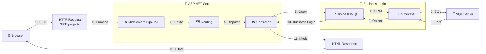

---

## Diagram 2: Database Schema - Project 1:N Task

Relacja między tabelami:

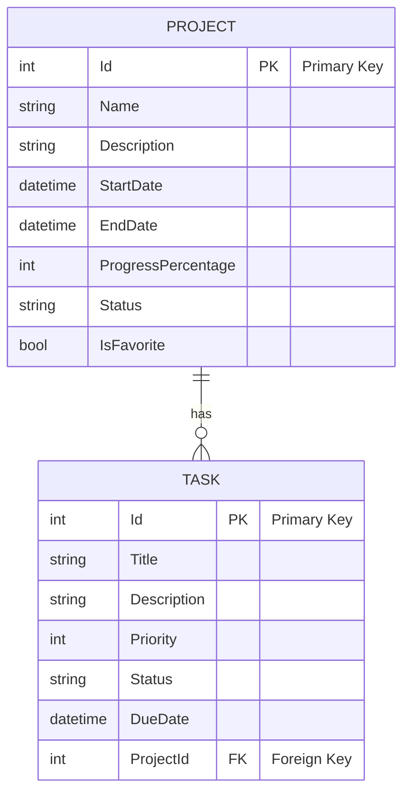

**Relacja:**
- 1 Project → Wiele Tasks (1:N)
- Usunięcie Project → Usuwa wszystkie Tasks (Cascade Delete)
- Indeksy: ProjectId, Status columns

---

## Diagram 3: Dependency Injection Container

Jak DI kontener rejestruje i injektuje usługi:

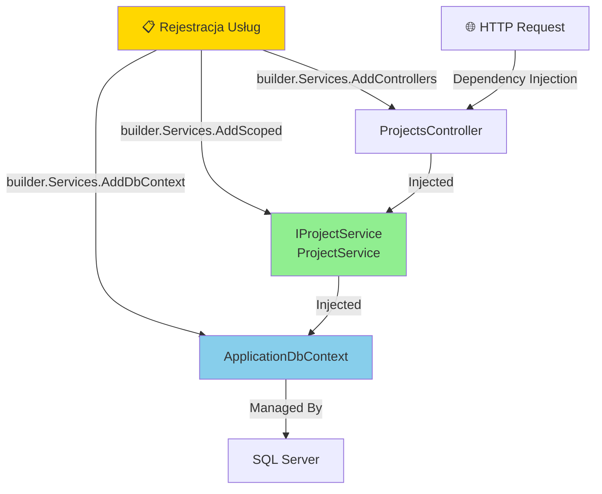

**Lifecycle:**
- **Singleton**: Jedna instancja dla całej aplikacji
- **Scoped**: Nowa instancja per HTTP request (default)
- **Transient**: Nowa instancja za każdym razem

---

## Diagram 4: Entity Framework Core Data Access Pattern

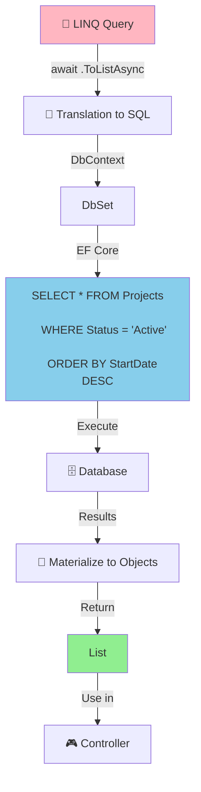

---

## Diagram 5: LINQ Query Execution Pipeline

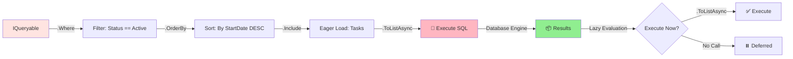

---

## Diagram 6: Razor Rendering Pipeline

Jak Razor konwertuje .cshtml na HTML:

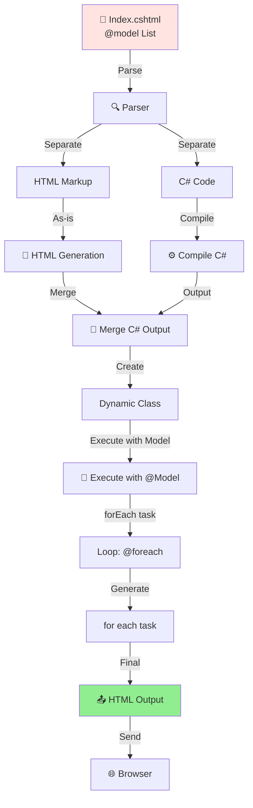

---

## Diagram 7: Blazor Component Lifecycle & Communication

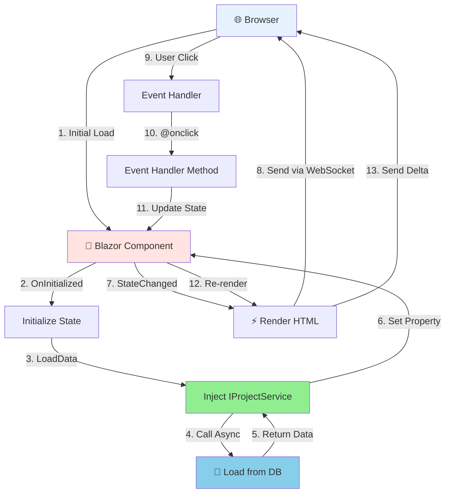

---

## Diagram 8: Authorization & Authentication Flow

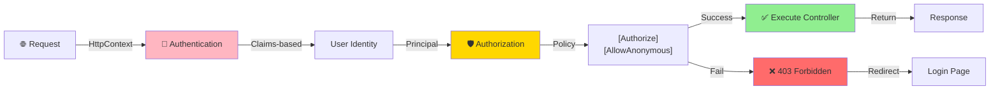

---

## Diagram 9: Layers Architecture

Separacja zainteresowań (Separation of Concerns):

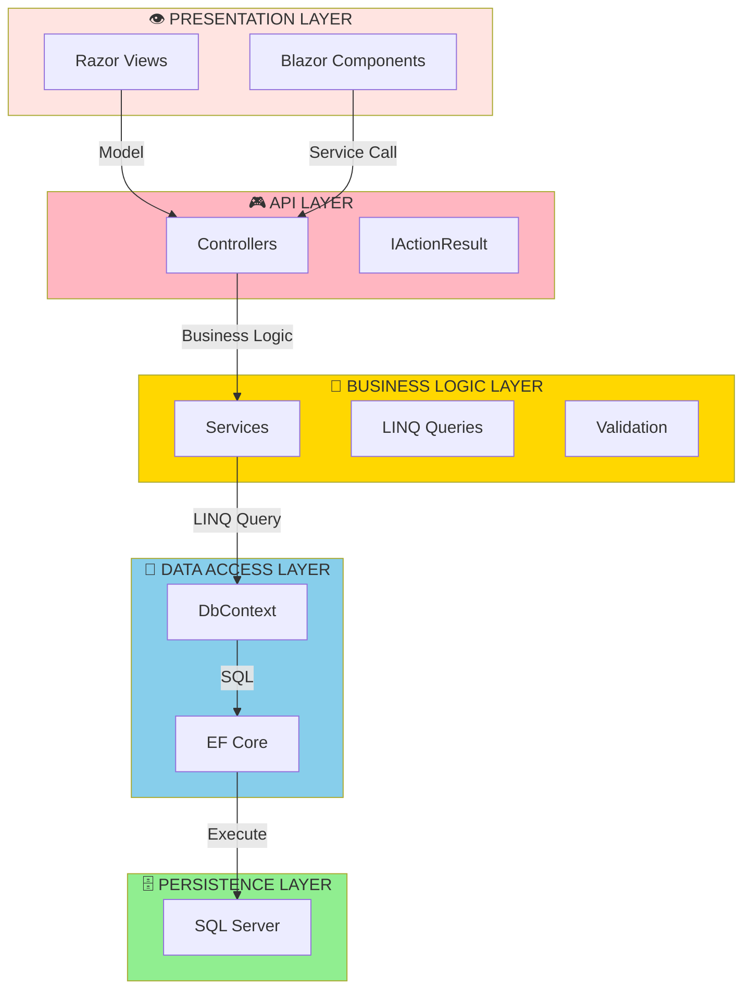

---

## Diagram 10: Performance Optimization - N+1 vs Include

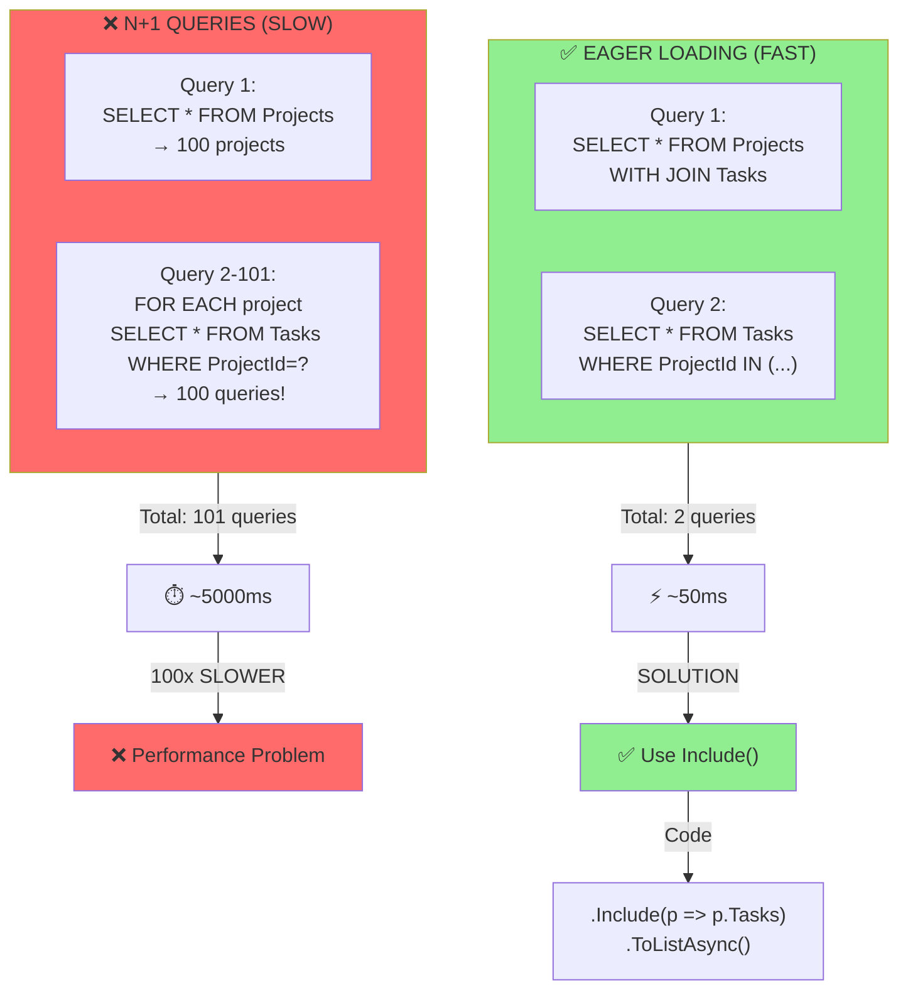

---

## Diagram 11: Caching Strategy

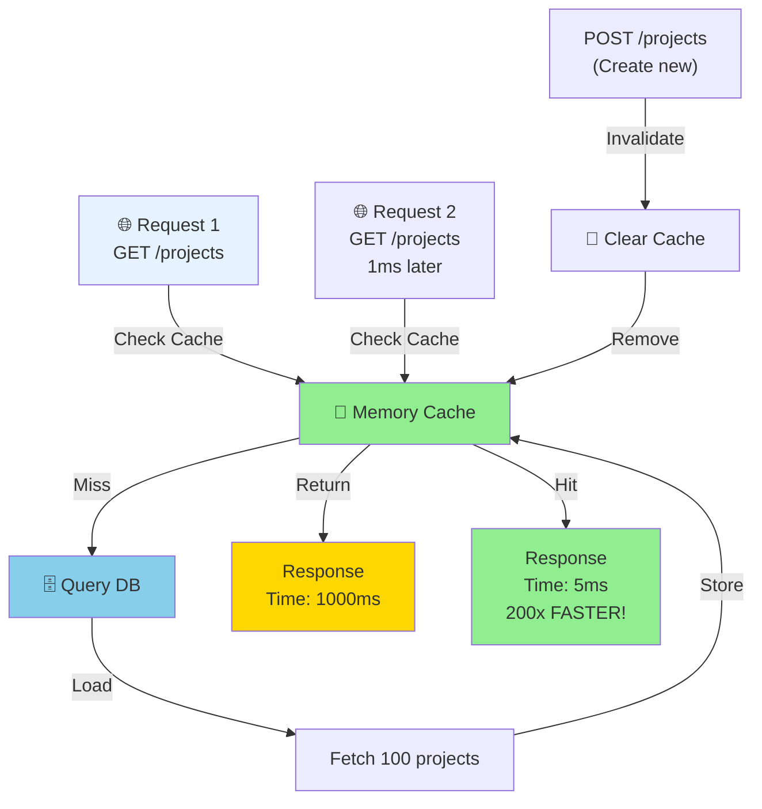

---

## Diagram 12: LINQ Query Operations Summary

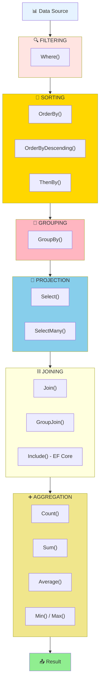

---

## Diagram 13: Complete Request Response Cycle

End-to-end diagram całego procesu:

```mermaid
graph LR
    User["👤 User<br/>Clicks Link"]
    
    User -->|1| Request["🌐 HTTP Request<br/>GET /projects/123"]
    
    Request -->|2| Pipeline["⚙️ Middleware Pipeline<br/>Logging → Auth → CORS"]
    
    Pipeline -->|3| Router["🗺️ Router<br/>Match Route:<br/>/projects/{id}"]
    
    Router -->|4| Controller["🎮 Controller<br/>ProjectsController<br/>.Details(123)"]
    
    Controller -->|5| Service["🔧 Service<br/>GetProjectAnalyticsAsync(123)"]
    
    Service -->|6| DbContext["💾 DbContext<br/>.Projects.Include()<br/>.FirstOrDefault(p => p.Id == 123)"]
    
    DbContext -->|7| Database["🗄️ SQL Server<br/>SELECT * FROM Projects WHERE Id = 123<br/>SELECT * FROM Tasks WHERE ProjectId = 123"]
    
    Database -->|8| Results["📦 Results<br/>Project object + Tasks collection"]
    
    Results -->|9| Analytics["📊 Analytics Calc<br/>TotalTasks, CompletedTasks, etc."]
    
    Analytics -->|10| ViewModel["📋 ViewModel<br/>ProjectDetailsViewModel"]
    
    ViewModel -->|11| View["👁️ Razor View<br/>Details.cshtml"]
    
    View -->|12| HTML["📄 Render HTML<br/>Bootstrap cards, tables"]
    
    HTML -->|13| Response["📤 HTTP Response<br/>200 OK + HTML"]
    
    Response -->|14| Browser["🌐 Browser<br/>Render & Display"]
    
    Browser -->|15| User
    
    style User fill:#E6F3FF
    style Request fill:#E6F3FF
    style Browser fill:#E6F3FF
    style Controller fill:#FFE4E1
    style Service fill:#FFD700
    style DbContext fill:#87CEEB
    style Database fill:#87CEEB
    style Results fill:#90EE90
    style HTML fill:#90EE90
```

---

## Diagram 14: Comparison Matrix

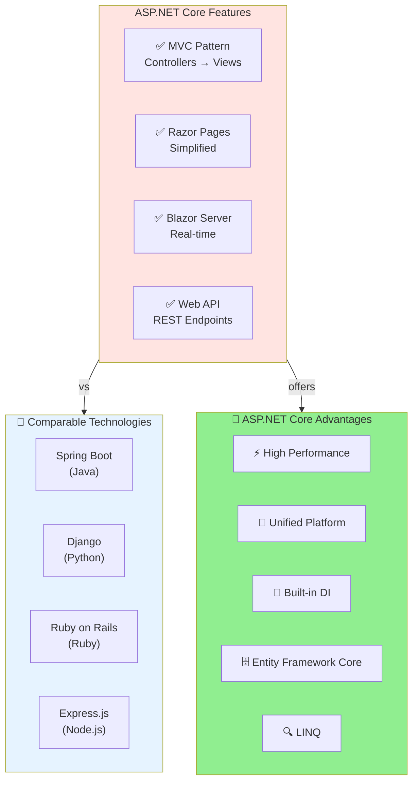

---

## Podsumowanie Diagramów

| # | Nazwa | Temat |
|---|-------|-------|
| 1 | Request Flow | HTTP → Controller → Response |
| 2 | Database Schema | Project 1:N Task relacja |
| 3 | DI Container | Service registration & injection |
| 4 | EF Core Pattern | LINQ → SQL → Objects |
| 5 | LINQ Pipeline | Query execution steps |
| 6 | Razor Rendering | .cshtml → HTML |
| 7 | Blazor Lifecycle | Component init & events |
| 8 | Auth Flow | Claim-based authorization |
| 9 | Layers | Separation of concerns |
| 10 | N+1 vs Include | Performance optimization |
| 11 | Caching | Memory cache strategy |
| 12 | LINQ Operations | Query operations summary |
| 13 | Full Cycle | Complete request-response |
| 14 | Comparison | ASP.NET Core vs alternatives |

Wszystkie diagramy wspierają zrozumienie architektury i flow aplikacji! 🎯
